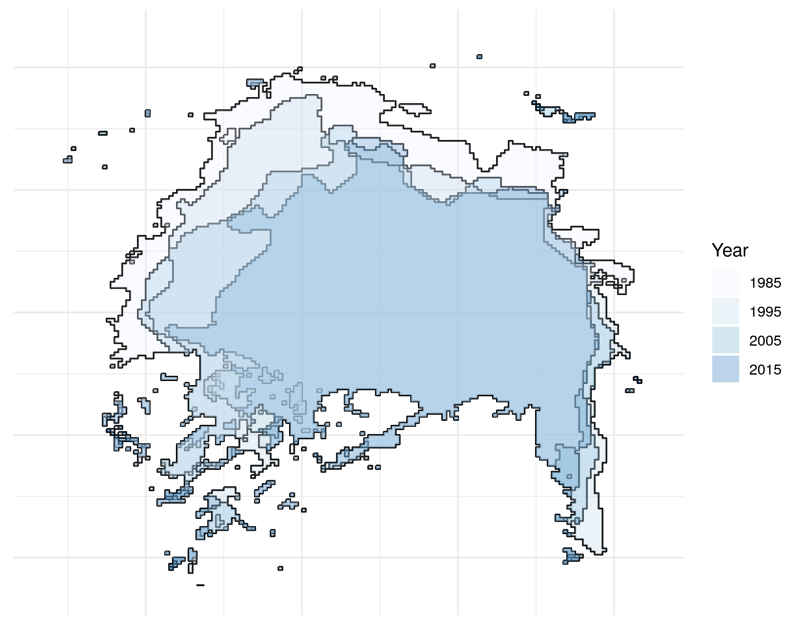

# Introduction

## Who this book is for

This book is for anyone who wants to make their R code faster to type, faster to run and more scalable. These considerations generally come *after* learning the very basics of R for data analysis: we assume you are either accustomed to R or proficient at programming in other languages, although the book could still be of use for beginners. Thus the book should be of use to three groups, albeit in different ways:

- For **programmers with little R knowledge** this book will help you navigate the quirks of R to make it work efficiently: it is easy to write slow  R code if you treat as if it were another language.

- For **R users who have little experience of programming** this book will show you many concepts and 'tricks of the trade', some of which are borrowed from Computer Science, that will make your work more time effective.

- An R beginner, you should probably read this book in parallel with other R resources such as the numerous, vignettes, tutorials and online articles that the R community has produced. At a bare minimum you should have R installed on your computer (see section \@ref(r-version) for information on how best to install R on new computers).

## What is efficiency?

In everyday life efficiency roughly means 'working well'. An efficient vehicle goes far without guzzling gas. An efficient worker gets the job done fast without stress. And an efficient light shines bright with a minimum of energy consumption. In this final sense, efficiency ($\eta$) has a formal definition as the ratio of work done ($W$ e.g. light output) over effort ($Q$ energy consumption):

$$
\eta = \frac{W}{Q}
$$

In the context of computer programming efficiency can be defined narrowly or broadly. The narrow sense, *algorithmic efficiency* refers to the way a particular task is undertaken. This concept dates back to the very origins of computing, as illustrated by the following quote by @lovelace1842translator in her notes on the work of Charles Babbage, one of the pioneers of early computing:

> In almost every computation a great variety of arrangements for the succession of the processes is possible, and various considerations must influence the selections amongst them for the purposes of a calculating engine. One essential object is to choose that arrangement which shall tend to reduce to a minimum the time necessary for completing the calculation.

The issue of having a 'great variety' of ways to solve a problem has not gone away with the invention of advanced computer languages: R is notorious for allowing users to solve problems in many ways, and this notoriety has only grown with the proliferation of community contributed package. In this book we want to focus on the *best* way of solving problems, from an efficiency perspective.

The second, broader definition of efficient computing is productivity. This is the amount of *useful* work a *person* (not a computer) can do per unit time. It may be possible to rewrite your codebase in C to make it 100 times faster. But if this takes 100 human hours it may not be worth it. Computers can chug away day and night. People cannot. Human productivity is the subject of Chapter \@ref(efficient-workflow).

By the end of this book you should know how to write R code that is efficient from both *algorithmic* and *productivity* perspectives. Efficient code is also concise, elegant and easy to maintain, vital when working on large projects.

## Why efficiency?

Computers are always getting more powerful. Does this not reduce the need for efficient computing? The answer is simple: in an age of Big Data and stagnating computer clockspeeds (see Chapter \@ref(hardware)), computational bottlenecks are more likely than ever before to hamper your work. An efficient programmer can "solve more complex tasks, ask more ambitious questions, and include more sophisticated analyses in their research" [@visser_speeding_2015].

A concrete example illustrates the importance of efficiency in mission critical situations. Robin was working on a tight contract for the UK's Department for Transport, to build the Propensity to Cycle Tool, an online application which had to be ready for national deployment in less than 4 months. To help his workflow he developed a function, `line2route()` in the **stplanr** to batch process calls to the ([cyclestreets.net](http://www.cyclestreets.net/)) API. But after a few thousand routes the code slowed to a standstill. Yet hundreds of thousands were needed. This endangered the contract. After eliminating internet connection issues, it was found that the slowdown was due to a bug in `line2route()`: it suffered from the 'vector growing problem', discussed in Section \@ref(memory-allocation).

The solution was simple. A [single commit](https://github.com/ropensci/stplanr/commit/c834abf7d0020c6fbb33845572d6be4801f31f47) made `line2route()` more than *ten times faster* and substantially shorter. This potentially saved the project from failure. The moral of this story is that efficient programming is not merely a desirable skill: it can be *essential*.

```{r, echo=FALSE}
# Add references to the above anecdote if appropriate
```

## What is efficient R programming?

Efficient R programming is the implementation of efficient programming practices in R. All languages are different, so efficient R code does not look like efficient code in another language. Many packages have been optimised for performance so, for some operations, acheiving maximum computational efficiency may simply be a case of selecting the appropriate package and using it correctly. There are many ways to get the same result in R, and some are very slow. Therefore *not* writing slow code should be prioritized over writing fast code.

Returning to the analogy of the two cars sketched in the preface, efficient R programming for some use cases can simply mean trading in your heavy and gas guzzling hummer for a normal hatchback. The search for optimal performance often has diminishing returns so it is important to find bottlenecks in your code to prioritise work for maximum increases in computational efficency.

## Touch typing

The other side of the efficiency coin is programmer efficiency. There are many things that will help increase the productivity of yourself and your collaborators, not least following the advice of @janert2010data to 'think more work less'. The evidence suggests that good diet, physical activity, plenty of sleep and a healthy work-life balance can all boost your speed and effectiveness at work [@jensen2011can;@pereira2015impact;@grant2013exploration].

While we recommend the reader to reflect on this evidence and their own well-being, this is not a self help book. It is about programming. However, there is one non-programming skill that *can* have a huge impact on productivity: touch typing. This skill can be relatively painless to learn, and can have a huge impact on your ability to write, modify and test R code quickly. Learning to touch type properly will pay off in small increments throughout the rest of your programming life (of course, the benefits are not constrained to R programming).

The key difference between a touch typist and someone who constantly looks down at the keyboard, or who uses only two or three fingers for typing, is hand placement. Touch typing involves positioning your hands on the keyboard with each finger of both hands touching or hovering over a specific letter (Figure \@ref(fig:touch)). This takes time and some discipline to learn. Fortunately there are many resources that will help you get in the habit of touch typing early, including open source software projects [Klavaro](https://sourceforge.net/projects/klavaro/) and [TypeFaster](https://sourceforge.net/projects/typefaster/).

```{r touch, echo=FALSE, fig.cap="The starting position for touch typing, with the fingers over the 'home keys'. Source: [Wikipedia](https://commons.wikimedia.org/wiki/File:QWERTY-home-keys-position.svg) under the Creative Commons license."}
knitr::include_graphics("figures/800px-QWERTY-home-keys-position.png")
```

## Benchmarking

Benchmarking is the process of testing the performance of specific operations
repeatedly. Modifying things from one benchmark to the next and recording the results
after changing things allows experimentation to see which bits of code are fastest.
Benchmarking is important in the efficient programmer's toolkit: you may *think* that
your code is faster than mine but benchmarking allows you to *prove* it. The easiest
way to benchmark a function is to use `system.time()`. The **microbenchmark** package
is more flexible and runs a test many times (by default $1000$), enabling the user to
detect microsecond difference in code performance.

### Benchmarking example

A good example is testing different methods to look-up an element of a dataframe.

```{r}
library("microbenchmark")
df = data.frame(v = 1:4, name = c(letters[1:4]))
microbenchmark(
  df[3, 2],
  df$name[3],
  df[3, 'v']
)
```

The results show that seemingly arbitrary changes to how R code is written can affect the efficiency of computation. Without benchmarking, these differences would be very hard to detect.

## Profiling

Benchmarking generally tests execution time of one function against another. Profiling, on the other hand, is about testing large chunks of code.

It is difficult to over-emphasise the importance of profiling for efficient R programming. Without a profile of what took longest, you will have only a vague idea of why your code is taking so long to run. The example below (which generates Figure \@ref(fig:icesheet) an image of ice-sheet retreat from 1985 to 2015) shows how profiling can be used to identify bottlenecks in your R scripts:

```{r test-ice, eval=FALSE}
library("profvis")
profvis(expr = {
  
  # Stage 1: load packages
  library("rnoaa")
  library("ggplot2")
  
  # Stage 2: load and process data
  out = readRDS("data/out-ice.Rds")
  df = dplyr::rbind_all(out, id = "Year")
  
  # Stage 3: visualise output
  ggplot(df, aes(long, lat, group = paste(group, Year))) +
    geom_path(aes(colour = Year)) 
  ggsave("figures/icesheet-test.png")
}, interval = 0.01, prof_output = "ice-prof")
```

The result of this profiling exercise are displayed in Figure \@ref(fig:profvis-ice).

```{r profvis-ice, echo=FALSE, fig.cap="Profiling results of loading and plotting NASA data on icesheet retreat."}
knitr::include_graphics("figures/profvis-ice.png")
```


```{r icefig, echo=FALSE, eval=FALSE}
library("rnoaa")
library("ggplot2")
yrs = seq(1985, 2015, by = 10)
urls = sapply(yrs, function(x)
  seaiceeurls(yr = x, mo = 'Sep', pole = 'N'))
out = lapply(urls, seaice)
names(out) <- yrs
# saveRDS(out, "data/out-ice.Rds")
df = dplyr::rbind_all(out, id = "Year")
xlims = quantile(df$lat, probs = c(0.01, 0.90))
ylims = quantile(df$long, probs = c(0.01, 0.99))
ggplot(df, aes(long, lat, group = paste(group, Year))) +
  geom_path() +
  geom_polygon(aes(fill = Year), alpha = 0.3) +
  xlim(xlims) +
  ylim(ylims) +
  scale_fill_brewer(type = "seq") +
  theme_minimal() +
  theme(axis.title = element_blank(),
        axis.text = element_blank())
ggsave("figures/icesheet-change.png")
# Alternative ways of doing the df rbind
# df = do.call(rbind, out)
# df = rbind_all(out, id = "id")
```

```{r icesheet, echo=FALSE, fig.cap="Visualisation of North Pole icesheet decline, generated using the code profiled using the profvis package."}

```