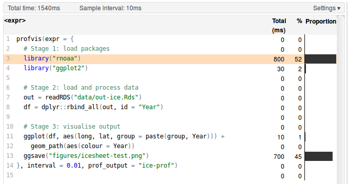
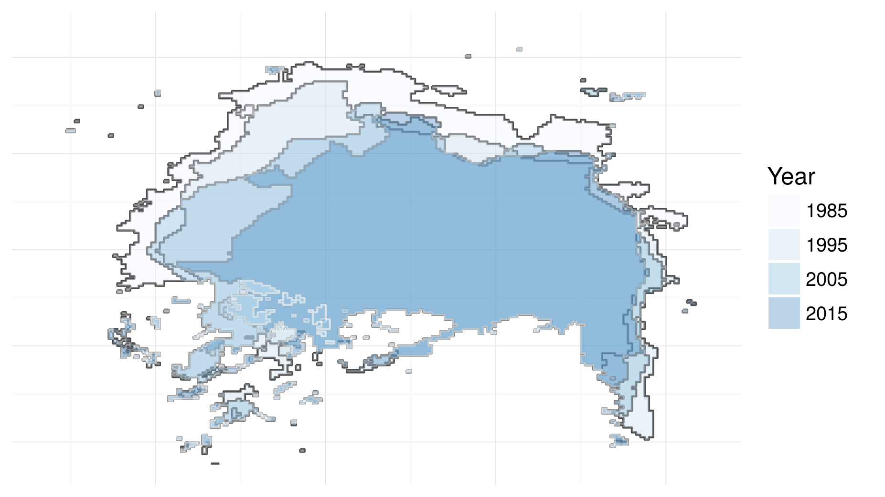

```{r, echo=FALSE}
rm(list=ls())
```

# Introduction {#introduction}

This chapter introduces the book. It describes the wide range of people it was written for, in terms of R and programming experience, and how you can get the most out of it. Anyone setting out to improve efficiency should have an understanding of precisely what they mean by the term, and this is discussed, with reference to *algorithmic* and *programmer* efficiency in Section \@ref(what-is-efficiency), and with reference to R in particular in \@ref(what-is-efficient-r-programming). It may seem obvious, but it's also worth thinking about *why* anyone would bother with efficient code now that powerful computers are cheap and accessible. This is covered in Section \@ref(why-efficiency).

This book happily is not completely R-specific. Non R programming skills that are needed for efficient R programming, which you will develop during the course of following this book, are covered in Section \@ref(cross-transferable-skills-for-efficiency). Unusually for a book about programming, this section introduces touch typing and consistency: cross-transferable skills that should improve your efficiency beyond programming. However, this is first and foremost a book about programming and it wouldn't be so without code examples in every chapter. Despite being more conceptual and discursive, this opening chapter is no exception: its penultimate section (\@ref(benchmarking-and-profiling)) describes these two essential tools in the efficient R programmer's toolbox, and how to use them with a couple of illustrative examples. The final thing to say at the outset is how to use this book in conjunction with the book's associated package and its source code. This is covered in Section \@ref(book-resources).

### Prerequisites {-}

As emphasised in the next section, it's useful to run code and experiment as you read. This *Prerequisites* section ensures you have the necessary packages for each chapter. The prerequisites for this chapter are:

- A working installation of R on your computer (see Section \@ref(install-rstudio)).

- Install and load the **microbenchmark**, **profvis** and **ggplot2** packages (see Section \@ref(installing-r-packages) for tips on installing packages and keeping them up-to-date). You can ensure these packages are installed by loading them as follows:

```{r}
library("microbenchmark")
library("profvis")
library("ggplot2")
```

The prerequisites needed to run the code contained in the entire book are covered in \@ref(book-resources) at the end of this chapter.

## Who this book is for and how to use it

This book is for anyone who wants to make their R code faster to type, faster to run and more scalable. These considerations generally come *after* learning the very basics of R for data analysis: we assume you are either accustomed to R or proficient at programming in other languages, although this book could still be of use to beginners. Thus the book should be useful to people with a range of skill levels, who can broadly be divided into three groups: 

- For **programmers with little experience with R** this book will help you navigate the quirks of R to make it work efficiently: it is easy to write slow R code if you treat as if it were another language.

- For **R users with little experience of programming** this book will show you many concepts and 'tricks of the trade', some of which are borrowed from Computer Science, that will make your work more time effective.

- For **R beginners with little experience of programming** this book can help steer you towards getting things right (or at least less wrong) at the outset. Bad habits are easy to gain but hard to lose. Reading this book at the outset of your programming career could save the future you many hours searching the web for issues covered in this book.
  
Identifying which group you best fit into and how this book is most likely to help you will help get the most out of it.
For everyone, we recommend reading *Efficient R Programming* while you have an active R project on the go, whether it's a collaborative task at work or simply a personal interest project at home. Why? The scope of this book is wider than that of most programming textbooks (Chapter 4 covers project management) and working on a project outside the confines of the book will help put the concepts, recommendations and code into practice. Going directly from words into action in this way will help ensure that the information is consolidated: learn by doing.

If you're an R novice and fit into the final category, we recommend that this 'active R project' is not an important deliverable, but another R resource. While this book is generic, it is likely that your usage of R will be largely domain-specific. For this reason we recommend reading it alongside teaching material in your chosen area. Furthermore, we advocate that all readers use this book alongside other R resources such as the numerous, vignettes, tutorials and online articles that the R community has produced (described in the *tip* below). At a bare minimum you should be familiar with data frames, looping and simple plots.

```{block, intro-resources, type='rmdtip'}
There are many places to find generic and domain specific R teaching materials. For complete R and programming beginners, there are a number of introductory resources, such as the excellent [Student's Guide to R](https://cran.r-project.org/doc/contrib/Horton+Pruim+Kaplan_MOSAIC-StudentGuide.pdf) and the more technical [IcebreakeR](https://cran.r-project.org/other-docs.html) tutorial.

R also comes pre-installed with guidance, revealed by entering `help.start()` into the R console, including the classic official guide *An Introduction to R* which is excellent but daunting to many. Entering `vignette()` will display a list of guides packaged *within your R installation* (and hence free from the need of an internet connection). To see the vignette for a specific topic, just enter the vignette's name into the same command, e.g. `vignette(package = "dplyr", "introduction")` to see the introductory vignette for the **dplyr** package.

Another early port of call should be the CRAN website. The [Contributed Documentation](https://cran.r-project.org/other-docs.html) page contains a list of contributed resources, mainly tutorials, on subjects ranging from [map making](https://github.com/Robinlovelace/Creating-maps-in-R) to [Econometrics](https://cran.r-project.org/doc/contrib/Farnsworth-EconometricsInR.pdf) The new [bookdown website](https://bookdown.org/) contains a list of complete (or near complete) books, which cover domains including [*R for Data Science*](http://r4ds.had.co.nz/) and [Authoring Books with R Markdown](https://bookdown.org/yihui/bookdown/). We recommend keeping your eye on the 'R-o-sphere', e.g. via the [R-Bloggers](http://r-bloggers.com/) website, popular Twitter feeds and [CRAN-affiliated email lists](https://www.r-project.org/mail.html) for up-to-date materials that can be used in conjunction with this book.
```

## What is efficiency?

In everyday life efficiency roughly means 'working well'. An efficient vehicle goes far without guzzling gas. An efficient worker gets the job done fast without stress. And an efficient light shines bright with a minimum of energy consumption. In this final sense, efficiency ($\eta$) has a formal definition as the ratio of work done ($W$ e.g. light output) per unit effort ($Q$, energy consumption in this case):

$$
\eta = \frac{W}{Q}
$$

How does this translate into programming? Efficient code can be defined narrowly or broadly. The first, narrower definition is *algorithmic efficiency*: how quickly the *computer* can undertake a piece of work given a particular piece of code. This concept dates back to the very origins of computing, as illustrated by the following quote from Ada Lovelace in her notes on the work of Charles Babbage, one of the pioneers of early computing [@lovelace1842translator]:

> In almost every computation a great variety of arrangements for the succession of the processes is possible, and various considerations must influence the selections amongst them for the purposes of a calculating engine. One essential object is to choose that arrangement which shall tend to reduce to a minimum the time necessary for completing the calculation.

The second, broader definition of efficient computing is *programmer productivity*. This is the amount of *useful* work a *person* (not a computer) can do per unit time. It may be possible to rewrite your code base in C to make it $100$ times faster. But if this takes $100$ human hours it may not be worth it. Computers can chug away day and night. People cannot. Human productivity is the subject of Chapter \@ref(workflow).

By the end of this book you should know how to write code that is efficient from both *algorithmic* and *productivity* perspectives. Efficient code is also concise, elegant and easy to maintain, vital when working on large projects. But this raises the wider question: what is different about efficient R code compared with efficient code in any other language. 

## What is efficient R programming?

The issue flagged by Ada of having a 'great variety' of ways to solve a problem is key to understanding how efficient R programming differs from efficient programming in other languages. R is notorious for allowing users to solve problems in many ways. This is due to R's inherent flexibility, in which almost "anything can be modified after it is created" [@Wickham2014]. R's inventors, Ross Ihaka and Robert Gentleman, designed it to be this way: a cell in a data frame can be selected in multiple ways in *base R* alone (three of which are illustrated later in this Chapter, in Section \@ref(benchmarking-example)). This is useful, allowing programmers to use the language as best suits their needs, but can be confusing for people looking for the 'right' way of doing things and can cause inefficiencies if you don't understand the language well.

R's notoriety for being able to solve a problem in multiple different ways has grown with the proliferation of community contributed packages. In this book we focus on the *best* way of solving problems, from an efficiency perspective. Often it is instructive to discover *why* a certain way of doing things is faster than others. However, if your aim is simply to *get stuff done*, you only need to know what is likely to be the most efficient way. In this way R's flexibility can be inefficient: although it is likely easier to find *a* way of solving any given problem in R than other languages, solving the problem with R may make it harder to find *the best* way to solve that problem, as there are so many. This book tackles this issue head-on by recommending what we believe are the most efficient approaches. We hope you trust our views, based on years of R using and teaching, but we also hope that you challenge them at times and test them, with benchmarks, if you suspect there's a better way of doing things (thanks to R's flexibility and ability to interface with other languages there may well be).

It is well known that R code can promote *algorithmic efficiency* compared with low level languages for certain tasks, especially if the code was written by someone who doesn't fully understand the language. But it is worth highlighting the numerous ways that R *encourages* and *guides* efficiency, especially programmer efficiency:

- R is not compiled but it calls compiled code. This means that you get the best of both worlds: R thankfully removes the laborious stage of compiling your code before being able to run it, but provides impressive speed gains by calling compiled C, FORTRAN and other languages behind the scenes.
- R is a functional and object orientated language [@Wickham2014]. This means that it is possible to write complex and flexible functions in R that get a huge amount of work done with a single line of code. 
- R uses RAM for memory. This may seem obvious but it's worth saying: RAM is much faster than any hard disk system. Compared with databases, R is therefore very fast at common data manipulation, processing and modelling operations. RAM is now cheaper than ever, meaning the potential downside of this feature are further away than ever.
- R is supported by excellent Integrated Development Environments (IDEs). The environment in which you program can have a huge impact on *programmer efficiency* as it can provide supporting help quickly, allow for interactive plotting, and allow your R projects to be tightly integrated with other aspects of your project such as file management, version management and interactive visualisation systems, as discussed in \@ref(rstudio).
- R has a strong user community. This boosts efficiency because if you encounter a problem that has not yet been solved, you can simply ask the community. If it is a new, clearly stated and reproducible question asked on a popular forum such as [StackOverflow](http://stackoverflow.com/questions/tagged/r) or an appropriate [R list](https://www.r-project.org/mail.html), you are likely to get a response from an accomplished R programmer within minutes. The obvious benefit of this crowd-sourced support system is that the efficiency benefits of the answer will from that moment be available to everyone.

Efficient R programming is the implementation of efficient programming practices in R. All languages are different, so efficient R code does not look like efficient code in another language. Many packages have been optimised for performance so, for some operations, achieving maximum computational efficiency may simply be a case of selecting the appropriate package and using it correctly. There are many ways to get the same result in R, and some are very slow. Therefore *not* writing slow code should be prioritized over writing fast code.

Returning to the analogy of the two cars sketched in the preface, efficient R programming for some use cases can simply mean trading in your old, heavy, and gas guzzling hummer function for a lightweight velomobile. The search for optimal performance often has diminishing returns so it is important to find bottlenecks in your code to prioritise work for maximum increases in computational efficiency. Linking back to R's notoriety as a flexible language, efficient R programming can be interpretted as finding a solution that is **fast enough** in terms of *computational efficiency* but **as fast as possible** in terms of *programmer efficiency*. After all, you and your co-workers probably have better and more valuable pastimes outside work so it is more important for you to get the job done quickly and take the time off for other interesting persuits. 

## Why efficiency?

Computers are always getting more powerful. Does this not reduce the need for efficient computing? The answer is simple: no. In an age of Big Data and stagnating computer clock speeds (see Chapter \@ref(hardware)), computational bottlenecks are more likely than ever before to hamper your work. An efficient programmer can "solve more complex tasks, ask more ambitious questions, and include more sophisticated analyses in their research" [@visser_speeding_2015].

A concrete example illustrates the importance of efficiency in mission critical situations. Robin was working on a tight contract for the UK's Department for Transport, to build the Propensity to Cycle Tool, an online application which had to be ready for national deployment in less than 4 months. For this work he developed the function, `line2route()` in the **stplanr** package, to generate routes via the ([cyclestreets.net](http://www.cyclestreets.net/)) API.
Hundreds of thousands of routes were needed but, to his dismay, code slowed to a standstill after only a few thousand routes. This endangered the contract. After eliminating other issues and via code profiling (covered in section \@ref(performance-profvis)), it was found that the slowdown was due to a bug in `line2route()`: it suffered from the 'vector growing problem', discussed in Section \@ref(memory-allocation).

The solution was simple. A [single commit](https://github.com/ropensci/stplanr/commit/c834abf7d0020c6fbb33845572d6be4801f31f47) made `line2route()` more than *ten times faster* and substantially shorter. This potentially saved the project from failure. The moral of this story is that efficient programming is not merely a desirable skill: it can be *essential*. 
<!-- Add references to the above anecdote if appropriate -->

There are many concepts and skills that are language agnostic. Much of the knowledge imparted in this book should be relevant to programming in other languages (and other technical activities beyond programming). There are strong reasons for focussing on efficiency in one language, however in R simply using replacement functions from a different package can greatly improve efficiency, as discussed in relation to reading in text files Chapter \@ref(input-output). This level of detail, with reproducible examples, would not be possible in a general purpose 'efficient programming' book. Skills for efficient working, that apply beyond R programming, are covered in the next section.

## Cross-transferable skills for efficiency

The meaning of 'efficient R code', as opposed to generic 'efficient code', should be clear from for the preceding two sections. However, that does not mean that the skills and concepts covered in this book are not transferable to other languages and non-programming tasks. Likewise working on these *cross-transferable* skills will improve your R programming (as well as other aspects of your working life). Two of these skills are especially important: touch typing and use of a consistent style.

### Touch typing

The other side of the efficiency coin is programmer efficiency. There are many things that will help increase the productivity of yourself and your collaborators, not least following the advice of @janert2010data to 'think more work less'. The evidence suggests that good diet, physical activity, plenty of sleep and a healthy work-life balance can all boost your speed and effectiveness at work [@jensen2011can;@pereira2015impact;@grant2013exploration].

While we recommend the reader to reflect on this evidence and their own well-being, this is not a self help book. It is about programming. However, there is one non-programming skill that *can* have a huge impact on productivity: touch typing. This skill can be relatively painless to learn, and can have a huge impact on your ability to write, modify and test R code quickly. Learning to touch type properly will pay off in small increments throughout the rest of your programming life (of course, the benefits are not constrained to R programming).

The key difference between a touch typist and someone who constantly looks down at the keyboard, or who uses only two or three fingers for typing, is hand placement. Touch typing involves positioning your hands on the keyboard with each finger of both hands touching or hovering over a specific letter (figure \@ref(fig:1-1)). This takes time and some discipline to learn. Fortunately there are many resources that will help you get in the habit of touch typing early, including open source software projects [Klavaro](https://sourceforge.net/projects/klavaro/) and [TypeFaster](https://sourceforge.net/projects/typefaster/).

```{r 1-1, echo=FALSE, fig.cap="The starting position for touch typing, with the fingers over the 'home keys'. Source: [Wikipedia](https://commons.wikimedia.org/wiki/File:QWERTY-home-keys-position.svg) under the Creative Commons license.", out.width="100%"}
knitr::include_graphics("figures/f1_1_800px-QWERTY-home-keys-position.png")
```

### Consistent style and code conventions

Getting into the habit of clear and consistent style when writing anything, be it code or poetry, will have benefits in many other projects, programming or non-programming. As outlined in Section \@ref(coding-style), style is to some extent a personal preference. However, it is worth noting at the outset the conventions we use, in order to maximise readability. Throughout this book we use a consistent set of conventions to refer to code.

  * Package names are in bold, e.g. __dplyr__.
  * Functions are in a code font, followed by parentheses, like `plot()`, or `median()`.
  * Other R objects, such as data or function arguments, are in a code font, without parentheses, like `x` and `name`.
  * Occasionally we'll highlight the package of the function, using two colons, e.g. `microbenchmark::microbenchmark()`.
  Note, this notation can be efficient if you only need to use a package's function once, as it avoids loading the package with `library()`.
  
The concepts of benchmarking and profiling are not R specific. However, they are done in a particular way in R, as outlined in the next section.

## Benchmarking and profiling

Benchmarking and profiling are key to efficient programming, especially in R. Benchmarking is the process of testing the performance of specific operations repeatedly. Profiling involves running many lines of code to find out where bottlenecks lie. Both are vital for understanding efficiency and we use them throughout the book. Their centrality to efficient programming practice means they must be covered in this introductory chapter, despite being seen by many as an intermediate or advance R programming topic.

In some ways benchmarks can be seen as the building blocks of profiles. Profiling can be understood as automatically running many benchmarks, for every line in a script, and comparing the results line-by-line. Because benchmarks are smaller, easier and more modular, we will cover them first.

### Benchmarking

Modifying elements from one benchmark to the next and recording the results after the alteration enables us to determine the fastest piece of code. Benchmarking is important in the efficient programmer's tool-kit: you may *think* that your code is faster than mine but benchmarking allows you to *prove* it. The easiest way to benchmark a function is to use `system.time()`. However it is important to remember that we are taking a sample. We wouldn't expect a single person in London to be representative of the entire UK population, similarly, a single benchmark provides us with a single observation on our functions behaviour. Therefore, we'll need to repeat the timing many times with a loop. 

An alternative way of benchmarking, is via the flexible **microbenchmark** package. This allows us to easily run each function multiple times (by default $100$), enabling the user to detect microsecond differences in code performance. We then get a convenient summary of the results: the minimum/maximum, lower/upper quartiles and the mean/median times. We suggest focusing on the median time to get a feel for the standard time and the quartiles to understand the variability.

### Benchmarking example

A good example is testing different methods to look-up a single value in a data frame. Note that each argument in the benchmark below is a term to be evaluated (for multi-line benchmarks, the term to be evaluated can be surrounded by curly brackets, `{}`).

```{r, results="hide"}
library("microbenchmark")
df = data.frame(v = 1:4, name = letters[1:4])
microbenchmark(df[3, 2], df[3, "name"], df$name[3])
# Unit: microseconds
#          expr     min    lq  mean median    uq   max neval cld
#      df[3, 2]   17.99 18.96 20.16  19.38 19.77 35.14   100   b
# df[3, "name"]   17.97 19.13 21.45  19.64 20.15 74.00   100   b
#    df$name[3]   12.48 13.81 15.81  14.48 15.14 67.24   100   a 
```

The results summarise how long each query took: the minimum (`min`), lower and upper quartiles (`lq` and `uq` respectively) and the mean, median and maximum, for each of the number of evaluations (`neval`, with the default value of 100 used in this case). `cld` reports the relative rank of each row in the form of 'compact letter display': in this case `df$name[3]` performs best, with a rank of `a` and a mean time around 25% lower than the other two functions.

When using `microbenchmark()`, you should pay careful attention to the units. In the above example, each function call takes approximately 20 _microseconds_, implying around 50,000 function calls could be done in a second. When comparing quick functions, the standard units are:

  * milliseconds (ms), one thousand functions takes a second;
  * microseconds ($\mu$s),  one million function calls takes a second;
  * nanoseconds  (ns), one billion calls takes a second.

We can set the units we want to use with the `unit` argument, e.g. the results are reported
in seconds if we set `unit = "s"`.

When thinking about computational efficiency, there are (at least) two measures:

  * Relative time: `df$name[3]` is 25% faster than `df[3, "name"]`;
  * Absolute time: `df$name[3]` is 5 microseconds faster than `df[3, "name"]`.

Both measures are useful, but its important not to forget the underlying 
time scale: it makes little sense to optimise a function that takes *microseconds* to complete if there are operations that take *seconds* to complete in your code.

### Profiling

Benchmarking generally tests the execution time of one function against another. Profiling, on the other hand, is about testing large chunks of code.

It is difficult to over-emphasise the importance of profiling for efficient R programming. Without a profile of what took longest, you will have only a vague idea of why your code is taking so long to run. The example below (which generates figure \@ref(fig:1-3) an image of ice-sheet retreat from 1985 to 2015) shows how profiling can be used to identify bottlenecks in your R scripts:

```{r test-ice, eval=FALSE, out.width="50%"}
library("profvis")
profvis(expr = {
  
  # Stage 1: load packages
  # library("rnoaa") # not necessary as data pre-saved
  library("ggplot2")
  
  # Stage 2: load and process data
  out = readRDS("extdata/out-ice.Rds")
  df = dplyr::rbind_all(out, id = "Year")
  
  # Stage 3: visualise output
  ggplot(df, aes(long, lat, group = paste(group, Year))) +
    geom_path(aes(colour = Year)) 
  ggsave("figures/icesheet-test.png")
}, interval = 0.01, prof_output = "ice-prof")
```

The result of this profiling exercise are displayed in figure \@ref(fig:1-2).

```{r 1-2, echo=FALSE, fig.cap="Profiling results of loading and plotting NASA data on icesheet retreat.", out.width="100%"}

```

```{r 1-3, echo=FALSE, fig.cap="Visualisation of North Pole icesheet decline, generated using the code profiled using the profvis package."}
# See code/f3.R

```

For more information about profiling and benchmarking, please refer to the [Optimising code](http://adv-r.had.co.nz/Profiling.html) chapter in @Wickham2014, and Section \@ref(performance-profvis) in this book. We recommend reading these additional resources while performing benchmarks and profiles on your own code, for example, based on the exercises below.

#### Exercises

Consider the following benchmark to evaluate different functions for calculating the cumulative sum of the whole numbers from 1 to 100:

```{r}
x = 1:100 # initiate vector to cumulatively sum

# Method 1: with a for loop (10 lines)
cs_for = function(x){
  for(i in x){
    if(i == 1){
      xc = x[i]
    } else {
      xc = c(xc, sum(x[1:i]))
    }
  }
  xc
}

# Method 2: with apply (3 lines)
cs_apply = function(x){
  sapply(x, function(x) sum(1:x))
}

# Method 3: cumsum (1 line, not shown)
microbenchmark(cs_for(x), cs_apply(x), cumsum(x))
```

1. Which method is fastest and how many times faster is it?

2. Run the same benchmark, but with the results reported in seconds, on a vector of all the whole numbers from 1 to 50,000. Hint: also use the argument `neval = 1` so that each command is only run once to ensure the results complete (even with a single evaluation the benchmark may take up to or more than a minute to complete, depending on your system). Does the *relative* time difference increase or decrease? By how much?

```{r, eval=FALSE, echo=FALSE}
x = 1:5e4 # initiate vector to cumulatively sum
microbenchmark(cs_for(x), cs_apply(x), cumsum(x), times = 1, unit = "s")
```

3. Test how long the different methods for subsetting the data frame `df`, presented in Section \@ref(benchmarking-example), take on your computer. Is it faster or slower at subsetting than the computer on which this book was compiled?

4. Use `system.time()` and a `for()` loop to test how long it takes to perform the subsetting operation 50,000 times. Before testing this, do you think it will be more or less than 1 second, for each subsetting method? Hint: the test for the first method is shown below:

```{r, eval=FALSE}
# Test how long it takes to subset the data frame 50,000 times:
system.time(
  for(i in 1:50000){
    df[3, 2]
  }
)
```

5. Bonus exercise: try profiling a section of code you have written using **profvis**. Where are the bottlenecks? Were they where you expected?

## Book resources

### R package

This book has an associated R package that contains data sets and functions referenced in the book. The package is hosted on [github](https://github.com/csgillespie/efficient) and can be installed using the **devtools** package:

```{r, eval=FALSE}
devtools::install_github("csgillespie/efficient", build_vignettes = TRUE)
```

The package also contains solutions (as vignettes) to the exercises found in this book. They can be browsed with the following command:

```{r, eval=FALSE}
browseVignettes(package="efficient")
```

The following command will install all packages used to generate this book:

```{r, eval=FALSE}
devtools::install_github("csgillespie/efficientR")
```

### Online version

We are grateful to O'Reilly Press for allowing us to develop this book [online](https://csgillespie.github.io/efficientR/). The online version constitutes a substantial additional resource to supplement this book, and will continue to evolve in between reprints of the physical book.  The book's code also represents a substantial learning opportunity in itself as it was written using R Markdown and the **bookdown** package, allowing us to run the R code each time we compile the book to ensure that it works, and allowing others to contribute to its future longevity.
To edit this chapter, for example, simply navigate to [github.com/csgillespie/efficientR/edit/master/01-introduction.Rmd](https://github.com/csgillespie/efficientR/edit/master/01-introduction.Rmd) while logged into a [GitHub account](https://help.github.com/articles/signing-up-for-a-new-github-account/). The full source of the book is available at [https://github.com/csgillespie/efficientR](https://github.com/csgillespie/efficientR) where we welcome comments/questions on the [Issue Tracker](https://github.com/csgillespie/efficientR/issues) and Pull Requests.
