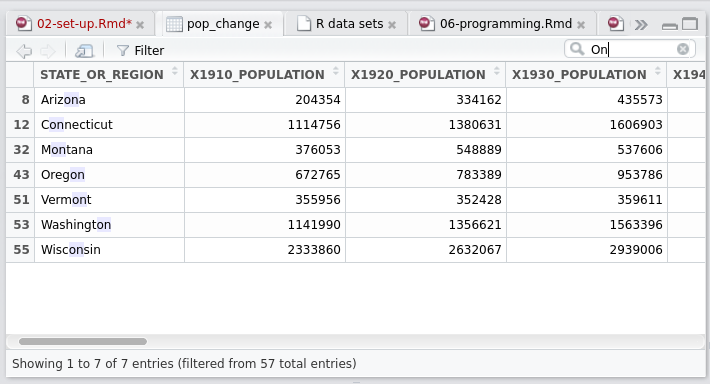

```{r echo=FALSE}
rm(list = ls())
data("USArrests", package = "datasets")
```

# Efficient set-up {#set-up}

An efficient computer set-up is analogous to a well-tuned vehicle. Its components work in harmony. It is well-serviced. It's fast!

This chapter describes the set-up that will enable a productive workflow. It explores how the operating system, R version, startup files and IDE can make your R work faster. Understanding and at times changing these set-up options can have many knock-on benefits. That's why we cover them at this early stage (hardware is covered in Chapter \@ref(hardware)).  By the end of this chapter you should understand how to set-up your computer and R installation for optimal efficiency. It covers the following topics:

- R and the operating systems: system monitoring on Linux, Mac and Windows
- R version: how to keep your base R installation and packages up-to-date
- R start-up: how and why to adjust your `.Rprofile` and `.Renviron` files
- RStudio: an integrated development environment (IDE) to boost your programming productivity
- BLAS and alternative R interpreters: looks at ways to make R faster

Efficient programming is more than a series of tips: there is no substitute for in-depth understanding. However, to help remember the key messages buried within the detail of this book, each chapter from now on contains a 'top 5 tips' section, after the pre-requisites.

### Prerequisites {-}

Only one package needs to be installed to run the code in this chapter:

```{r}
library("benchmarkme")
```

## Top 5 tips for an efficient R set-up

1. Use system monitoring to identify bottlenecks in your hardware/code.
1. Keep your R installation and packages up-to-date.
1. Make use of RStudio's powerful autocompletion capabilities and shortcuts.
1. Store API keys in the `.Renviron` file.
1. Use BLAS if your R number crunching is too slow.

## Operating system

R supports all three major operating system (OS) types: Linux, Mac and Windows.^[All CRAN packages are automatically tested on these systems, in addition to Solaris. R has also been reported to run on more exotic operating systems, including those used in smart phones and game consoles [@peng_r_2014].] R is platform-independent, although there are some OS-specific quirks, e.g. in relation to file path notation (see Section \@ref(location)).

Basic OS-specific information can be queried from within R using `Sys.info()`:

```{r, eval=FALSE}
Sys.info()
#R> sysname     release                machine      user
#R> "Linux"     "4.2.0-35-generic"     "x86_64"     "robin"
```

Translated into English, the above output means that R is running on a 64 bit (`x86_64`) Linux distribution (`4.2.0-35-generic` is the Linux version) and that the current user is `robin`. Four other pieces of information (not shown) are also produced by the command, the meaning of which is well documented in a help file revealed by entering `?Sys.info` in the R console.

```{block, assertive.reflection, type='rmdtip'}
The **assertive.reflection** package can be used to report additional information about your computer's operating system and R set-up with functions for asserting operating system and other system characteristics. The `assert_*()` functions work by testing the truth of the statement and erroring if the statement is untrue. On a Linux system `assert_is_linux()` will run silently, whereas `assert_is_windows()` will cause an error. The package can also test for the IDE you are using (e.g. `assert_is_rstudio()`), the capabilities of R (`assert_r_has_libcurl_capability()` etc.), and what OS tools are available (e.g. `assert_r_can_compile_code()`). These functions can be useful for running code that is designed only to run on one type of set-up.
```

### Operating system and resource monitoring

Minor differences aside, R's computational efficiency is broadly the same across different operating systems.^[Benchmarking conducted for a presentation "R on Different Platforms" at useR 2006 found that R was marginally faster on Windows than Linux set-ups. Similar results were reported in an academic paper, with R completing statistical analyses faster on a Linux than Mac OS's [@sekhon2006art]. In 2015 [Revolution R](http://blog.revolutionanalytics.com/2015/04/benchmarks-of-rro-on-osx-and-ubuntu.html) supported these results with slightly faster run times for certain benchmarks on Ubuntu than Mac systems. The data from the **benchmarkme** package also suggests that running code under the Linux OS is marginally faster.
]
Beyond the $32$ vs $64$ bit issue (covered in the next chapter) and *process forking* (covered in Chapter \@ref(performance)), another OS-related issue to consider is external dependencies: programs that R packages depend on. Sometimes external package dependencies must be installed manually (i.e. not using `install.packages()`). This is especially common with Unix-based systems (Linux and Mac). On Debian-based operating systems such as Ubuntu, many R packages can be installed at the OS level, to ensure external dependencies are also installed (see Section \@ref(deps)).

Resource monitoring is the process of checking the status of key OS variables. For computationally intensive work, it is sensible to monitor system resources in this way. Resource monitoring can help identify computational bottlenecks. Alongside R profiling functions such as **profvis** (see Section \@ref(performance-profvis)), system monitoring provides a useful tool for understanding how R is performing in relation to variables reporting the OS state, such as how much RAM is in use, which relates to the wider question of whether more is needed (covered in Chapter \@ref(programming)).

CPU resource allocated over time is another common OS variable that is worth monitoring. A basic use case is to check whether your code is running in parallel (see Figure \@ref(fig:2-1)), and whether there is spare CPU capacity on the OS that could be harnessed by parallel code.

```{r 2-1, echo=FALSE, fig.cap="Output from a system monitor (`gnome-system-monitor` running on Ubuntu) showing the resources consumed by running the code presented in the second of the Exercises at the end of this section. The first increases RAM use, the second is single-threaded and the third is multi-threaded.", out.width="100%"}
knitr::include_graphics("figures/f2_1_sysmon.png")
```

System monitoring is a complex topic that spills over into system administration and server management. Fortunately there are many tools designed to ease monitoring on all major operating systems.

- On Linux, the shell command `top` displays key resource use figures for most distributions. `htop` and Gnome's **System Monitor** (`gnome-system-monitor`, see Figure \@ref(fig:2-1)) are more refined alternatives which use command-line and graphical user interfaces respectively. A number of options such as `nethogs` monitor internet usage.
- On Mac, the **Activity Monitor** provides similar functionality. This can be initiated from the Utilities folder in Launchpad.
- On Windows, the **Task Manager** provides key information on RAM and CPU use by process. This can be started in modern Windows versions by typing `Ctrl-Alt-Del` or by clicking the task bar and 'Start Task Manager'.

#### Exercises {-}

1. What is the exact version of your computer's operating system?

2. Start an activity monitor then execute the following code chunk. In it `lapply()` (or its parallel version `mclapply()`) is used to *apply* a function, `median()`, over every column in the data frame object `X` (see Section \@ref(the-apply-family) for more on the 'apply family' of functions).[The reason this works is that a data frame is really a list of vectors, each vector forming a column.
]
How do the system output logs (results) on your system compare to those presented in Figure \@ref(fig:2-1)? 

    ```{r, eval=FALSE}
    # Note: uses 2+ GB RAM and several seconds or more depending on hardware
    # 1: Create large dataset
    X = as.data.frame(matrix(rnorm(1e8), nrow = 1e7))
    # 2: Find the median of each column using a single core
    r1 = lapply(X, median)
    # 3: Find the median of each column using many cores
    r2 = parallel::mclapply(X, median)
    ```

```{block type='rmdnote'}
`mclapply` only works in parallel on Mac and Linux. In Chapter 7 you'll learn about an equivalent function `parLapply()` that works in parallel on Windows. 
```

3. What do you notice regarding CPU usage, RAM and system time, during and after each of the three operations?

4. Bonus question: how would the results change depending on operating system?

```{r timings-tests, echo=FALSE, eval=FALSE}
system.time(lapply(X, median))
system.time(parallel::parLapply(X, median))
identical(r1, r2)
# Answers:
# 1: The RAM use should jump up by 1 Gb or so and one processor should max out.
#
# 2: One processor should max out.
#
# 3: A few processors should max out, it should run quicker
```

## R version

It is important to be aware that R is an evolving software project, whose behaviour changes over time. In general, base R is very conservative about making changes that break backwards compatibility. However, packages occasionally change substantially from one release to the next; typically it depends on the age of the package.  For most use cases we recommend always using the most up-to-date version of R and packages, so you have the latest code. In some circumstances (e.g. on a production server or working in a team) you may alternatively want to use specific versions which have been tested, to ensure stability. Keeping packages up-to-date is desirable because new code tends to be more efficient, intuitive, robust and feature rich. This section explains how.

```{block, packrat, type='rmdtip'}
Previous R versions can be installed from CRAN's archive or previous R releases. The binary versions for all OSs can be found at [cran.r-project.org/bin/](https://cran.r-project.org/bin/). To download binary versions for Ubuntu 'Xenial', for example, see [cran.r-project.org/bin/linux/ubuntu/xenial/](https://cran.r-project.org/bin/linux/ubuntu/xenial/). To 'pin' specific versions of R packages you can use the **packrat** package. For more on pinning R versions and R packages see articles on RStudio's website [Using-Different-Versions-of-R](https://support.rstudio.com/hc/en-us/articles/200486138-Using-Different-Versions-of-R) and [rstudio.github.io/packrat/](https://rstudio.github.io/packrat/).
```

### Installing R

The method of installing R varies for Windows, Linux and Mac.

On Windows, a single `.exe` file (hosted at [cran.r-project.org/bin/windows/base/](https://cran.r-project.org/bin/windows/base/)) will install the base R package.

On a Mac, the latest version should be installed by downloading the `.pkg` files hosted at [cran.r-project.org/bin/macosx/](https://cran.r-project.org/bin/macosx/).

On Linux, the installation method depends on the distribution of Linux installed, althogh the principles are the same. We'll cover how to install R on Debian-based systems, with links at the end for details on other Linux distributions. First stage is to add the CRAN repository, to ensure that the latest version is installed. If you are running Ubuntu 16.04, for example, append the following line to the file `/etc/apt/sources.list`:

```{r, eval=FALSE, engine='bash'}
deb http://cran.rstudio.com/bin/linux/ubuntu xenial/
```

`http://cran.rstudio.com` is the mirror (which can be replaced by any listed at [cran.r-project.org/mirrors.html](https://cran.r-project.org/mirrors.html)) and `xenial` is the release. See the [Debian](https://cran.r-project.org/bin/linux/debian/) and [Ubuntu](https://cran.r-project.org/bin/linux/ubuntu/) installation pages on CRAN from further details.

Once the appropriate repository has been added and the system updated (e.g. with `sudo apt-get update`), `r-base` and other `r-` packages can be installed using the `apt` system. The following two commands, for example, would install the base R package (a 'bare-bones' install) and the package **rcurl**, which has an external dependency:

```{r, eval=FALSE, engine='bash'}
sudo apt-get install r-cran-base # install base R
sudo apt-get install r-cran-rcurl # install the rcurl package
```

`apt-cache search "^r-.*" | sort` will display all R packages that can be installed from `apt` in Debian-based systems. In Fedora-based systems, the equivalent command is `yum list R-\*`.

Typical output from the second command is illustrated below:

```
The following extra packages will be installed:
  libcurl3-nss
The following NEW packages will be installed
  libcurl3-nss r-cran-rcurl
0 to upgrade, 2 to newly install, 0 to remove and 16 not to upgrade.
Need to get 699 kB of archives.
After this operation, 2,132 kB of additional disk space will be used.
Do you want to continue? [Y/n] 

```

Further details are provided at [cran.r-project.org/bin/linux/](https://cran.r-project.org/bin/linux/) for Debian, Redhat and Suse OSs. R also works on FreeBSD and other Unix-based systems.^[See [jason-french.com/blog/2013/03/11/installing-r-in-linux/](http://www.jason-french.com/blog/2013/03/11/installing-r-in-linux/) for more information on installing R on a variety of Linux distributions.]

Once R is installed it should be kept up-to-date.

### Updating R

R is a mature and stable language so well-written code in base R should work on most versions. However, it is important to keep your R version relatively up-to-date, because:

- Bug fixes are introduced in each version, making errors less likely;
- Performance enhancements are made from one version to the next, meaning your code may run faster in later versions;
- Many R packages only work on recent versions on R.

Release notes with details on each of these issues are hosted at [cran.r-project.org/src/base/NEWS](https://cran.r-project.org/src/base/NEWS). R release versions have 3 components corresponding to major.minor.patch changes. Generally 2 or 3 patches are released before the next minor increment - each 'patch' is released roughly every 3 months. R 3.2, for example, has consisted of 3 versions: 3.2.0, 3.2.1 and 3.2.2.

 - On Ubuntu-based systems, new versions of R should be automatically detected through the software management system, and can be installed with `apt-get upgrade`.
 - On Mac, the latest version should be installed by the user from the `.pkg` files mentioned above.
 - On Windows **installr** package makes updating easy:

    ```{r, eval=FALSE}
    # check and install the latest R version
    installr::updateR()
    ```
    
For information about changes to expect in the next version, you can subscribe to the R's NEWS RSS feed:  [developer.r-project.org/blosxom.cgi/R-devel/NEWS/index.rss](http://developer.r-project.org/blosxom.cgi/R-devel/NEWS/index.rss).  It's a good way of keeping up-to-date.

### Installing R packages

Large projects may need several packages to be installed. In this case, the required packages can be installed at once. Using the example of packages for handling spatial data, this can be done quickly and concisely with the following code:

```{r, eval=FALSE}
pkgs = c("raster", "leaflet", "rgeos") # package names
install.packages(pkgs)
```

In the above code all the required packages are installed with two not three lines, reducing typing. Note that we can now re-use the `pkgs` object to load them all:

```{r, eval=FALSE}
inst = lapply(pkgs, library, character.only = TRUE) # load them
```

In the above code `library(pkgs[i])` is executed for every package stored in the text string vector. We use `library` here instead of `require` because the former produces an error if the package is not available.

Loading all packages at the beginning of a script is good practice as it ensures all dependencies have been installed *before* time is spent executing code. Storing package names in a character vector object such as `pkgs` is also useful because it allows us to refer back to them again and again.
<!-- To provide another example, we can update only the packages named in `pkgs` with the following command: -->

<!-- ```{r, eval=FALSE} -->
<!-- update.packages(oldPkgs = pkgs) -->
<!-- ``` -->

### Installing R packages with dependencies {#deps}

Some packages have external dependencies (i.e. they call libraries outside R). On Unix-like systems, these are best installed onto the operating system, bypassing `install.packages`. This will ensure the necessary dependencies are installed and setup correctly alongside the R package. On Debian-based distributions such as Ubuntu, for example, packages with names starting with `r-cran-` can be searched for and installed as follows (see [cran.r-project.org/bin/linux/ubuntu/](https://cran.r-project.org/bin/linux/ubuntu/) for a list of these):

```{r, engine='bash', eval = FALSE}
apt-cache search r-cran- # search for available cran Debian packages
sudo apt-get-install r-cran-rgdal # install the rgdal package (with dependencies)
```

On Windows the **installr** package helps manage and update R packages with system-level dependencies. For example the **Rtools** package for compiling C/C++ code on Windows can be installed with the following command:

```{r, eval=FALSE}
installr::install.rtools()
```

### Updating R packages

An efficient R set-up will contain up-to-date packages.
This can be done *for all packages* with:

```{r, eval=FALSE}
update.packages() # update installed CRAN packages
```

The default for this function is for the `ask` argument to be set to `TRUE`, giving control over what is downloaded onto your system. This is generally desirable as updating dozens of large packages can consume a large proportion of available system resources.

```{block, update-rprofile, type='rmdtip'}
To update packages automatically, you can add the line `update.packages(ask = FALSE)` to your `.Rprofile` startup file (see the next section for more on `.Rprofile`). Thanks to Richard Cotton for this tip.
```

An even more interactive method for updating packages in R is provided by RStudio via Tools > Check for Package Updates. Many such time saving tricks are enabled by RStudio, as described in [a subsequent section](#install-rstudio). Next (after the exercises) we take a look at how to configure R using start-up files. 

#### Exercises {-}

1. What version of R are you using? Is it the most up-to-date?
2. Do any of your packages need updating?

## R startup

Every time R starts a couple of file scripts are run by default, as documented in `?Startup`. This section explains how to customise these files, allowing you to save API keys or load frequently used functions. Before learning how to modify these files, we'll take a look at how to ignore them, with R's startup arguments. If you want to turn custom set-up 'on' it's useful to be able to turn it 'off', e.g. for debugging.

```{block, rstudio-tip, type='rmdtip'}
Some of R's startup arguments can be controlled interactively in RStudio. See the online help file [Customizing RStudio](https://support.rstudio.com/hc/en-us/articles/200549016-Customizing-RStudio) for more on this.
```

### R startup arguments

A number of arguments can be appended to the R startup command (`R` in a shell environment) which relate to startup.
The following are particularly important:

- `--no-environ` and `--no-init` arguments tell R to only look for startup files (described in the next section) in the current working directory. 

- `--no-restore` tells R not to load a file called `.RData` (the default name for R session files) that may be present in the current working directory.

- `--no-save` tells R not to ask the user if they want to save objects saved in RAM when the session is ended with `q()`.

Adding each of these will make R load slightly faster, and mean that slightly less user input is needed when you quit. R's default setting of loading data from the last session automatically is potentially problematic in this context. See [An Introduction to R](https://cran.r-project.org/doc/manuals/R-intro.pdf), Appendix B, for more startup arguments.

```{block type='rmdtip'}
A concise way to load a 'vanilla' version of R, with all of the above options enabled is with an option of the same name: 
```

```{r, engine='bash', eval=FALSE}
R --vanilla
```

### An overview of R's startup files

Two files are read each time R starts (unless one of the command line options outlined above is used):

- `.Renviron`, the primary purpose of which is to set *environment variables*. These tell R where to find external programs and can hold user-specific information that needs to be kept secret, typically *API keys*. 

- `.Rprofile` is a plain text file (which is always called `.Rprofile`, hence its name) that simply runs lines of R code every time R starts. If you want R to check for package updates each time it starts (as explained in the previous section), you simply add the relevant line somewhere in this file.

When R starts (unless it was launched with `--no-environ`) it first searches for `.Renviron` and then `.Rprofile`, in that order.
Although `.Renviron` is searched for first, we will look at `.Rprofile` first as it is simpler and for many set-up tasks more frequently useful. Both files can exist in three directories on your computer.

```{block, startup-warn, type="rmdwarning"}
Modification of R's startup files should not be taken lightly. This is an advanced topic. If you modify your startup files in the wrong way, it can cause problems: a seemingly innocent call to `setwd()` in `.Rprofile`, for example, will break **devtools** `build` and `check` functions.

Proceed with caution and, if you mess things up, just delete the offending files!
```

### The location of startup files {#location}

Confusingly, multiple versions of these files can exist on the same computer, only one of which will be used per session. Note also that these files should only be changed with caution and if you know what you are doing. This is because they can make your R version behave differently to other R installations, potentially reducing the reproducibility of your code.

Files in three folders are important in this process:

- `R_HOME`, the directory in which R is installed. The `etc` sub-directory can contain start-up files read early on in the start-up process. Find out where your `R_HOME` is with the `R.home()` command.

- `HOME`, the user's home directory. Typically this is `/home/username` on Unix machines or `C:\Users\username` on Windows (since Windows 7). Ask R where your home directory is with, `Sys.getenv("HOME")`.

- R's current working directory. This is reported by `getwd()`.

It is important to know the location of the `.Rprofile` and `.Renviron` set-up files that are being used out of these three options.
R only uses one `.Rprofile` and one `.Renviron` in any session: if you have a `.Rprofile` file in your current project, R will ignore `.Rprofile` in `R_HOME` and `HOME`.
Likewise, `.Rprofile` in `HOME` overrides `.Rprofile` in `R_HOME`. 
The same applies to `.Renviron`: you should remember that adding project specific environment variables with `.Renviron` will de-activate other `.Renviron` files. 

To create a project-specific start-up script, simply create a `.Rprofile` file in the project's root directory and start adding R code, e.g. via `file.edit(".Rprofile")`.
Remember that this will make `.Rprofile` in the home directory be ignored.
The following commands will open your `.Rprofile` from within an R editor:

```{r, eval=FALSE}
file.edit("~/.Rprofile") # edit .Rprofile in HOME
file.edit(".Rprofile") # edit project specific .Rprofile
```

```{block, file.path, type="rmdwarning"}
File paths provided by Windows operating systems will not always work in R. Specifically, if you use a path that contains single backslashes, such as `C:\\DATA\\data.csv`, as provided by Windows, this will generate the error: `Error: unexpected input in "C:\\"`. To overcome this issue R provides two functions, `file.path()` and `normalizePath()`. The former can be used to specify file locations without having to use symbols to represent relative file paths, as follows: `file.path("C:", "DATA", "data.csv")`. The latter takes any input string for a file name and outputs a text string that is standard (canonical) for the operating system. `normalizePath("C:/DATA/data.csv")`, for example, outputs `C:\\DATA\\data.csv` on a Windows machine but `C:/DATA/data.csv` on Unix-based platforms. Note that only the latter would work on both platforms so standard Unix file path notation is safe for all operating systems.
```

Editing the `.Renviron` file in the same locations will have the same effect.
The following code will create a user specific `.Renviron` file (where API keys and other cross-project environment variables can be stored), without overwriting any existing file.

```{r, eval=FALSE}
user_renviron = path.expand(file.path("~", ".Renviron"))
file.edit(user_renviron) # open with another text editor if this fails
```

```{block, pathological, type='rmdtip'}
The **pathological** package can help find where `.Rprofile` and `.Renviron` files are located on your system, thanks to the `os_path()` function. The output of `example(Startup)` is also instructive.
```

The location, contents and uses of each is outlined in more detail below.

### The `.Rprofile` file {#rprofile}

By default, R looks for and runs `.Rprofile` files in the three locations described above, in a specific order. `.Rprofile` files are simply R scripts that run each time R runs and they can be found within `R_HOME`, `HOME` and the project's home directory, found with `getwd()`. To check if you have a site-wide `.Rprofile`, which will run for all users on start-up, run:

```{r, eval=FALSE}
site_path = R.home(component = "home")
fname = file.path(site_path, "etc", "Rprofile.site")
file.exists(fname)
```

The above code checks for the presence of `Rprofile.site` in that directory. As outlined above, the `.Rprofile` located in your home directory is user-specific. Again, we can test whether this file exists using 

```{r, eval=FALSE}
file.exists("~/.Rprofile")
```

We can use R to create and edit `.Rprofile` (warning: do not overwrite your previous `.Rprofile` - we suggest you try a project-specific `.Rprofile` first):

```{r, eval=FALSE}
file.edit("~/.Rprofile")
```

### An example `.Rprofile` file

The example below provides a taster of what goes into `.Rprofile`.
Note that this is simply a usual R script, but with an unusual name.
The best way to understand what is going on is to create this same script, save it as `.Rprofile` in your current working directory and then restart your R session to observe what changes. To restart your R session from within RStudio you can click `Session > Restart R` or use the keyboard shortcut `Ctrl+Shift+F10`.

```{r, eval=FALSE}
# A fun welcome message
message("Hi Robin, welcome to R")
# Customise the R prompt that prefixes every command
# (use " " for a blank prompt)
options(prompt = "R4geo> ")
```

To quickly explain each line of code: the first simply prints a message in the console each time a new R session is started. The latter modifies the console prompt in the console (set to `> ` by default). Note that simply adding more lines to the `.Rprofile` will set more features. An important aspect of `.Rprofile` (and `.Renviron`) is that *each line is run once and only once for each R session*. That means that the options set within `.Rprofile` can easily be changed during the session. The following command run mid-session, for example, will return the default prompt:

```{r}
options(prompt = "> ")
```

More details on these, and other potentially useful `.Rprofile` options are described subsequently. For more suggestions of useful startup settings, see Examples in `help("Startup")` and online resources such as those at [statmethods.net](http://www.statmethods.net/interface/customizing.html). The help pages for R options (accessible with `?options`) are also worth a read before writing your own `.Rprofile`.

```{block, continuetip, style='rmdtip'}
Ever been frustrated by unwanted `+` symbols that prevent copied and pasted multi-line functions from working? These potentially annoying `+`s can be eradicated by adding `options(continue = "  ")` to your `.Rprofile`.
```

#### Setting options

The function `options`, used above, contains a number of default settings. Typing `options()` provides a good indication of what can be configured. Since `options()` are often related to personal preferences (with few implications for reproducibility), that you will want for many of your R sessions, `.Rprofile` in your home directory or in your project's folder are sensible places to set them. Other illustrative options are shown below:

```{r, eval=FALSE}
# With a customised prompt
options(prompt = "R> ", digits = 4, show.signif.stars = FALSE, continue = "  ")
# With a longer prompt and empty 'continue' indent (default is "+ ")
options(prompt = "R4Geo> ", digits = 3, continue = "  ")
```  

The first option changes four default options in a single line.

  * The R prompt, from the boring `>` to the exciting `R>`.
  * The number of digits displayed.
  * Removing the stars after significant $p$-values.
  * Removing the `+` in multi-line functions.

Try to avoid adding options to the start-up file that make your code non-portable. For example, adding `options(stringsAsFactors = FALSE)` to your start-up script has knock-on effects for `read.table` and related functions including `read.csv`, making them convert text strings into characters rather than into factors as is default. This may be useful for you, but can make your code less portable, so be warned.

#### Setting the CRAN mirror

To avoid setting the CRAN mirror each time you run `install.packages()` you can permanently set the mirror in your `.Rprofile`.

```{r, eval=FALSE}
# `local` creates a new, empty environment
# This avoids polluting .GlobalEnv with the object r
local({
  r = getOption("repos")           
  r["CRAN"] = "https://cran.rstudio.com/"
  options(repos = r)
})
```
  
The RStudio mirror is a virtual machine run by Amazon's EC2 service, and it syncs with the main CRAN mirror in Austria once per day.  Since RStudio is using Amazon's CloudFront, the repository is automatically distributed around the world, so no matter where you are in the world, the data doesn't need to travel very far, and is therefore fast to download.

#### The **fortunes** package

This section illustrates the power of `.Rprofile` customisation with reference to a package that was developed for fun. The code below could easily be altered to automatically connect to a database, or ensure that the latest packages have been downloaded.

The **fortunes** package contains a number of memorable quotes that the community has collected over many years, called R fortunes. Each fortune has a number. To get fortune number $50$, for example, enter

```{r}
fortunes::fortune(50)
```

It is easy to make R print out one of these nuggets of truth each time you start a session, by adding the following to `.Rprofile`:

```{r results="hide"}
if (interactive())
  try(fortunes::fortune(), silent = TRUE)
```

The `interactive()` function tests whether R is being used interactively in a terminal. The `fortune()` function is called within `try()`. If the **fortunes** package is not available, we avoid raising an error and move on. By using `::` we avoid adding the **fortunes** package to our list of attached packages.

```{block, type="rmdtip"}
Typing `search()`, gives the list of attached packages. By using `fortunes::fortune()` we avoid adding the **fortunes** package to that list.
```

The function `.Last()`, if it exists in the `.Rprofile`, is always run at the end of the session. We can use it to install the **fortunes** package if needed. To load the package, we use `require()`, since if the package isn't installed, the `require()` function returns `FALSE` and raises a warning.

```{r, eval=FALSE}  
.Last = function() {
  cond = suppressWarnings(!require(fortunes, quietly = TRUE))
  if (cond)
    try(install.packages("fortunes"), silent = TRUE)
  message("Goodbye at ", date(), "\n")
}
```

#### Useful functions

You can use `.Rprofile` to define new 'helper' functions or redefine existing ones so they're faster to type.
For example, we could load the following two functions for examining data frames:

```{r}  
# ht == headtail
# Show the first 6 rows & last 6 rows of a data frame
ht = function(d, n=6) rbind(head(d, n), tail(d, n))
# Show the first 5 rows & first 5 columns of a data frame
hh = function(d) d[1:5, 1:5]
```

and a function for setting a nice plotting window:

```{r, eval=FALSE}  
nice_par = function(mar = c(3, 3, 2, 1), mgp = c(2, 0.4, 0), tck = -0.01,
                      cex.axis = 0.9, las = 1, mfrow = c(1, 1), ...) {
    par(mar = mar, mgp = mgp, tck = tck, cex.axis = cex.axis, las = las,
        mfrow = mfrow, ...)
}
```

Note that these functions are for personal use and are unlikely to interfere with code from other people.
For this reason even if you use a certain package every day, we don't recommend loading it in your `.Rprofile`.
Shortening long function names for interactive (but not reproducible) code writing is another option for using `.Rprofile` to increase efficiency.
If you frequently use `View()`, for example, you may be able to save time by referring to it in abbreviated form. This is illustrated below to make it faster to view datasets (although with IDE-driven autocompletion, outlined in the next section, the time savings is less).

```{r, eval=FALSE}
v = utils::View
```

Also beware the dangers of loading many functions by default: it may make your code less portable.
Another potentially useful setting to change in `.Rprofile` is R's current working directory.
If you want R to automatically set the working directory to the R folder of your project, for example, one would add the following line of code to the **project**-specific `.Rprofile`:

```{r, eval=FALSE}
setwd("R")
```

#### Creating hidden environments with .Rprofile

Beyond making your code less portable, another downside of putting functions in your `.Rprofile` is that it can clutter-up your work space: 
when you run the `ls()` command, your `.Rprofile` functions will appear. Also if you run `rm(list = ls())`, your functions will be deleted. One neat trick to overcome this issue is to use hidden objects and environments. When an object name starts with `.`, by default it doesn't appear in the output of the `ls()` function

```{r}
.obj = 1
".obj" %in% ls()
```

This concept also works with environments. In the `.Rprofile` file we can create a _hidden_ environment

```{r}
.env = new.env()
```

and then add functions to this environment

```{r}
.env$ht = function(d, n = 6) rbind(head(d, n), tail(d, n))
```

At the end of the `.Rprofile` file, we use `attach`, which makes it possible to refer to objects in the environment by their names alone.

```{r message=FALSE}
attach(.env)
```

<!--
\sidenote{I also have a function that shows the size of
  objects in my R session (\url{http://stackoverflow.com/q/1358003/203420}).}-->
  
### The `.Renviron` file {#renviron}

The `.Renviron` file is used to store system variables. It follows a similar start-up routine to the `.Rprofile` file: R first looks for a global `.Renviron` file, then for local versions. A typical use of the `.Renviron` file is to specify the `R_LIBS` path, which determines where new packages are installed:

```{r, engine='bash', eval=FALSE}
# Linux
R_LIBS=~/R/library
# Windows
R_LIBS=C:/R/library
```
After setting this, `install.packages()` saves packages in the directory specified by `R_LIBS`.
The location of this directory can be referred back to subsequently as follows:

```{r}
Sys.getenv("R_LIBS_USER")
```

All currently stored environment variables can be seen by calling `Sys.getenv()` with no arguments. Note that many environment variables are already pre-set and do not need to be specified in `.Renviron`. `HOME`, for example, which can be seen with `Sys.getenv("HOME")`, is taken from the operating system's list of environment variables. A list of the most important environment variables that can affect R's behaviour is documented in the little known help page `help("environment variables")`.

To set or unset an environment variable for the duration of a session, use the following commands:

```{r}
Sys.setenv("TEST" = "test-string") # set an environment variable for the session
Sys.unsetenv("TEST") # unset it
```

Another common use of `.Renviron` is to store API keys and authentication tokens that will be available from one session to another.^[See [`vignette("api-packages")`](https://cran.r-project.org/web/packages/httr/vignettes/api-packages.html) from the `httr` package for more on this.]
A common use case is setting the 'envvar' `GITHUB_PAT`, which will be detected by the **devtools** package via the function `github_pat()`. To take another example, the following line in `.Renviron` sets the `ZEIT_KEY` environment variable which is used in the **[diezeit](https://cran.r-project.org/web/packages/diezeit/)** package:

```{r, engine='bash', eval=FALSE}
ZEIT_KEY=PUT_YOUR_KEY_HERE
```

You will need to sign-in and start a new R session for the environment variable (accessed by `Sys.getenv()`) to be visible. To test if the example API key has been successfully added as an environment variable, run the following:

```{r, eval=FALSE}
Sys.getenv("ZEIT_KEY")
```

Use of the `.Renviron` file for storing settings such as library paths and API keys is efficient because it reduces the need to update your settings for every R session. Furthermore, the same `.Renviron` file will work across different platforms so keep it stored safely.

#### Example `.Renviron` file

My `.Renviron` file has grown over the years. I often switch between my desktop and laptop computers, so to maintain a consistent working environment, I have the same `.Renviron` file on all of my machines. As well as containing an `R_LIBS` entry and some API keys, my `.Renviron` has a few other lines:

  * `TMPDIR=/data/R_tmp/`. When R is running, it creates temporary copies. On my work machine, the default directory is a network drive. 
  
  * `R_COMPILE_PKGS=3`. Byte compile all packages (covered in Chapter \@ref(programming)).
  
  * `R_LIBS_SITE=/usr/lib/R/site-library:/usr/lib/R/library` I explicitly state where to look for packages. My University has a site-wide directory that contains out of date packages. I want to avoid using this directory.

  * `R_DEFAULT_PACKAGES=utils,grDevices,graphics,stats,methods`. Explicitly state the packages to load. Note I don't load the `datasets` package, but I ensure that `methods` is always loaded. Due to historical reasons, the `methods` package isn't loaded by default in certain applications, e.g. `Rscript`.

#### Exercises {-}

1. What are the three locations where the startup files are stored? Where are these locations on your computer?

2. For each location, does a `.Rprofile` or `.Renviron` file exist?

3. Create a `.Rprofile` file in your current working directory that prints the message `Happy efficient R programming` each time you start R at this location.

4. What happens to the startup files in `R_HOME` if you create them in `HOME` or local project directories? 

## RStudio {#rstudio}

RStudio is an Integrated Development Environment (IDE) for R.
It makes life easy for R users and developers with its intuitive and flexible interface. RStudio encourages good programming practice. Through its wide range of features RStudio can help make you a more efficient and productive R programmer. RStudio can, for example, greatly reduce the amount of time spent remembering and typing function names thanks to intelligent autocompletion.
Some of the most important features of RStudio include:

- Flexible window pane layouts to optimise use of screen space and enable fast interactive visual feed-back.
- Intelligent autocompletion of function names, packages and R objects.
- A wide range of keyboard shortcuts.
- Visual display of objects, including a searchable data display table.
- Real-time code checking, debugging and error detection.
- Menus to install and update packages.
- Project management and integration with version control.
- Quick display of function source code and help documents.

The above list of features should make it clear that a well set-up IDE can be as important as a well set-up R installation for becoming an efficient R programmer.^[Other
open source R IDEs exist, including [RKWard](https://rkward.kde.org/), [Tinn-R](http://sourceforge.net/projects/tinn-r/) and [JGR](https://www.rforge.net/JGR/). [emacs](https://www.gnu.org/software/emacs/) is another popular software environment. However, it has a very steep learning curve.]
As with R itself, the best way to learn about RStudio is by using it.
It is therefore worth reading through this section in parallel with using RStudio to boost your productivity.

### Installing and updating RStudio {#install-rstudio}

RStudio is a mature, feature rich and powerful Integrated Development Environment (IDE) optimised for R programming and has become popular among R developers. The Open Source Edition is completely open source (as can be seen from the project's GitHub repo). It can be installed on all major OSs from the RStudio website [rstudio.com](https://www.rstudio.com/products/rstudio/download/).

If you already have RStudio and would like to update it, simply click `Help > Check for Updates` in the menu.
For fast and efficient work, keyboard shortcuts should be used wherever possible, reducing the reliance on the mouse.
RStudio has many keyboard shortcuts that will help with this.
To get into good habits early, try accessing the RStudio Update interface without touching the mouse.
On Linux and Windows, dropdown menus are activated with the `Alt` button, so the menu item can be found with:

```
Alt+H U
```

On Mac, it works differently.
`Cmd+?` should activate a search across menu items, allowing the same operation can be achieved with:

```
Cmd+? update
```

```{block type="rmdnote"}
In RStudio the keyboard shortcuts differ between Linux and Windows versions on one hand and Mac on the other.
In this section we generally only use the Windows/Linux shortcut keys for brevity.
The Mac equivalent is usually found by simply replacing `Ctrl` and `Alt` with the Mac-specific `Cmd` button.
```

### Window pane layout

RStudio has four main window 'panes' (see Figure \@ref(fig:2-2)), each of which serves a range of purposes:

 - The **Source pane**, for editing, saving, and dispatching R code to the console (top left). Note that this pane does not exist by default when you start RStudio: it appears when you open an R script, e.g. via `File -> New File -> R Script`. A common task in this pane is to send code on the current line to the console, via `Ctrl/Cmd+Enter`.
 
 - The **Console pane**. Any code entered here is processed by R, line by line. This pane is ideal for interactively testing ideas before saving the final results in the Source pane above.
 
 - The **Environment pane** (top right) contains information about the current objects loaded in the workspace including their class, dimension (if they are a data frame) and name. This pane also contains tabbed sub-panes with a searchable history that was dispatched to the console and (if applicable to the project) Build and Git options.
 
 - The **Files pane** (bottom right) contains a simple file browser, a Plots tab, Packages and Help tabs and a Viewer for visualising interactive R output such as those produced by the leaflet package and HTML 'widgets'.
 
```{r 2-2, fig.cap="RStudio Panels", echo=FALSE, out.width="100%"}
knitr::include_graphics("figures/f2_2_rstudio.png")
```

Using each of the panels effectively and navigating between them quickly is a skill that will develop over time, and will only improve with practice.

#### Exercises {-}

You are developing a project to visualise data.
Test out the multi-panel RStudio workflow by following the steps below:

1. Create a new folder for the input data using the **Files pane**.

2. Type in `downl` in the **Source pane** and hit `Enter` to make the function `download.file()` autocomplete. Then type `"`, which will autocomplete to `""`, paste the URL of a file to download (e.g. `https://www.census.gov/2010census/csv/pop_change.csv`) and a file name (e.g. `pop_change.csv`).

3. Execute the full command with `Ctrl+Enter`:

    ```{r, eval=FALSE}
    download.file("https://www.census.gov/2010census/csv/pop_change.csv",
                  "extdata/pop_change.csv")
    ```

3. Write and execute a command to read-in the data, such as

    ```{r}
    pop_change = read.csv("extdata/pop_change.csv", skip = 2)
    ```

    ```{r, echo=FALSE}
    # question: complete example with plots and all here?
    ```

4. Use the **Environment pane** to click on the data object `pop_change`. Note that this runs the command `View(pop_change)`, which launches an interactive data explore pane in the top left panel (see Figure \@ref(fig:2-3)).

    ```{r 2-3, echo=FALSE, fig.cap="The data viewing tab in RStudio.", out.width="100%"}
    
    ```

5. Use the **Console** to test different plot commands to visualise the data, saving the code you want to keep back into the **Source pane**, as `pop_change.R`.

6. Use the **Plots tab** in the Files pane to scroll through past plots. Save the best using the Export dropdown button.

The above example shows understanding of these panes and how to use them interactively can help with the speed and productivity of your R programming.
Further, there are a number of RStudio settings that can help ensure that it works for your needs.

### RStudio options

A range of `Project Options` and `Global Options` are available in RStudio from the `Tools` menu (accessible in Linux and Windows from the keyboard via `Alt+T`).
Most of these are self-explanatory but it is worth mentioning a few that can boost your programming efficiency:

- GIT/SVN project settings allow RStudio to provide a graphical interface to your version control system, described in Chapter \@ref(collaboration).

- R version settings allow RStudio to 'point' to different R versions/interpreters, which may be faster for some projects.

- `Restore .RData`: Unticking this default prevents loading previously created R objects. This will make starting R quicker and also reduce the chance of getting bugs due to previously created objects. For this reason we recommend you untick this box.

- Code editing options can make RStudio adapt to your coding style, for example, by preventing the autocompletion of braces, which some experienced programmers may find annoying. Enabling `Vim mode` makes RStudio act as a (partial) Vim emulator.

- Diagnostic settings can make RStudio more efficient by adding additional diagnostics or by removing diagnostics if they are slowing down your work. This may be an issue for people using RStudio to analyse large datasets on older low-spec computers.

- Appearance: if you are struggling to see the source code, changing the default font size may make you a more efficient programmer by reducing the time overheads associated with squinting at the screen. Other options in this area relate more to aesthetics. Settings such as font type and background color are also important because feeling comfortable in your programming environment can boost productivity. Go to `Tools > Global Options` to modify these.

```{r, echo=FALSE}
# TODO say which 'subsequent chapter' above
```

### Autocompletion 

R provides some basic autocompletion functionality.
Typing the beginning of a function name, for example `rn` (short for `rnorm()`), and hitting `Tab` twice will result in the full function names associated with this text string being printed.
In this case two options would be displayed: `rnbinom` and `rnorm`, providing a useful reminder to the user about what is available. The same applies to file names enclosed in quote marks: typing `te` in the console in a project which contains a file called `test.R` should result in the full name `"test.R"` being auto completed.
RStudio builds on this functionality and takes it to a new level.

```{block, autocompletion, type='rmdtip'}
The default settings for autocompletion in RStudio work well. They are intuitive and are likely to work well for many users, especially beginners. However, RStudio's autocompletion options can be modified, by navigating to **Tools > Global Options > Code > Completion** in RStudio's top level menu.
```

Instead of only auto completing options when `Tab` is pressed, RStudio auto completes them at any point.
Building on the previous example, RStudio's autocompletion triggers when the first three characters are typed: `rno`.
The same functionality works when only the first characters are typed, followed by `Tab`:
automatic autocompletion does not replace `Tab` autocompletion but supplements it.
Note that in RStudio two more options are provided to the user after entering `rn Tab` compared with entering the same text into base R's console described in the previous paragraph: `RNGkind` and `RNGversion`.
This illustrates that RStudio's autocompletion functionality is not case sensitive in the same way that R is.
This is a good thing because R has no consistent function name style!

RStudio also has more intelligent autocompletion of objects and file names than R's built-in command line.
To test this functionality, try typing `US`, followed by the Tab key.
After pressing down until `USArrests` is selected, press Enter so it autocompletes.
Finally, typing `$` should leave the following text on the screen and the four columns should be shown in a drop-down box, ready for you to select the variable of interest with the down arrow.

```{r, eval=FALSE, echo=2}
data("USArrests", package = "datasets")
USArrests$ # a dropdown menu of columns should appear in RStudio
```

To take a more complex example, variable names stored in the `data` slot of the class `SpatialPolygonsDataFrame` (a class defined by the foundational spatial package **sp**) are referred to in the long form
`spdf@data$varname`.^['Slots' are elements of an object (specifically, S4 objects) analogous to a column in a `data.frame` but referred to with `@` not `$`.]
In this case `spdf` is the object name, `data` is the slot and `varname` is the variable name.
RStudio makes such `S4` objects easier to use by enabling autocompletion of the short form `spdf$varname`.
Another example is RStudio's ability to find files hidden away in sub-folders.
Typing `"te` will find `test.R` even if it is located in a sub-folder such as `R/test.R`.
There are a number of other clever autocompletion tricks that can boost R's productivity when using RStudio which are best found by experimenting and hitting `Tab` frequently during your R programming work.

### Keyboard shortcuts

RStudio has many useful shortcuts that can help make your programming more efficient by reducing the need to reach for the mouse and point and click your way around code and RStudio.
These can be viewed by using a little known but extremely useful keyboard shortcut (this can also be accessed via the **Tools** menu). 

```
Alt+Shift+K
```

This will display the default shortcuts in RStudio.
It is worth spending time identifying which of these could be useful in your work and practising interacting with RStudio rapidly with minimal reliance on the mouse.
The power of these autocompletion capabilities can be further enhanced by setting your own keyboard shortcuts.
However, as with setting `.Rprofile` and `.Renviron` settings, this risks reducing the portability of your workflow.

Some more useful shortcuts are listed below:

- `Ctrl+Z/Shift+Z`: Undo/Redo.
- `Ctrl+Enter`: Execute the current line or code selection in the Source pane.
- `Ctrl+Alt+R`: Execute all the R code in the currently open file in the Source pane.
- `Ctrl+Left/Right`: Navigate code quickly, word by word.
- `Home/End`: Navigate to the beginning/end of the current line.
- `Alt+Shift+Up/Down`: Duplicate the current line up or down.
- `Ctrl+D`: Delete the current line.

To set your own RStudio keyboard shortcuts, navigate to **Tools > Modify Keyboard Shortcuts**.

### Object display and output table

It is useful to know what is in your current R environment.
This information can be revealed with `ls()`, but this function only provides object names.
RStudio provides an efficient mechanism to show currently loaded objects, and their details, in real-time: the Environment tab in the top right corner.
It makes sense to keep an eye on which objects are loaded and to delete objects that are no longer useful.
Doing so will minimise the probability of confusion in your workflow (e.g. by using the wrong version of an object) and reduce the amount of RAM R needs.
The details provided in the Environment tab include the object's dimension and some additional details depending on the object's class (e.g. size in MB for large datasets).

A very useful feature of RStudio is its advanced viewing functionality.
This is triggered either by executing `View(object)` or by clicking on the object name in the Environment tab.
Although you cannot edit data in the Viewer (this should be considered a good thing from a data integrity perspective), recent versions of RStudio provide an efficient search mechanism to rapidly filter and view the records that are of most interest (see Figure \@ref(fig:2-3)).

### Project management

In the far top-right of RStudio there is a diminutive drop-down menu illustrated with R inside a transparent box.
This menu may be small and simple, but it is hugely efficient in terms of organising large, complex and long-term projects.

The idea of RStudio projects is that the bulk of R programming work is part of a wider task, which will likely consist of input data, R code, graphical and numerical outputs and documents describing the work.
It is possible to scatter each of these elements at random across your hard-discs but this is not recommended.
Instead, the concept of projects encourages reproducible work, such that anyone who opens the particular project folder that you are working from should be able to repeat your analyses and replicate your results.

It is therefore *highly recommended* that you use projects to organise your work. It could save hours in the long-run.
Organizing data, code and outputs also makes sense from a portability perspective: if you copy the folder (e.g. via GitHub) you can work on it from any computer without worrying about having the right files on your current machine.
These tasks are implemented using RStudio's simple project system, in which the following things happen each time you open an existing project:

- The working directory automatically switches to the project's folder. This enables data and script files to be referred to using relative file paths, which are much shorter than absolute file paths. This means that switching directory using `setwd()`, a common source of error for R users, is rarely, if ever, needed.

- The last previously open file is loaded into the Source pane. The history of R commands executed in previous sessions is also loaded into the History tab. This assists with continuity between one session and the next.

- The `File` tab displays the associated files and folders in the project, allowing you to quickly find your previous work.

- Any settings associated with the project, such as Git settings, are loaded. This assists with collaboration and project-specific set-up.

Each project is different but most contain input data, R code and outputs.
To keep things tidy, we recommend a sub-directory structure resembling the following:

```{r, engine='bash', eval = FALSE}
project/
  - README.Rmd # Project description
  - set-up.R  # Required packages
  - R/ # For R code
  - input # Data files
  - graphics/
  - output/ # Results
```

Proper use of projects ensures that all R source files are neatly stashed in one folder with a meaningful structure. This way data and documentation can be found where one would expect them. Under this system, figures and project outputs are 'first class citizens' within the project's design, each with their own folder.

Another approach to project management is to treat projects as R packages.
This is not recommended for most use cases, as it places restrictions on where you can put files. However, if the aim is *code development and sharing*, creating a small R package may be the way forward, even if you never intend to submit it on CRAN. Creating R packages is easier than ever before, as documented in [@cotton_learning_2013] and, more recently [@Wickham_2015]. The **devtools** package helps manage R's quirks, making the process much less painful.
If you use GitHub, the advantage of this approach is that anyone should be able to reproduce your working using `devtools::install_github("username/projectname")`, although the administrative overheads of creating an entire package for each small project will outweigh the benefits for many.

Note that a `set-up.R` or even a `.Rprofile` file in the project's root directory enable project-specific settings to be loaded each time people work on the project.
As described in the previous section, `.Rprofile` can be used to tweak how R works at start-up.
It is also a portable way to manage R's configuration on a project-by-project basis.

```{r, echo=FALSE}
## RStudio tips and tricks
# Commented out for now: plenty of tips and tricks in there already...
```

Another capability that RStudio has is excellent debugging support. Rather than re-invent the wheel, we would like to direct interested readers to the [RStudio website](https://support.rstudio.com/hc/en-us/articles/205612627-Debugging-with-RStudio).

#### Exercises {-}

1. Try modifying the look and appearance of your RStudio setup.

2. What is the keyboard shortcut to show the other shortcuts? (Hint: it begins with `Alt+Shift` on Linux and Windows.)

3. Try as many of the shortcuts revealed by the previous step as you like. Write down the ones that you think will save you time, perhaps on a post-it note to go on your computer.

## BLAS and alternative R interpreters

In this section we cover a few system-level options available to speed-up R's performance.
Note that for many applications stability rather than speed is a priority, so these should only be considered if a) you have exhausted options for writing your R code more efficiently and b) you are confident tweaking system-level settings.
This should therefore be seen as an advanced section: if you are not interested in speeding-up base R, feel free to skip to the next section of hardware.

Many statistical algorithms manipulate matrices. R uses the Basic Linear Algebra System (BLAS) framework for linear algebra operations. Whenever we carry out a matrix operation, such as transpose or finding the inverse, we use the underlying BLAS library. By switching to a different BLAS library, it may be possible to speed-up your R code. Changing your BLAS library is straightforward if you are using Linux, but can be tricky for Windows users.

The two open source alternative BLAS libraries are [ATLAS](http://math-atlas.sourceforge.net/) and [OpenBLAS](https://github.com/xianyi/OpenBLAS). The [Intel MKL](https://software.intel.com/en-us/intel-mkl) is another implementation,
designed for Intel processors by Intel and used in Revolution R (described in the next section) but it requires licensing fees. The MKL library is provided with the Revolution analytics system. Depending on your application, by switching your BLAS library, linear algebra operations can run several times faster than with the base BLAS routines. 

If you use macOS or Linux, you can check whether you have a BLAS library setting with the following function, from **benchmarkme**:

```{r, eval=FALSE}
library("benchmarkme")
get_linear_algebra()
```

### Testing performance gains from BLAS

As an illustrative test of the performance gains offered by BLAS, the following test was run on a new laptop running Ubuntu 15.10 on a 6^th^ generation Core i7 processor, before and after OpenBLAS was installed.^[OpenBLAS was installed on the computer via `sudo apt-get install libopenblas-base`, which was then automatically detected and used by R.]

```{r, eval=FALSE}
res = benchmark_std() # run a suit of tests to test R's performance
```

It was found that the installation of OpenBLAS led to a 2-fold speed-up (from around 150 to 70 seconds). The majority of the speed gain was from the matrix algebra tests, as can be seen in Figure \@ref(fig:blas-bench). Note that the results of such tests are highly dependent on the particularities of each computer. However, it clearly shows that 'programming' benchmarks (e.g. the calculation of 3,500,000 Fibonacci numbers) are not much faster, whereas matrix calculations and functions receive a substantial speed boost. This demonstrates that the speed-up you can expect from BLAS depends heavily on the type of computations you are undertaking.

(ref:blas-bench) Performance gains obtained changing the underlying BLAS library (tests from `benchmark_std()`).

```{r blas-bench, fig.width=6, fig.height=4, echo=FALSE, out.width="70%", fig.align="center", fig.cap="(ref:blas-bench)"}
local(source("code/02-blas.R", local = TRUE))
```

### Other interpreters

The R *language* can be separated from the R *interpreter*. The former refers to the meaning of R commands, the latter refers to how the computer executes the commands. Alternative interpreters have been developed to try to make R faster and, while promising, none of the following options has fully taken off.

  * [Microsoft R Open](https://mran.microsoft.com/open), formerly known as Revolution R Open (RRO), is the enhanced distribution of R from Microsoft. The key enhancement is that it uses multi-threaded mathematics libraries, which can improve performance.
  * [Rho](https://github.com/rho-devel/rho) (previously called CXXR, short for C++), a re-implementation of the R interpreter for speed and efficiency. Of the new interpreters, this is the one that has the most recent development activity (as of April 2016).

 * [pqrR](http://www.pqr-project.org/) (pretty quick R) is a new version of the R interpreter. One major downside, is that it is based on R-2.15.0. The developer (Radford Neal) has made many improvements, some of which have now been incorporated into base R. __pqR__ is an open-source project licensed under the GPL. One notable improvement in pqR is that it is able to do some numeric computations in parallel with each other, and with other operations of the interpreter, on systems with multiple processors or processor cores.
 
  * [Renjin](http://www.renjin.org/) reimplements the R interpreter in Java, so it can run on the Java Virtual Machine (JVM). Since R will be pure Java, it can run anywhere.

  * [Tibco](http://spotfire.tibco.com/) created a C++ based interpreter called TERR (TIBCO Enterprise Runtime for R) that is incorporated into their analytics platform, Spotfire. 

  * Oracle also offer an R-interpreter that uses Intel's mathematics library and therefore achieves a higher performance without changing R's core. 

At the time of writing, switching interpreters is something to consider carefully. But in the future, it may become more routine.

### Useful BLAS/benchmarking resources

  * The [gcbd](https://cran.r-project.org/web/packages/gcbd/) package benchmarks performance of a few standard linear algebra operations across a number of different BLAS libraries as well as a GPU implementation. It has an excellent vignette summarising the results.
  * [Brett Klamer](http://brettklamer.com/diversions/statistical/faster-blas-in-r/) provides a nice comparison of ATLAS, OpenBLAS and Intel MKL BLAS libraries. He also gives a description of how to install the different libraries.
  * The official R manual [section](https://cran.r-project.org/doc/manuals/r-release/R-admin.html#BLAS) on BLAS.
  
### Exercises {-}

1. What BLAS system is your version of R using?
