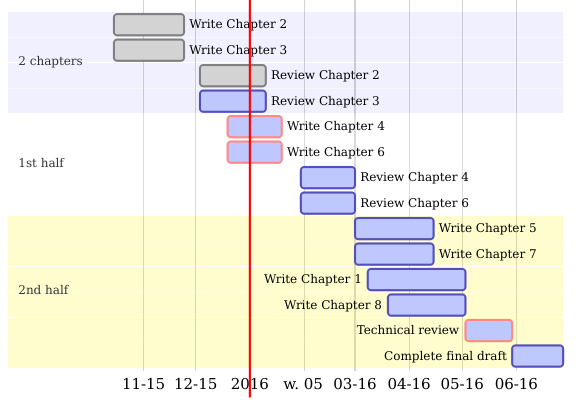

<link rel="stylesheet" type="text/css" href="style.css">
<script type="text/javascript" async
src="https://cdn.mathjax.org/mathjax/latest/MathJax.js?config=TeX-MML-AM_CHTML">
</script>

# Efficient workflow

```{r, echo=FALSE, message=FALSE}
library("ggplot2")
library("cowplot")
library("DiagrammeR")
library("microbenchmark")
```

Efficient programming is an important and sometimes vital skill for generating the correct result, on time.
Yet coding is only one part of a wider skillset needed for successful project outcomes which involve R programming. 
In this context we define 'workflow' as the sum of practices, habits and systems that enable productivity.^[The Oxford Dictionary's
definition of workflow is similar, with a more industrial feel: "The sequence of industrial, administrative, or other processes through which a piece of work passes from initiation to completion."
]
To some extent workflow is about personal preferences.
Everyone's mind works differently so the most appropriate workflow varies from person to person and from one project to the next.
We recommend trying different working practices to discover which works best for you.^[The
importance of workflow has not gone unnoticed by the R community and there are a number of different suggestions to boost R productivity.
[Rob Hyndman](http://robjhyndman.com/hyndsight/workflow-in-r/), for example, advocates the strategy of using four self-contained scripts to break up R work into manageable chunks: `load.R`, `clean.R`, `func.R` and `do.R`.
]

There are, however, concrete steps that can be taken to improve workflow in most projects that involve R programming.
Learning them will, in the long-run, improve productivity and reproducibility.
With these motivations in mind, the purpose of this chapter is simple: to highlight some key ingredients of an efficient R workflow.
It builds on the concept of an R/RStudio *project*, introduced in Chapter 2, and is ordered chronologically throughout the stages involved in a typical project's lifespan, from its inception to publication:

 - Project planning. This should happen before any code has been written, to avoid time wasted using poor packages or a mistaken analysis strategy.
 
 - Package selection. After planning your project you should identify which packages are most suitable to get the work done quickly and effectively. With the burgeoning number of packages available, and the phenomenon that some R packages now perform better than base R for certain functions (`*_join`, for example, is better than `merge`).

 - Importing data. This can depend on external packages and represent a time-consuming and computational bottle-neck that prevents progress.
 
 - Tidying the data. This critical stage results in datasets that are convenient for analysis and processing, with implications for the efficiency of all subsequent stages [@Wickham_2014].
 
 - Data processing. This stage involves manipulating data to assist in the answering of hypotheses. The focus is on the **dplyr** and **data.table** packages. These are designed to make this stage both fast to type process.

 - Publication. This final stage is relevant if you want your R code to be useful for others in the long term. To this end Section \@ref(publication) touches on documentation using knitr and the much stricter approach to code publication of package development. 
 
## Project planning

Good programmers embarking on a complex project will rarely just start typing code. Instead, they will plan the steps needed to complete the task as efficiently as possible: "smart preparation minimizes work" [@berkun2005art].
Although search engines are useful for identifying the appropriate strategy, the trail-and-error approach --- typing code at random and Googling the inevitable error messages --- is usually highly *inefficient*. Strategic thinking is necessary.

Often the best place to start is often with a pen and paper.
Project planning is a non-linear, open-ended and creative process not always well-suited to the linear logic of computing.^[A
number of programs have been developed to assist project management and planning, however. These include [ProjectLibre](http://sourceforge.net/projects/projectlibre/) and [GanttProject](http://sourceforge.net/projects/projectlibre/).
]
Planning simply involves thinking about the project's aims in the context of available resources (e.g. computational vs programming skill), the project's scope, timelines and suitable software (i.e. R packages, covered in the next section).
Minutes spent before a single line of code is written have the potential to save hours later on. There are many excellent guides available that will help you develop a project plan.

Once a project overview has been devised and stored, in mind (for small projects, if you trust that as storage medium!) or written, a plan with a time-line can be drawn-up.
The up-to-date visualisation of this plan can be a powerful reminder to yourself and collaborators of progress on the project so far. More importantly the timeline provides an overview of what needs to be done next.
Setting start dates and deadlines for each task will help prioritise the work and ensure you are on track.
Breaking a large project into smaller chunks is highly recommended, making huge, complex tasks more achievable and modular @PMBoK_2000.
'Chunking' the work will also make collaboration easier, as we shall see in Chapter 5.

```{r phases, echo=FALSE, fig.height=3, fig.cap="Schematic illustrations of key project phases and levels of activity over time, based on @PMBoK_2000."}
x = seq(0, 1, length.out=100)
df <- rbind(
  data.frame(
    Phase = "Planning",
    Time = dbeta(x, 2, 6),
    x
  ),
  data.frame(
    Phase = "Programming",
    Time = dbeta(x, 2, 2) + 0.2,
    x
  ),
  data.frame(
    Phase = "Write-up",
    Time = dbeta(x, 6, 2) + 0.4,
    x
  )
)
m <- ggplot(df, aes(x, Time)) + 
  geom_line(aes(color=Phase)) + xlab("Time")
m + 
  theme(axis.text = element_blank(),
        axis.ticks = element_blank(),
        legend.position = "top") +
  ylab("Level of Activity")  +
  scale_color_discrete(name = "Phase: ")
```

The tasks that a project should be split into will depend the nature of the work and the phases illustrated in Figure \@ref(fig:phases) represent a rough starting point, not a template and the 'programming' phase will usually need to be split into at least 'data tidying', 'processing', and 'visualisation'.

A more rigorous (but potentially onerous) way to project plan is to divide the work into a series of objectives and tracking their progress throughout the project's duration.
One way to check if an objective is appropriate for action and review is by using the SMART criteria.

- Specific: is the objective clearly defined and self-contained?
- Measurable: is there a clear indication of its completion?
- Attainable: can the target be achieved?
- Realistic: have sufficient resources been allocated to the task?
- Time-bound: is there an associated completion date or milestone?

If the answer to each of these questions is 'yes', the task is likely to be suitable to include in the project's plan.
Note that this does not mean all project plans need to be uniform.
A project plan can take many forms, including a short document, a Gantt chart
(see Figure \@ref(fig:timeline) or simply a clear vision of the project's steps in mind.

```{r timeline, echo=FALSE, fig.cap="A Gantt chart created using DiagrammeR illustrating the steps needed to complete this book at an early stage of its development."}

```

```{r, echo=FALSE, eval=FALSE}
# Code to create DiagrammeR Gantt chart for the book
# install.packages("DiagrammeR")
mermaid("gantt
        dateFormat  YYYY-MM-DD

        section 2 chapters
        Write Chapter 2           :done,    des1, 2015-10-15,2015-11-24
        Write Chapter 3           :done,    des2, 2015-10-15,2015-11-24
        Review Chapter 2          :done,  des3, 2015-12-03,2016-01-10
        Review Chapter 3          :active,  des4, 2015-12-03,2016-01-10

        section 1st half
        Write Chapter 4          :crit, active, 2015-12-19,2016-01-19
        Write Chapter 6          :crit, active, 2015-12-19,2016-01-19
        Review Chapter 4          :active, 2016-01-30,2016-03-01
        Review Chapter 6          :active, 2016-01-30,2016-03-01

        section 2nd half
        Write Chapter 5               :active, a1, 2016-03-01,2016-04-15
        Write Chapter 7               :active, a1, 2016-03-01,2016-04-15
        Write Chapter 1               :active, a1, 2016-03-08,2016-05-03
        Write Chapter 8               :active, c8, 2016-03-20,2016-05-03
        Technical review              :crit, active, a1, 2016-05-03,2016-05-30
        Complete final draft          :active, c8, 2016-05-30,2016-06-28
")
```

A number of R packages can assist with this process of formalising and visualising the project plan, including:^[For
a more comprehensive discussion of Gantt charts in R,
please refer to [stackoverflow.com/questions/3550341](http://stackoverflow.com/questions/3550341/gantt-charts-with-r).]

- [plan](https://cran.r-project.org/web/packages/plan/) provides basic tools to create burndown charts (which concisely show whether a project is on-time or not) and Gantt charts.

- [plotrix](https://cran.r-project.org/web/packages/plotrix/index.html), a general purpose plotting package, provides basic Gantt chart plotting functionality. See `example(gantt.chart)` for details.

- [DiagrammeR](http://rich-iannone.github.io/DiagrammeR/), a new package for creating network graphs and other schematic diagrams in R. This package provides an R interface to simple flow-chart file formats such as [mermaid](https://github.com/knsv/mermaid) and [GraphViz](https://github.com/ellson/graphviz).

The small example below (which provides the basis for creating charts like Figure \@ref(fig:timeline) illustrates how DiagrammeR can take simple text inputs to create informative up-to-date Gantt charts.
Such charts can greatly help with the planning and task management of long and complex R projects, as long as they do not take away valuable programming time from core project objectives.

```{r, eval=FALSE}
library("DiagrammeR") # load the necessary package

# define the Gantt chart and plot the result (not shown)
mermaid("gantt
        Section Initiation
        Planning           :a1, 2016-01-01, 10d
        Data processing    :after a1  , 30d")
```

In the above code `gantt` defines the subsequent data layout.
`Section` refers to the project's section (useful for large projects, with milestones) and each new line refers to a discrete task.
`Planning`, for example, has the code `a`, begins on the first day of 2016 and lasts for 10 days. See [knsv.github.io/mermaid/gantt.html](http://knsv.github.io/mermaid/gantt.html)
for more detailed documentation.

### Exercises

1. What are the three most important work 'chunks' of your current R project?

1. What is the meaning of 'SMART' objectives?

1. Run the code chunk at the end of this section to see the output.

1. Bonus exercise: modify the code to create a very basic Gantt chart of an R project you are working on.

## Package selection

A good example of the importance of prior planning to minimise effort is package selection.
An inefficient, poorly supported or simply outdated package can waste hours.
When a more appropriate alternative is available this waste can be prevented by prior planning.
There are many poor packages on CRAN and much duplication so it's easy to go wrong.
Just because a certain package *can* solve a particular problem, doesn't mean that it *should*.

However, used well, packages can greatly improve productivity.
Due to the conservative nature base R development, which prioritises stability, much of the innovation and performance gains in the 'R ecosystem' has occured in recent years in the packages.
The increased ease of package development [@Wickham_2015] and interfacing with other languages [e.g. @Eddelbuettel_2011] has accelerated their number, quality and efficiency.
An additional factor has been the growth in collaboration and peer review in package development, driven by code-sharing websites such as GitHub and online communities such as [ROpenSci](https://ropensci.org/) for peer reviewing code.

Performance, stability and ease of use should be high on the priority list when choosing which package to use.
Another more subtle factor is that some packages work better together than others.
The 'R package ecosystem' is composed of interrelated package.
Knowing something of these inter-dependencies can help select a 'package suite' when the project demands a number of diverse yet interrelated programming tasks.
The 'hadleyverse', for example, contains many interrelated packages that work well together, such as `readr`, `tidyr`, and `dplyr`.^[An excellent overview of the 'hadleyverse' and its benefits is available from [barryrowlingson.github.io/hadleyverse](https://barryrowlingson.github.io/hadleyverse).]
These may be used together to read-in, tidy and then process the data, as outlined in the subsequent sections.

There is no 'hard and fast' rule about which package you should use and new packages are emerging all the time.
The ultimate test will be empirical evidence:
does it get the job done on your data?
However, the following criteria should provide a good indication of whether a package is worth an investment of your precious time, or even installing on your computer:

- Is it mature? The more time a package is available, the more time it will have for obvious bugs to be ironed out. The age of a package on CRAN can be seen from its Archive page on CRAN. We can see from [cran.r-project.org/src/contrib/Archive/ggplot2/](https://cran.r-project.org/src/contrib/Archive/ggplot2/), for example, that ggplot2 was first released on the 10^th^ June 2007 and that it has had 28 releases.
The most recent of these at the time of writing was ggplot2 2.0.0:
reaching 1 or 2 in the first digit of package versions is usually an indication from the package author that the package has reached a high level of stability.

- Is it actively developed? It is a good sign if packages are frequently updated. A frequently updated package will have its latest version 'published' recently on CRAN. The CRAN package page for ggplot2, for example, said `Published: 2015-12-18`, less than a month old at the time of writing.

- Is it well documented? This is not only an indication of how much thought, care and attention has gone into the package. It also has a direct impact on its ease of use. Using a poorly documentated package can be inefficient due to the hours spent trying to work out how to use it! To check if the package is well documented, look at the help pages associated with its key functions (e.g. `?ggplot`), try the examples (e.g. `example(ggplot)`) and search for package vignettes (e.g. `vignette(package = "ggplot2")`).

- Is it well used? This can be seen by searching for the package name online. Most packages that have a strong user base will produce thousands of results when typed into a generic search engine such as Google's. More specific (and potentially useful) indications of use will narrow down the search to particular users. A package widely used by the programming community will likely visible GitHub. At the time of writing a search for [`ggplot2`](https://github.com/search?utf8=%E2%9C%93&q=ggplot2) on GitHub yielded over 400 repositories and almost 200,000 matches in committed code!
Likewise, a package that has been adopted for use in academia will tend to be mentioned in Google Scholar (again, ggplot2 scores extremely well in this measure, with over 5000 hits).

An article in [simplystats](http://simplystatistics.org/2015/11/06/how-i-decide-when-to-trust-an-r-package/) discusses this issue with reference to the proliferation of GitHub packages (those that are not available on CRAN). In this context well-regarded and experienced package creators and 'indirect data' such as amount of GitHub activity are also highlighted as reasons to trust a package.

## Importing data

Before reading in data, it is worth considering a general principle for reproducible data management: never modify raw data files. Raw data should be seen as read-only, and contain information about its provenance. Keeping the original file name and including a comment about its origin are a couple of ways to improve reproducibility, even when the data are not publicly available. This is illustrated below with functions
`download.file`^[Since
R 3.2.3 the base function `download.file()` can be used to download from secure (`https://`) connections on any operating system.
]
and `unzip` to download and unzip the
dataset,^[This
is a multi-table dataset on shipping records used with permission from the CWI Database Architectures Group and described more fully at [monetdb.org](https://www.monetdb.org/Documentation/UserGuide/MonetDB-R).
]
illustrating how R can be used to automate processes that are conventionally done by hand. The result is data stored in the `data` directory ready to be read-in (note the data is also provided in the efficient package).

```{r, eval=FALSE}
url <- "https://www.monetdb.org/sites/default/files/voc_tsvs.zip"
download.file(url, "voc_tsvs.zip") # download file
unzip("voc_tsvs.zip", exdir = "data") # unzip files
file.remove("voc_tsvs.zip") # tidy up by removing he zip file
```

To avoid the file download stage, many functions for reading in data can accept urls and read directly from the internet. This is illustrated below for `read.csv()`:

```{r, eval=FALSE}
url <- "https://www.osha.gov/dep/fatcat/FatalitiesFY10.csv"
df <- read.csv(url)
```

There are now many R packages designed specifically to assist with the download and import of data. The organisation [ROpenSci](https://ropensci.org/) supports a number of these.
The example below illustrates this using the WDI package (not supported by ROpenSci) which accesses the World Bank's World Development Indicators:

```{r, eval=FALSE}
library("WDI") # load the WDI library (must be installed)
WDIsearch("CO2") # search for data on a topic
df <- WDI(indicator = "EN.CO2.TRAN.ZS" ) # import data
```

There will be situations where you cannot download the data directly or when the data cannot be made available. In this case, simply providing a comment relating to the data's origin (e.g. `# Downloaded from http://example.com`) before referring to the dataset can greatly improve the utility of the code to yourself and others. 

```{r, eval=FALSE, echo=FALSE}
# Not shown as a distraction (RL)
# download data from nasa, as described here:
# http://disc.sci.gsfc.nasa.gov/recipes/?q=recipes/How-to-Read-Data-in-netCDF-Format-with-R
library("raster") # requires the ncdf4 package to be installed
r <- raster("data/nc_3B42.20060101.03.7A.HDF.Z.ncml.nc")
```

### Fast data reading

There is often more than one way to read data into R. Even a simple `.csv` file can be imported using a range of methods, with implications for computational efficiency. This section looks at three approaches: base R's reading functions such as `read.csv`, which are derived from `read.table`; the data.table approach, which uses the function `fread`; and the new `readr` package which provides `read_csv` and other `read_` functions such as `read_tsv`.

Although this section is focussed on reading text files, it demonstrate the wider principle that the speed and flexibility advantages of additional read functions can be offset by the disadvantages of addition package dependency (in terms of complexity and maintaining the code) for small datasets. The real benefits kick in on large datasets. Of course, there are some data types that *require* a certain package to load in R: the readstata13 package, for example, was developed solely to read in `.dta` files generated by versions of Stata 13 and above.

Figure \@ref(fig:readr-vs-base) demonstrates that the relative performance gains of the data.table readr approaches increase with data size, especially so for data with many rows. Below around 1 MB `read.csv` is actually *faster* than `read_csv` while `fread` is much faster than both, although these savings are likely to be inconsequential for such small datasets.

For files beyond 100 MB in size `fread` and `read_csv` can be expected to be around *5 times faster* than `read.csv`. This efficiency gain may be inconsequential for a one-off file of 100 MB running on a fast computer (which still take less than a minute with `read.csv`), but could represent an important speed-up if you frequently load large text files. 

```{r, eval=FALSE, echo=FALSE}
rows <- 10^(seq(3,7, length.out = 20))
cols <- 2 * 10^(0:2)
res <- NULL
for(i in seq_along(rows)) {
  for(j in seq_along(cols)) {
    no_of_rows = floor(rows[i]/(10^(j-1)))
    m = matrix(runif(no_of_rows * cols[j]), nrow = no_of_rows, ncol = cols[j])
    fname <- tempfile()
    write.csv(m, file = fname, row.names = FALSE)
    mb = microbenchmark(times = 1,
                base_default = read.csv(fname),
                readr_default = read_csv(fname), 
                base_numeric = read.csv(fname, colClasses = rep("numeric", cols[j])), 
                readr_double = read_csv(fname, col_types = 
                                          paste(replicate(cols[j], "d"), collapse = "")),
                fread_default = fread(fname),
                fread_numeric = fread(fname, colClasses = rep("numeric", cols[j]))
                )

    tab = tapply(mb$time/1000, mb$expr, mean)
    res_tmp = data.frame(exp = names(tab),
                         time = as.vector(tab), rows = no_of_rows,
                         cols = cols[j], MB = file.size(fname) / 1000000)
    res <- rbind(res, res_tmp)
  }
  message(i)
}

# Plot the result
res$cells <- res$rows * res$cols
res$Time <- NA
head(res)
for(i in res$cells){
  sel <- res$cells == i
  res$Time[sel] <- res$time[sel] / min(res$time[sel])
}
i
library(ggplot2)
res$facet_cols = paste("No of columns:", res$cols)
saveRDS(res, "data/res.Rds")
```

```{r readr-vs-base, fig.cap="Benchmarks of base vs data.table vs readr functions for reading csv files. The facets ranging from 2 to 200 represent the number of columns.", echo=FALSE}
res <- readRDS("data/res.Rds")
ggplot(res, aes(MB, Time)) + 
  geom_line(aes(colour = exp)) + facet_wrap(~ facet_cols) +
  scale_x_log10() + 
  xlab("Size (MB)") + 
  geom_vline(xintercept = 1) + ylim(c(0, 10)) + ylab("Relative time")
```

When tested on a large (4 GB) .csv file it was found that `fread` and `read_csv` were almost identical in load times and that `read.csv` took around 5 times longer. This consumed more than 10 GB of RAM, making it unsuitable to run on many computers (see Section \@ref(memoryXXX) for more on memory). Note that both readr and base methods can be made faster by pre-specifying the column types at the outset, as illustrated in \@ref(fig:readr-vs-base) and described in the help files.

```{r, eval=FALSE, echo=FALSE}
# This script illustrates the download and processing of a massive (~4 Gb) csv file
# Aim is to test read times on large datasets
url <- "http://download.cms.gov/nppes/NPPES_Data_Dissemination_Aug_2015.zip"

# download a large dataset - don't run
download.file(url, "data/largefile.zip")
# unzip the compressed file, measure time
system.time( 
  unzip("data/largefile.zip", exdir = "data")
  )
##    user  system elapsed 
##  34.380  22.428 193.145

bigfile <- "data/npidata_20050523-20150809.csv"
file.info(bigfile) # file info (not all shown)
##       size: 5647444347

system.time(df1 <- read.csv(bigfile))
system.time(df2 <- fread(bigfile))
system.time(df3 <- read_csv(bigfile))
## Error (from 32 bit machine): cannot allocate vector of 32.0 Mb
```


<!-- Idea: test the functions on text data -->

It is important to be aware that in many cases a compromise must be struck between speed and robustness. This is illustrated below with reference to differences in how readr and base R approaches handle unexpected values.

```{r, warning=FALSE}
library("readr")
fname <- system.file("extdata/voc_voyages.tsv", package = "efficient")
microbenchmark(times = 10,
  base_read = df3 <- read.csv(fname, sep = "\t"),
  readr_read = df4 <- read_tsv(fname))
```

In this case `read_tsv` is around 3 times faster, illustrating that the benefits of efficient read functions scale with dataset size: the relative speed increases to more than a factor of 5 for 1 GB files.
Note that readr generates a warning for row 2841 in the `built` variable.
This is because `readr()` decides what class each variable is based on the first 1000 rows, rather than all rows as base `read.*` functions do.
As illustrated by printing the result for the row which generated a warning, the `read_tsv` output is probably more sensible than the `read.csv` output: the latter coerced the date field into a factor based on a single entry which is a text whereas the latter coerced the variable into a numeric data, as illustrated below.

```{r}
class(df3$built) # coerced to a factor
class(df4$built) # numeric based on first 1000 rows
df3$built[2841] # contains the text responsible for coercion
df4$built[2841] # an NA: text cannot be converted to numeric
```

```{r, eval=FALSE, tidy=FALSE, echo=FALSE}
# I've removed this for now as it's such a large and unwieldy dataset
url <- "http://download.cms.gov/nppes/NPPES_Data_Dissemination_Aug_2015.zip"
download.file(url, "largefile.zip") # takes many minutes
unzip("largefile.zip", exdir = "data") # many minutes
bigfile <- "npidata_20050523-20150809.csv"
file.info(bigfile) # file info (4 GB+)
# split -b1000m npidata_20050523-20150809.csv # original command commented out
```

Apart from being faster and slightly less robust (coercing the data based on the 1st 1000 rows), `read_*` functions also differ subtley from `read.*` functions in terms of the data that they generate: `read_*` generates an object of `tbl_df` format, which is an extension of the base class `data.frame`, as discussed in Section  \@ref(dplyr).

### Preprocessing outside R

There are circumstances when datasets become too large to read directly into R.
Reading in 4 GB text file using the functions tested above, for example, consumed all available RAM on an 16 GB machine!
To overcome the limitation that R reads all data directly into RAM, we can use external *stream processing* tools to interact with large text files such as the `npidata` file.
The following command, using the shell command `split`, for example, would break a large multi GB file many one GB chunks, each of which is more maneageble for R:

```{r, engine='bash', eval=FALSE}
split -b1000m bigfile.csv
```

The result is a series of files called `xaa`, `xab`etc, which allow them to be read into R using `read.csv` and `read_csv`, without crashing most modern computers.
Using a test dataset, reading-in the 1 GB file `xaa` using the function `read_csv` was found to be more than 5 times faster than `read.csv` on 4th Generation Pentium maching (30 seconds vs almost 3 minutes).

```{r bigfile-read, eval=FALSE, echo=FALSE}
# Not printed as it assumes split has been run
system.time(df3 <- read.csv("xaa"))
system.time(df4 <- read_csv("xaa"))
```

Splitting a large file into individual chunks may allow it to be read into R *one chunk at a time*.
But is not an efficient way to import large datasets because you will only ever have access to a non-random sample of the data this way.
A more efficient way to work with very large datasets is via databases.

### Working with databases

Insead of loading all the data into RAM, as R does, databases query data from the hard-disk. This can allow a subset of a very large dataset to be defined and read into R quickly, without having to load it first.

R can connect to databases in a number of ways. The most mature of these is via the RODBC package, which sets up links to external databases using the Open Database Connectivity (ODBC) API, as described in the packages vignette (which can be accessed with `vignette("RODBC")`, once the package has been installed).
RODBC connects to 'traditional' databases such as MySQL, PostgreSQL, Oracle and SQLite.

The function used to set-up a connection to an external database with RODBC is `odbcConnect`, which takes Data Source Name (`dsn =`), User ID (`uid =`) and passwork (`pwd`) as required arguments.
Be sure never to release your password by entering it directly into the command. Instead, we recommend saving sensitive information such as database passwords and API keys in `.Renviron`, described in \@ref(renviron).
Assuming you had saved your password as the environment variable `PSWRD`, you could enter `pwd = Sys.getenv("PSWRD")` to minimise the risk of exposing your password through accidentally releasing the code or your session history.

Recently there has been a shift 'noSQL' approach to data storage for handling large datasets.
This is illustrated by the emergence and uptake of software such as MongoDB and Apache Cassandra, which have R interaces via packages [mongolite](https://cran.r-project.org/web/packages/mongolite/index.html) and [RJDBC](https://cran.r-project.org/web/packages/RJDBC/index.html), which can connect to Apache Cassandra data stores and any source complient with the Java Database Connectivity (JDBC) API.

MonetDB is a recent alternative to traditional and noSQL approaches which offers substantial efficiency advantages for handling large datasets [@kersten2011researcher].
A tutorial on the [MonetDB website](https://www.monetdb.org/Documentation/UserGuide/MonetDB-R) provides an excellent introduction to handling databases from within R. A new development showcased in this tutorial is the ability to interact with databases using exactly the same syntax used to interact with R objects stored in RAM. This innovation was made possible by dplyr, an R library for data processing that aims to provide a unified 'front end' to perform a wide range of analysis task on datasets using a variety of 'back ends' which do the number crunching. This is one of the main advantages of dplyr over the data.table, both of which are covered in \@ref(data-processing).

## Tidying data with tidyr

A key skill in data analysis is understanding the 'shape' of datasets and being able to 'reshape' them. This is also important from a programming efficiency perspective: more than half of a data analyst's time can be spent re-formatting datasets [@Wickham_2014]. In some projects the analysis and modelling phases seem like the easy part! This section is motivated by this observation.

An example of the various shapes that the same datasets can assume is provided by @Wickham_2014 and illustrated in Tables \@ref(tab:tpew) and \@ref(tab:tpewt).

```{r, echo=FALSE, eval=FALSE}
# Download data from its original source - an academic paper
downloader::download("http://www.jstatsoft.org/v59/i10/supp/4", destfile = "v59i10-data.zip")
# The source code associated with the paper
downloader::download("http://www.jstatsoft.org/v59/i10/supp/3", destfile = "data/reshape/v59i10.R")
# After running the R script...
dir.create("data/reshape")
unzip("v59i10-data.zip", exdir = "data/reshape/")
# write.csv(raw, "data/reshape-pew.csv")
```

```{r tpew, echo=FALSE}
# generate pew dataset
raw <- read_csv("data/reshape-pew.csv")
raw <- raw[-c(1,ncol(raw))] # remove excess cols
names(raw) <- c("religion", "<$10k", "$10--20k", "$20--30k", "$30--40k", "$40--50k",
"$50--75k", "$75--100k", "$100--150k", ">150k")
# write_csv(raw, "data/pew.csv")
knitr::kable(raw[1:3,1:4], caption = "First 6 rows of the aggregated 'pew' dataset from Wickham (2014a) in an 'untidy' form.")
```

```{r tpewt, echo=FALSE}
library(tidyr)
rawt <- gather(raw, Income, Count, -religion)
rawt$Count <- as.character(rawt$Count)
rawt$Income <- as.character(rawt$Income)
rawtp <- rawt[c(1:3, nrow(rawt)),]

insertRow <- function(existingDF, newrow, r) {
  existingDF[seq(r+1,nrow(existingDF)+1),] <- existingDF[seq(r,nrow(existingDF)),]
  existingDF[r,] <- newrow
  existingDF
}

rawtp <- insertRow(existingDF = rawtp, newrow = rep("...", 3), r = 4)
knitr::kable(rawtp, caption = "First 3 and last rows of the 'tidied' Pew dataset.")
```

These tables may look very different, but they contain precisely the same data.
They have been reshaped, such that column names in the 'flat' form in Table \@ref(tab:tpew) became a new variable in the 'long' form in Table \@ref(tab:tpewt).
According to the concept of 'tidy data', the long form is correct.
Note that 'correct' here is used in the context of data analysis and graphical visualisation.
For tabular presentation (i.e. tables) the 'wide' or 'untidy' form may be better.

Tidy data has the following characteristics [@Wickham_2014]:

1. Each variable forms a column.
2. Each observation forms a row.
3. Each type of observational unit forms a table.

Because there is only one observational unit in the example (religions), it can be described in a single table.
Large and complex datasets are usually represented by multiple tables, with unique identifiers or 'keys' to join them together [@Codd1979].
Being able to manipulate your data into a tidy and relational form is important for Big Data work because this form minimises data duplication and facilitates fast
code.^[Because
R is a vectorised language, it adept at handling long 1 dimensional vectors but less so at handling many interrelated
columns.]
Due to the importance of tidying data, an entire package, aptly named **tidyr** has been developed for the purpose.
Two common operations needed to tidy datasets are reshaping and splitting.
Each of these has its own **tidyr** function:

- 'Wide' tables can become 'long', so that column names become a new variable. This is illustrated in Table \@ref(tab:tpew) and Table \@ref(tab:tpewt) and can be achieved with the function
`gather`:^[Note
that the dimensions of the data change from having 10 observations across 18 columns to 162 rows in only 3 columns.
Note that when we print the object `rawt[1:3,]`, the class of each variable is given
(`chr`, `fctr`, `int` refer to character, factor and integer classes, respectively).
This is because `read_csv` uses the `tbl` class from the **dplyr** package (described below).
]

```{r}
raw <- read_csv("data/pew.csv") # read in the 'wide' dataset
dim(raw)
rawt <- gather(raw, Income, Count, -religion)
dim(rawt)
rawt[1:3,]
```

- Splitting compound variables in two. A classic example is age-sex variables (e.g. `m0-10` and `f0-15` to represent males and females in the 0 to 10 age band). Splitting such variables can be done with `separate`, as illustrated in the difference between Table \@ref(tab:to-separate) and \@ref(tab:separated):

```{r}
agesex <- c("m0-10", "f0-10") # create compound variable
n <- c(3, 5) # create a value for each observation
df <- data.frame(agesex, n) # create a data frame
separate(df, agesex, c("sex", "age"), 1)
```

```{r to-separate, echo=FALSE}
knitr::kable(df, caption = "Joined age and sex variables in one column")
```

```{r seperated, echo=FALSE}
knitr::kable(separate(df, agesex, c("sex", "age"), 1),
             caption = "Age and sex variables separated by the funtion `separate`.")
```

Note there are other tidying operations that **tidyr** can performed in addition to the two described in this section.
These are described in the `tidy-data` vignette, which can be called by entering `vignette("tidy-data")` once the package has been installed.
Moreover, data manipulation and cleaning is a Big topic that extends beyond the **tidyr** approach and about which much has been written [e.g. @Spector2008].

### Filtering columns

Often Big Data contains much worthless or blank information.
An example of this is provided in the huge 'NPI' dataset presented in the introduction.
Being able to focus quickly only on the variables of interest becomes especially important when handling large datasets.

Imagine that the tiny subset of the 'NPI' data, created using Unix tools in [Chapter 3](#pre), is the full 5+ GB file.
We are running a machine of the future, is powerful enough to load the data in a fraction of a second, not the 15 minutes that it took a desktop in 2015.

```{r}
fname <- system.file("extdata/miniaa", package = "efficient")
df <- read_csv(fname) # load imaginary large data
dim(df)
```

Note that the data frame has 329 columns (and imagine it has 4 million+ rows as the original does).
That's a lot of variables. Do we need them all?
It's worth taking a glimpse at this dataset to find out:

```{r, eval=FALSE}
glimpse(df)
```

```
# $ NPI                   (int) 1679576722, ...
# $ Entity Type Code      (int) 1, 1, 2,    ...
# $ Replacement NPI       (lgl) NA, NA, NA, ...
# ...
```

Looking at the output, it becomes clear that the majority of the variables only contain `NA`.
To clean the giant dataset, removing the empty columns, we need to identify which these variables are.

```{r}
# Identify the variable which are all NA
all_na <- sapply(df, function(x) all(is.na(x)))
summary(all_na) # summary of the results
df <- df[!all_na] # subset the dataframe
```

The new `df` object has fewer than a third of the original columns.

> **Challenge:** find out how much space was saved by the above operation using `object.size()`

```{r, include=FALSE}
object.size(df)
object.size(read_csv(fname))
```

### Data aggregation

Data aggregation is the process of creating summaries of data based on a grouping variable.
The end result usually has the same number of rows as there are groups.
Because aggregation is a way of condensing datasets it can be a very useful technique for making sense of large datasets.
The following code finds the average emissions per country (country being the grouping variable) from the 'GHG' dataset rescued from a spreadsheet and converted into a .csv file in the previous chapter.

```{r, warning=FALSE}
fname <- system.file("extdata/ghg-ems.csv", package = "efficient")
df <- read.csv(fname)
names(df)
nrow(df)
length(unique(df$Country))
```

> **Challenge:** rename the variables 4 to 8 so they are much shorter, following the pattern `ECO2`, `MCO2` etc. That will make the code for manipulating the dataset easier to write

```{r, echo=FALSE}
names(df)[4:8] <- c("ECO2", "MCO2", "TCO2", "OCO2", "FCO2")
```

After the variable names have been updated, we can aggregate.^[Note the first argument in the function is the vector we're aiming to aggregate and the second is the grouping variable (in this case Countries).
A quirk of R is that the grouping variable must be supplied as a list.
Next we'll see a way of writing this that is neater.]

```{r}
e_ems <- aggregate(df$ECO2, list(df$Country), mean, na.rm = T)
nrow(e_ems)
```

Note that the resulting data frame has the same number of rows as there are countries:
the aggregation has successfully reduced the number of rows we need to deal with.
Now it is easier to find out per-country statistics, such as the three lowest emitters from electricity production:

```{r}
head(e_ems[order(e_ems$x),], 3)
```

Another way to specify the `by` argument is with the tilde (`~`).
The following command creates the same object as `e_ems`, but with less typing.

```{r}
e_ems <- aggregate(ECO2 ~ Country, df, mean, na.rm = T)
```

The final way to aggregate the dataset uses a totally different syntax, from the **dplyr** package.
Without worrying exactly how it works (this is described in the next section), try the following.

```{r, message=FALSE}
library(dplyr)
group_by(df, Country) %>%
  summarise(mean_eco2 =mean(ECO2, na.rm = T))
```

## Data processing {#dplyr}

This section demonstrates the unique syntax of the dplyr package for data processing.
dplyr has a number of key features that sets it apart from functions for data processing in base R and in the package `data.table`:

**dplyr** has been designed to make data analysis
fast and intuitive.
**dplyr** works best with tidy data, as described above.
Indeed, the two packages were designed to work closely together: **tidyr** creates tidy datasets, **dplyr** analyses
them.^[As
an interesting aside, **dplyr** works perfectly on `data.frames` but its default object is the `tbl`, which
is identical to a `data.frame` but prints
objects a useful glimpse of the dataset, rather than the whole thing.]

```{r, message=FALSE, results='hide'}
library(readr)
fname <- system.file("extdata/world-bank-ineq.csv", package = "efficient")
idata <- read_csv(fname)
idata # print the dataset in the dplyr way
```

**dplyr** is much faster than base implementations of various
operations, but it has the potential to be even faster, as
*parallelisation* is
[planned](https://github.com/hadley/dplyr/issues/145).

You should not be expecting to learn the **dplyr** package in one sitting:
the package is large and can be seen as
an entirely new language, to supplement R's,
in its own right. Following the 'walk before you run' principle,
we'll start simple, by replicating the subsetting
and grouping operations undertaken in base R above.

First, we'll do a little 'data carpentry', and rename the first column using the extremely useful **dplyr** function
`rename()`.^[Note
in this code block the variable name is surrounded by back-quotes (`).
This allows R to refer to column names that are non-standard.
Note also the syntax:
`rename` takes the `data.frame` as the first object and then creates new variables by specifying `new_variable_name = original_name`.]

```{r}
idata <- rename(idata, Country = `Country Name`)
```

The standard way to subset data by rows in R is with square brackets, for example:

```{r}
aus1 <- idata[idata$Country == "Australia",]
```

**dplyr** offers an alternative and more flexible way of filtering data, using `filter()`.

```{r}
aus2 <- filter(idata, Country == "Australia")
```

Note that we did not need to use the `$` to tell R
that `Country` is a variable of the `idata` object.
Because `idata` was the first argument, **dplyr** 'knew'
that any subsequent names would be variables.^[Note that this syntax is a defining feature of **dplyr**
and many of its functions work in the same way.
Later we'll learn how this syntax can be used alongside the `%>%` 'pipe' command to write clear data manipulation commands.
] 

The **dplyr** equivalent of aggregate is to use
the grouping function `group_by` in combination with
the general purpose function `summarise` (not to
be confused with `summary` in base R).

```{r}
names(idata)[5:9] <-
  c("top10", "bot10", "gini", "b40_cons", "gdp_percap")
```

The *class* of R objects is critical to how it performs.
If a class is incorrectly specified (if numbers are treated
as factors, for example), R will likely generate error messages.
Try typing `mean(idata$gini)`, for example.

We can re-assign the classes of the numeric variables
one-by one:

```{r}
idata$gini <- as.numeric(as.character(idata$gini))
mean(idata$gini, na.rm = TRUE) # now the mean is calculated
```

However, the purpose of programming languages is to *automate*
arduous tasks and reduce typing. The following command
re-classifies all of the numeric variables using
the `apply` function (we'll seem more of `apply`'s relatives
later):

```{r, warning=FALSE}
idata[5:9] <- apply(idata[5:9], 2,
  function(x) as.numeric(as.character(x)))
```

```{r}
countries <- group_by(idata, Country)
summarise(countries, gini = mean(gini, na.rm = T))
```

Note that `summarise` is highly versatile, and can
be used to return a customised range of summary statistics:

```{r tidy=FALSE}
summarise(countries,
  # number of rows per country
  obs = n(), 
  med_t10 = median(top10, na.rm = T),
  # standard deviation
  sdev = sd(gini, na.rm = T), 
  # number with gini > 30
  n30 = sum(gini > 30, na.rm = T), 
  sdn30 = sd(gini[ gini > 30 ], na.rm = T),
  # range
  dif = max(gini, na.rm = T) - min(gini, na.rm = T)
  )
```

To showcase the power of `summarise` used on
a `grouped_df`, the
above code reports a wide range of customised
summary statistics
*per country*: 

- the number of rows in each country group
- standard deviation of gini indices
- median proportion of income earned by the top 10%
- the number of years in which the gini index was greater than 30
- the standard deviation of gini index values over 30
- the range of gini index values reported for each country.

> **Challenge**: explore the **dplyr**'s documentation, starting with the introductory vignette, accessed by entering `vignette("introduction")` and test out its capabilities on the `idata` dataset. (More vignette names can be discovered by typing `vignette(package = "dplyr")`)

### Chaining operations with dplyr

Another interesting feature of **dplyr** is its ability
to chain operations together. This overcomes one of the
aesthetic issues with R code: you can end end-up with
very long commands with many functions nested inside each
other to answer relatively simple questions.

> What were, on average, the 5 most unequal
years for countries containing the letter g?

Here's how chains work to organise the analysis in a
logical step-by-step manner:

```{r tidy=FALSE}
idata %>% 
  filter(grepl("g", Country)) %>%
  group_by(Year) %>%
  summarise(gini = mean(gini, na.rm = T)) %>%
  arrange(desc(gini)) %>%
  top_n(n = 5)
```

The above function consists of 6 stages, each of which
corresponds to a new line and **dplyr** function:

1. Filter-out the countries we're interested in (any selection criteria could be used in place of `grepl("g", Country)`).
2. Group the output by year.
3. Summarise, for each year, the mean gini index.
4. Arrange the results by average gini index
5. Select only the top 5 most unequal years.

To see why this method is preferable to the nested
function approach, take a look at the latter.
Even after indenting properly it looks terrible
and is almost impossible to understand!

```{r tidy=FALSE}
top_n(
  arrange(
    summarise(
      group_by(
        filter(idata, grepl("g", Country)),
        Year),
      gini = mean(gini, na.rm = T)),
    desc(gini)),
  n = 5)
```

Of course, you *could* write code in base R to
undertake the above analysis but for many
people the **dplyr** approach is the most agreeable to write.

### data.table

Any well-informed discussion of how to speed-up data processing in R is likely to eventually touch on the dplyr vs data.table debate. It's a debate that has generated some controversey and much hot air. Before venturing into the pros and cons of each approach it's therefore worth stating that dplyr and data.table needn't be seen as mutually exclusive competitors or that one is 'better' than another: the important thing from an efficiency perspective is that both can help speed up your code. This section provides a few examples to illustrate how data.table differs and (at the risk of inflaming the debate further) some benchmarks to explore which is more efficient. As emphasised throughout the book, efficient code writing is often more important than efficient execution on many everyday tasks so to some extent it's a matter of preference.

data.table does have some unique features that make it very fast at accomplishing some tasks very efficiently that it is worth being aware of. 


## Publication

<!-- Thought: this should be more about 'getting your work out there' than packages-->

This section describes a strict approach to project management and workflow: treating your projects as R packages. This is good practice in terms of learning to correctly document your code, store example data, and even (via vignettes) ensure reproducibility. This approach to R workflow is appropriate for managing complex projects and should provide a strong foundation for generalising your code for use by others.
