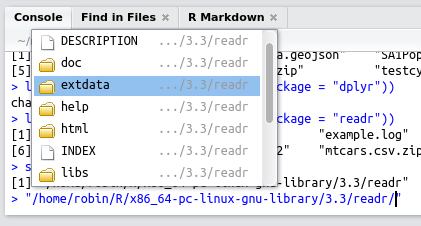

<!-- To do: -->
<!-- Talk about merge vs *_join -->
  
# Efficient data carpentry

There are many words for processing and analysing data. You can clean, hack, manipulate, munge, refine and tidy your datasets, ready for the next stage, typically modelling and visualisation. Each verb says something about perceptions towards the process: it is often seen as *dirty work*. It is often regarded as an unpleasant necesity that must be endured before the *real*, *fun* and *important* work begins. This perception of data handling is dangerous and counter-productive. For this reason we call the process the more respectable job of *data carpentry*.

Getting your data 'ship shape' is a respectable and valuable skill. Carpentry is the process of taking rough pieces of wood and working with care, dilligence and precision to create a finished product. A carpenter does not hack at the wood at random. He or she will inspect the raw material and select the right tool for the job. In the same way *data carpentry* is the process of taking rough, raw and to some extent randomly arranged input data and creating neatly organised and *tidy* data. Learning the skill of data carpentry early will yield benefits for years to come. "Give me six hours to chop down a tree and I will spend the first four sharpening the axe" as Abraham Lincoln put it, continuing the metaphor.

Data processing is a critical stage in any project involving any datasets from external sources, i.e. most real world applications. In the same way that *technical debt*, discussed in the previous Chapter, can criple your workflow, working with messy data can lead to project management hell. Poorly organised, named and formated data can cause havoc.

Fortunately, done efficiciently, at the outset of your project (rather than half way through, when it may be too late) and using appropriate tools this data processing stage can be highly rewarding. More importantly from an efficiency perspective, working with clean data will be beneficial for every subsequent stage of your R project. So, for data intensive applications, this could be the most important chapter of book. In it we cover the following topics:

- Importing data
- Working with databases
- Tidying data with **tidyr**
- Data processing with **dplyr**
- Data processing with **data.table**

## Top 5 tips for efficient data carpentry

- File format decisions can have a huge impact on the efficiency of data import and export operations. Use `.Rds` files with `readRDS` and `saveRDS` for keeping local copies of clean data.

- Tidy your data carefully at the earliest stage of the analysis process, perhaps using functions provided by **tidyr**.

- Use efficient functions for reading and writing plain text files, such as `read_csv` and `fread`, from the **readr** and **data.table** packages respectively.

- Don't rely on base R for data processing. We recommend **dplyr** for most applications, although **data.table** may be optimal in some contexts where speed is critical.

- Using the ` %>%` 'pipe' operator in combination with **dplyr**'s verbs can help clarify complex data processing workflows, easing the writing of analysis code and communication with others.

## Importing data

With the accelerating digital revolution and increasing download rates worldwide, an increasing proportion of the world's data is available online. Further, and increasing amount of data is *open access*, available to the public to download and use as they please. For these reasons we begin this section by exploring some ways to download and import data from the web. Next we briefly outline two developments for data import: the **rio** package and the `.feather` data format, which can make data import efficient from programmer and computational perspectives. The section finishes with an exploration of how functions for reading in files stored in common *plain text* file formats from the **readr** and **data.table** packages can improve load speeds when working with these files.

Before reading in a single line of data, however, it is worth considering a general principle for reproducible data management: never modify raw data files. Raw data should be seen as read-only, and contain information about its provenance. Keeping the original file name and commenting on its origin are a couple of ways to improve reproducibility, even when the data are not publicly available.

### Getting data from the internet

The code chunk below shows how the functions
`download.file`^[Since
R 3.2.3 the base function `download.file()` can be used to download from secure (`https://`) connections on any operating system.
]
and `unzip` can be used to download and unzip a dataset from the internet.
R can automate processes that are often performed manually, e.g. through the graphical user interface of a web browser, with potential advantages for reproducibility and programmer efficiency. The result is data stored neatly in the `data` directory ready to be imported. Note we deliberately kept the file name intact help with documentation, enhancing understanding of the data's *provenance*. Note also that part of the dataset is stored in the **efficient** package.

```{block, dutch-data, type='rmdnote'}
Using R for basic file management can help create a reproducible workflow, as illustrated below. The data downloaded in the following code chunk is a multi-table dataset on Dutch naval expeditions used with permission from the CWI Database Architectures Group and described more fully at [monetdb.org](https://www.monetdb.org/Documentation/UserGuide/MonetDB-R). From this dataset we primarily use the 'voyages' table with lists Dutch shipping expeditions by their date of departure.
```

```{r, eval=FALSE}
url = "https://www.monetdb.org/sites/default/files/voc_tsvs.zip"
download.file(url, "voc_tsvs.zip") # download file
unzip("voc_tsvs.zip", exdir = "data") # unzip files
file.remove("voc_tsvs.zip") # tidy up by removing the zip file
```

This workflow equally applies to downloading and loading single files. Note that one could make the code more concise by entering replacing the second line with `df = read.csv(url)`. However, we recommend downloading the file to disk so that if for some reason it fails (e.g. if you would like to skip the first few lines), you don't have to keep downloading the file over and over again. The code below downloads and loads data on atmospheric concentrations of CO2. Note that this dataset is also available from the **datasets** package.

```{r, eval=FALSE}
url = "https://vincentarelbundock.github.io/Rdatasets/csv/datasets/co2.csv"
download.file(url, "data/co2.csv")
```

```{r}
df_co2 = read.csv("data/co2.csv")
```

There are now many R packages to assist with the download and import of data. The organisation [ROpenSci](https://ropensci.org/) supports a number of these.
The example below illustrates this using the WDI package (not supported by ROpenSci) which accesses the World Bank's World Development Indicators:

```{r, eval=FALSE}
library("WDI") # load the WDI library (must be installed)
WDIsearch("CO2") # search for data on a topic
df = WDI(indicator = "EN.CO2.TRAN.ZS") # import data
```

There will be situations where you cannot download the data directly or when the data cannot be made available. In this case, simply providing a comment relating to the data's origin (e.g. `# Downloaded from http://example.com`) before referring to the dataset can greatly improve the utility of the code to yourself and others. 

```{r, eval=FALSE, echo=FALSE}
# Not shown as a distraction (RL)
# download data from nasa, as described here:
# http://disc.sci.gsfc.nasa.gov/recipes/?q=recipes/How-to-Read-Data-in-netCDF-Format-with-R
library("raster") # requires the ncdf4 package to be installed
r = raster("data/nc_3B42.20060101.03.7A.HDF.Z.ncml.nc")
```

### Versatile data import with rio

**rio** is is a 'A Swiss-Army Knife for Data I/O', providing easy-to-use and highly performant wrapper functions for importing a range of file formats. At the time of writing, these include `.csv`, `.feather`, `.json`, `.dta`, `.xls`, `.xlsx` and Google Sheets (see the package's [github page](https://github.com/leeper/rio) for up-to-date information). Below we illustrate three of **rio**'s key functions.

```{r, eval=FALSE}
library(rio)

# Specify a file
fname = system.file("extdata/voc_voyages.tsv", package = "efficient")

# Import the file (uses the fread function from data.table)
df = import(fname)

# Export the file as an Excel spreadsheet
export(df, "output.xlsx")
```

```{block, json, type='rmdtip'}
The ability to import and use `.json` data is becoming increasingly common as it a standard output format for many APIs and the **jsonlite** and **geojsonio** packages have been developed to make this as easy as possible.
```

#### Exercises {-}

The final line in the code chunk above shows a neat feature of **rio** and some other packages: the output format is determined by the suffix of the filename, which make for concise code. Try opening the `output.xlsx` file with an editor such as LibreOffice Calc or Microsoft Excel to ensure that the export worked, before removing this rather inefficient and non-secure file format from your system to preserve precious disk space:

```{r}
file.remove("output.xlsx")
```

### Accessing data stored in packages

Most well documented packages provide some example data for you to play with. This can help demonstrate use cases in specific domains, that uses a particular data format. The command `data(package = "package_name")` will show the datasets in a package. Datasets provided by **dplyr**, for example, can be viewed with `data(package = "dplyr")`.

Raw data (i.e. data which has not been converted into R's native `.Rds` format) is usually located with the subfolder `extdata` in R (which corresponds to `inst/extdata` when developing packages. The function `system.file` outputs file paths associated with specific packages. To see all of the external files within the **readr** package, for example, one could use the following command:

```{r}
list.files(system.file("extdata", package = "readr"))
```

Further, to 'look around' to see what files are stored in a particular package, one could type the following, taking advantage of RStudio's intellisense file completion capabilities (using copy and paste to enter the file path):

```{r, eval=FALSE}
system.file(package = "readr")
#> [1] "/home/robin/R/x86_64-pc-linux-gnu-library/3.3/readr"
"/home/robin/R/x86_64-pc-linux-gnu-library/3.3/readr/"
```

Hitting `Tab` after the second command should trigger RStudio to create a miniature pop-up box listing the files within the folder, as illustrated in figure \@ref(fig:intelli).

```{r intelli, echo=FALSE, fig.cap="Discovering files in R packages using RStudio's 'intellisense'.", out.width="50%", fig.align='center'}

```


### The feather file format

Feather was developed as collaboration between R and Python developers to create a fast, light and language agnostic format for storing data frames. The code chunk below shows how it can be used to save and then re-load the `df_co2` dataset loaded previously in both R and Python:

```{r, eval=FALSE}
library("feather")
write_feather(df_co2, "data/co2.feather")
df_co2_feather = read_feather("data/co2.feather")
```

```{r, engine='python', eval=FALSE}
import feather
import feather
path = 'data/co2.feather'
df = feather.read_dataframe(path)
```

### Efficient data export: .Rdata or .Rds?

Once you have tidied you data (described in the next Section), it will hopefully be suitably ship shape to save. Beyond the raw data, which should also be saved, saving it after tidying is recommended to reduce the chance of having to run all the data cleaning code again. However, it may also make sense to save your data in a new format early on, not least because read and write speeds of proprietary formats can be very slow. A large `.shp` file, for example, can take more than ten times longer to load than a `.Rds` or `.Rdata` file.

`.Rds` and `.RData` are R's native file format. This is a binary file format optimised for speed and compression ratios. But what is the difference between them? The follow code chunk demonstrates the key difference between these two (but surprisingly little known and used) file formats that are central to the history of file import and export in R:

```{r}
save(df_co2, file = "data/co2.RData")
saveRDS(df_co2, "data/co2.Rds")
load("data/co2.RData")
df_co2_rds = readRDS("data/co2.Rds")
identical(df_co2, df_co2_rds)
```

The first method is the most widely used. It uses uses the `save` function which takes any number of R objects and writes them to a file, which must be specified by the `file =` argument. `save` is like `save.image`, which saves *all* the objects currently loaded in R.

The second method is slightly less used but we recommend it. Apart from being slightly more concise for saving single R objects, the `readRDS` function is more flexible: as shown in the subsequent line, the resulting object can be assigned to any name. In this case we called it `df_co2_rds` (which we show to be identical to `df_co2`, loaded with the `load` command) but we could have called it anything or simply printed it to the console.

Using `saveRDS` is good practice because it forces you to specify object names. If you use `save` without care, you could forget the names of the objects you saved and accidentally overwrite objects that already existed.

How space efficient are these file export methods? We can explore this question using the functions `list.files` and `file.size`, as illustrated below. The results, which also show how the *relative* space saving of native R formats increase with dataset size, are shown in Table \@ref(tab:sizes).

```{r}
files_co2 = list.files(path = "data", pattern = "co2.", full.names = TRUE)
filesize_co2 = data.frame(
  Format = gsub(pattern = "data/", replacement = "", files_co2),
  Size = file.size(files_co2) / 1000
  )
```

```{r spacebench, echo=FALSE, eval=FALSE}
filesize_co2$`Rel` = filesize_co2$Size / min(filesize_co2$Size)
filesize_co2$Size_10

for(i in 10^(1:3)){
  size_name = paste0("Size (", i, "x)")
  relsize_name = paste0("Rel (", i, "x)")
  df = do.call("rbind", replicate(i, df_co2, simplify = FALSE))
  write.csv(df, file.path(tempdir(), "co2.csv"))
  write_feather(df, file.path(tempdir(), "co2.feather"))
  save(df, file = file.path(tempdir(), "co2.RData"))
  saveRDS(df, file.path(tempdir(), "co2.Rds"))
  sizes = c(
    file.size( file.path(tempdir(), "co2.csv")),
    file.size( file.path(tempdir(), "co2.feather")),
    file.size( file.path(tempdir(), "co2.RData")),
    file.size( file.path(tempdir(), "co2.Rds"))
  )
  filesize_co2[[size_name]] = sizes / 1000
  filesize_co2[[relsize_name]] = sizes / min(sizes)
}
saveRDS(filesize_co2, "data/filesizes.Rds")
```

```{r sizes, echo=FALSE}
filesize_co2 = readRDS("data/filesizes.Rds")
knitr::kable(filesize_co2, digits = 1, row.names = FALSE, caption = "Absolute (MB) and relative (compared with the smallest size for each column) disk usage for the 3 column, 468 row 'co2' dataset, saved in different formats. Columns headed 10x, 100x and 1000x show the results for disk usage after increasing the number of rows by 10, 100 and 1000 fold respectively.")
```

The results of this simple disk usage benchmark show the advantages of saving data in a compressed binary format can be great, from hard-disk and, if your data will be shared on-line, data download time and bandwidth usage perpectives. It is striking to note that R's native formats can be **over 100 times** more space efficient than plain text (.csv) and other binary (`.feather`) formats. But how does each method compare from a computational efficiency perpective?

### A benchmark of methods for file import and export

The read and write times for the functions showcased above are presented in Table \@ref(tab:rtimes) and Table \@ref(tab:wtimes) respectively.

```{r, echo=FALSE, eval=FALSE}
# Create data frame for reporting read/write times
wtimes = data.frame(
  Function = c("write.csv", "save_feather", "save", "saveRDS"))
rtimes = rtimes = data.frame(
  Function = c("read.csv", "read_feather", "load", "readRDS"))

# Benchmark read/write times
library("microbenchmark")

for(i in 10^(0:3)){
  time_name = paste0("Time (", i, "x)")
  reltime_name = paste0("Rel (", i, "x)")
  df = do.call("rbind", replicate(i, df_co2, simplify = FALSE))
  times_w = c(
  summary(microbenchmark(write.csv(df, file.path(tempdir(), "co2.csv")),
                         unit = "ms", times = 10))$mean,
  summary(microbenchmark(write_feather(df, file.path(tempdir(), "co2.feather")),
                         unit = "ms", times = 10))$mean,
  summary(microbenchmark(save(df, file = file.path(tempdir(), "co2.RData")),
                         unit = "ms", times = 10))$mean,
  summary(microbenchmark(saveRDS(df, file.path(tempdir(), "co2.Rds")),
                         unit = "ms", times = 10))$mean
  )
  times_r = c(
  summary(microbenchmark(read.csv(file.path(tempdir(), "co2.csv")),
                         unit = "ms", times = 10))$mean,
  summary(microbenchmark(read_feather(file.path(tempdir(), "co2.feather")),
                         unit = "ms", times = 10))$mean,
  summary(microbenchmark(load(file.path(tempdir(), "co2.RData")),
                         unit = "ms", times = 10))$mean,
  summary(microbenchmark(readRDS(file.path(tempdir(), "co2.Rds")),
                         unit = "ms", times = 10))$mean
)
  wtimes[[time_name]] = times_w 
  wtimes[[reltime_name]] = times_w / min(times_w)
  rtimes[[time_name]] = times_r 
  rtimes[[reltime_name]] = times_r / min(times_r)
}
names(rtimes) = names(wtimes) = gsub(" \\(1x\\)", "", names(wtimes))
saveRDS(rtimes, "data/rtimes.Rds")
saveRDS(wtimes, "data/wtimes.Rds")
```

```{r rtimes, echo=FALSE}
rtimes = readRDS("data/rtimes.Rds")
knitr::kable(rtimes, digits = 1, row.names = FALSE, caption = "Absolute and relative (compared with the smallest size for each column) read times for the 3 column, 468 row 'co2' dataset, saved with different functions. Columns headed 10x, 100x and 1000x show the results for disk usage after increasing the number of rows by 10, 100 and 1000 fold respectively.")
```

```{r wtimes, echo=FALSE}
wtimes = readRDS("data/wtimes.Rds")
knitr::kable(wtimes, digits = 1, row.names = FALSE, caption = "Absolute and relative (compared with the smallest size for each column) write times for the 3 column, 468 row 'co2' dataset, saved with different functions. Columns headed 10x, 100x and 1000x show the results for disk usage after increasing the number of rows by 10, 100 and 1000 fold respectively.")
```

The results show that the relative *size* of different formats is not a reliable predictor of data read and write times. This is due to the computational overheads of compression. Although the binary `.feather` format did not perform well in terms of read and write times, the function `read_feather` is *faster*  than R's native functions for saving `.Rds` and `.RData` formats, for the datasets used in the benchmark. `write_feather` is also faster than `save` and `saveRDS` for all but the largest dataset. In all cases, `read.csv` and `write.csv` is several times slower than the binary formats and this relative slowness worsens with increasing dataset size. In the next section we explore the performance of alternatives to these base R functions for reading and writing plain text data files.

### Fast data reading {#fread}

There is often more than one way to read data into R. A simple `.csv`, for example, file can be imported using a wide range of methods, with implications for computational efficiency. This section investigates methods for getting data into R, with a focus on delimited text formats, as these are ubiquitous, and a focus on three approaches: base R's plain text reading functions such as `read.delim`, which are derived from `read.table`; the **data.table** approach, which uses the function `fread`; and the newer **readr** package which provides `read_csv` and other `read_` functions such as `read_tsv`.

```{block, read-table-csv, type='rmdnote'}
Note that a function 'derived from' another in this context means that it calls another function. The functions such as `read.csv` and `read.delim` in fact are *wrappers* for the more generic function `read.table`. This can be seen in the source code of `read.csv`, for example, which shows that the function is roughly the equivalent of `read.table(file, header = TRUE, sep = ","`.
```

Although this section is focussed on reading text files, it demonstrate the wider principle that the speed and flexibility advantages of additional read functions can be offset by the disadvantages of addition package dependency (in terms of complexity and maintaining the code) for small datasets. The real benefits kick in on large datasets. Of course, there are some data types that *require* a certain package to load in R: the readstata13 package, for example, was developed solely to read in `.dta` files generated by versions of Stata 13 and above.

Figure \@ref(fig:readr-vs-base) demonstrates that the relative performance gains of the **data.table** and **readr** approaches increase with data size, especially so for data with many rows. Below around 1 MB `read.delim` is actually *faster* than `read_csv` while `fread` is much faster than both, although these savings are likely to be inconsequential for such small datasets.

For files beyond 100 MB in size `fread` and `read_csv` can be expected to be around *5 times faster* than `read.delim`. This efficiency gain may be inconsequential for a one-off file of 100 MB running on a fast computer (which still take less than a minute with `read.csv`), but could represent an important speed-up if you frequently load large text files. 

```{r readr-vs-base, fig.cap="Benchmarks of `base`, `data.table` and `readr` functions for reading csv files. The facets ranging from 2 to 200 represent the number of columns in the csv file..", echo=FALSE, fig.height=4, fig.width=6,warning=FALSE, message=FALSE}
local(source("code/04-project-planning_f3.R", local=TRUE))
```

When tested on a large (4 GB) .csv file it was found that `fread` and `read_csv` were almost identical in load
times and that `read.csv` took around 5 times longer. This consumed more than 10 GB of RAM, making it unsuitable to
run on many computers (see Section \@ref(ram) for more on memory). Note that both **readr** and base methods can be
made significantly faster by pre-specifying the column types at the outset, e.g.

```{r eval=FALSE}
read.csv(file_name, colClasses = c("numeric", "numeric"))
```

See the associated help files for further details.

```{r, eval=FALSE, echo=FALSE}
# This script illustrates the download and processing of a massive (~4 Gb) csv file
# Aim is to test read times on large datasets
url = "http://download.cms.gov/nppes/NPPES_Data_Dissemination_Aug_2015.zip"

# download a large dataset - don't run
download.file(url, "data/largefile.zip")
# unzip the compressed file, measure time
system.time( 
  unzip("data/largefile.zip", exdir = "data")
  )
##    user  system elapsed 
##  34.380  22.428 193.145

bigfile = "data/npidata_20050523-20150809.csv"
file.info(bigfile) # file info (not all shown)
##       size: 5647444347

system.time(df1 = read.csv(bigfile))
system.time(df2 = fread(bigfile))
system.time(df3 = read_csv(bigfile))
## Error (from 32 bit machine): cannot allocate vector of 32.0 Mb
```

<!-- Idea: test the functions on text data -->

In some cases with R programming there is a trade-off between speed and robustness. This is illustrated below with reference to differences in how **readr**, **data.table** and base R approaches handle unexpected values. Table \@ref(tab:voyages) shows that `read_tsv` is around 3 times faster, re-enforcing the point that the benefits of efficient functions increase with dataset size (made with Figure \@ref(fig:readr-vs-base)). This is a small (1 MB) dataset: the relative difference between `fread` and `read_` functions will tend to decrease as dataset size increases.

```{r, eval=FALSE}
library("microbenchmark")
library("readr")
library("data.table")
fname = system.file("extdata/voc_voyages.tsv", package = "efficient")
res_v = microbenchmark(times = 10,
  base_read = voyages_base <- read.delim(fname),
  readr_read = voyages_readr <- read_tsv(fname),
  dt_fread = voyages_dt <- fread(fname))
```

```{r, echo=FALSE}
# saveRDS(res_v, "data/res_v.Rds") # re-save if updated
res_v = readRDS("data/res_v.Rds")
```

```{r voyages-pre, echo=FALSE, results='hide', warning=FALSE}
# Running results here (not in benchmark) for fast build
library("microbenchmark")
library("readr")
library("data.table")
fname = system.file("extdata/voc_voyages.tsv", package = "efficient")
voyages_base = read.delim(fname)
voyages_readr = read_tsv(fname)
voyages_dt = fread(fname)
df = print(res_v)
df = dplyr::select(df, Function = expr, min, mean, max)
df[2:ncol(df)] = df[2:ncol(df)] / df$mean[3]
```

```{r voyages, echo=FALSE}
knitr::kable(df, caption = "Execution time of base, **readr** and **data.table** functions for reading in a 1 MB dataset relative to the mean execution time of `fread`, around 0.02 seconds on a modern computer.", digits = 1)
```

The benchmark above produces warning messages (not shown) for the `read_tsv` and `fread` functions but not the slowest base function `read.delim`. An exploration of these functions can shed light on the speed/robustness trade-off.

- The **readr** function `read_csv` generates a warning for row 2841 in the `built` variable.
This is because `read_*()` decides what class each variable is based on the first 1000 rows, rather than all rows, as base `read.*` functions do.

As illustrated by printing the result for the row which generated a warning, the `read_tsv` output is more sensible than the `read.delim` output: `read.delim` coerced the date field into a factor based on a single entry which is a text. `read_tsv` coerced the variable into a numeric vector, as illustrated below. 

```{r}
class(voyages_base$built) # coerced to a factor
class(voyages_readr$built) # numeric based on first 1000 rows
voyages_base$built[2841] # contains the text responsible for coercion
voyages_readr$built[2841] # an NA: text cannot be converted to numeric
```

- The **data.table** function `fread` generates 5 warning messages stating that columns 2, 4, 9, 10 and 11 were `Bumped to type character on data row ...`, with the offending rows printed in place of `...`. Instead of changing the offending values to `NA`, as **readr** does for the `built` column (9), `fread` automatically converts any columns it thought of as numeric into characters. An additional feature of `fread` is that it can read-in a selection of the columns, either by their index or name, using the `select` argument. This is illustrated below by reading in only half (the first 11) columns from the voyages dataset and comparing the result with `fread`'ing all the columns in.

```{r, warning=FALSE}
microbenchmark(times = 5,
  with_select = fread(fname, select = 1:11),
  without_select = fread(fname)
  )
```

To summarise, the differences between base, **readr** and **data.table** functions for reading in data go beyond code execution times. The functions `read_csv` and `fread` boost speed partially at the expense of robustness because they decide column classes based on a small sample of available data. The similarities and differences between the approaches are summarised for the Dutch shipping data (described in a note at the beginning of this section) in Table \@ref(tab:colclasses).

```{r colclasses, echo=FALSE}
vcols = as.data.frame(rbind(
  sapply(voyages_base, class),
  sapply(voyages_readr, class),
  sapply(voyages_dt, class)))
vcols = cbind(df[1], vcols)
vcols = dplyr::select(vcols, Function, number, boatname, built, departure_date)
knitr::kable(vcols, caption = "Execution time of base, **readr** and **data.table** functions for reading in a 1 MB dataset")
```

Table \@ref(tab:colclasses) shows 4 main similarities and differences between the three read types of read function:

- For uniform data such as the 'number' variable in Table \@ref(tab:colclasses), all reading methods yield the same result (integer in this case).
- For columns that are obviously characters such as 'boatname', the base method results in factors (unless `stringsAsFactors` is set to `TRUE`) whereas `fread` and `read_csv` functions return characters.
- For columns in which the first 1000 rows are of one type but which contain anomalies, such as 'built' and 'departure_data' in the shipping example, `fread` coerces the result to characters.
`read_csv` and siblings, by contrast, keep the class that is correct for the first 1000 rows and sets the anomalous records to `NA`. This is illustrated in \@ref(tab:colclasses), where `read_tsv` produces a `numeric` class for the 'built' variable, ignoring the non numeric text in row 2841.
- `read_*` functions generate objects of class `tbl_df`, an extension of the `data.frame`, as discussed in Section  \@ref(dplyr). `fread` generates objects of class `data.table`. These can be used as standard data frames but differ subtly in their behaviour.

The wider point associated with these tests is that functions that save time can also lead to additional considerations or complexities your workflow. Taking a look at what is going on 'under the hood' of fast functions to increase speed, as we have done in this section, can help understand the knock-on consequences of choosing fast functions over slower functions from base R. 

```{r, eval=FALSE, tidy=FALSE, echo=FALSE}
# # This was a final sentence from the previous paragraph that I've removed for now: 
# In some cases there will be no knock-on consequences of using faster functions provided by packages but you should be aware that it is a possibility. 
# I've removed this for now as it's such a large and unwieldy dataset
url = "http://download.cms.gov/nppes/NPPES_Data_Dissemination_Aug_2015.zip"
download.file(url, "largefile.zip") # takes many minutes
unzip("largefile.zip", exdir = "data") # many minutes
bigfile = "npidata_20050523-20150809.csv"
file.info(bigfile) # file info (4 GB+)
# split -b1000m npidata_20050523-20150809.csv # original command commented out
```

### Preprocessing outside R

There are circumstances when datasets become too large to read directly into R.
Reading in 4 GB text file using the functions tested above, for example, consumed all available RAM on an 16 GB machine!
To overcome the limitation that R reads all data directly into RAM, external *stream processing* tools can be used to preprocess large text files.
The following command, using the shell command `split`, for example, would break a large multi GB file many one GB chunks, each of which is more manageable for R:

```{r, engine='bash', eval=FALSE}
split -b100m bigfile.csv
```

The result is a series of files, set to 100 MB each with the `-b100m` argument in the above code. By default these will be called `xaa`, `xab` and which could be read in *one chunk at a time* (e.g. using `read.csv`, `fread` or `read_csv`, described in the previous section) without crashing most modern computers.

Splitting a large file into individual chunks may allow it to be read into R.
This is not an efficient way to import large datasets, however, because it results in a non-random sample of the data this way.
A more efficient way to work with very large datasets is via databases.

## Working with databases

Instead of loading all the data into RAM, as R does, databases query data from the hard-disk. This can allow a subset of a very large dataset to be defined and read into R quickly, without having to load it first.
R can connect to databases in a number of ways, which are briefly touched on below. Databases is a large subject area undergoing rapid evolution. Rather than aiming at comprehensive coverage, we will provide pointers to developments that enable efficient access to a wide range of database types. An up-to-date history of R's interfaces to databases can be found in README of the [**DBI** package](https://cran.r-project.org/web/packages/DBI/README.html), which provides a common interface and set of classes for driver packages (such as **RSQLite**).

**RODBC** is a veteran package for querying external databases from within R, using the Open Database Connectivity (ODBC) API. The functionality of **RODBC** is described in the package's vignette (see `vignette("RODBC")`).
**RODBC** connects to 'traditional' databases such as MySQL, PostgreSQL, Oracle and SQLite. Since then, the **DBI** package has created a unified structure for accessing databases allowing for other drivers to be added as modular packages. Thus new packages that build on **DBI** can be seen as a replacement of **RODBC** (**RMySQL**, **RPostgreSQL**, and **RSQLite**) (see `vignette("backend")` for more on how **DBI** drivers work). Because the **DBI** syntax applies to a wide range of database types we use it here with a worked example.

Imagine you have access to a database on donations for a community cafe.

```{r, eval=FALSE}
# Connect to a database driver
library("RMySQL") # also loads DBI package
con = dbConnect(MySQL(), username = "me", password = pwd, dbname = "cafes")

# List available tables
dbListTables(con)
rs = dbSendQuery(con, "SELECT * FROM tblDonnations")
df_head = dbFetch(rs, n = 6) # extract first 6 rows
```

The above code chunk shows how the function `dbConnect` connects to an external database, in this case a MySQL database. The `username` and `password` arguments are used to establish the connection. Next we query which tables are available with `dbListTables`, query the database (without yet extracting the results to R) with `dbSendQuery` and, finally, load the results into R with `dbFetch`.

```{block, password-tip, type='rmdtip'}
Be sure never to release your password by entering it directly into the command. Instead, we recommend saving sensitive information such as database passwords and API keys in `.Renviron`, described in Chapter 2. Assuming you had saved your password as the environment variable `PSWRD`, you could enter `pwd = Sys.getenv("PSWRD")` to minimise the risk of exposing your password through accidentally releasing the code or your session history.
```

Recently there has been a shift to the 'noSQL' approach for storing large datasets.
This is illustrated by the emergence and uptake of software such as MongoDB and Apache Cassandra, which have R interfaces via packages [mongolite](https://cran.r-project.org/web/packages/mongolite/index.html) and [RJDBC](https://cran.r-project.org/web/packages/RJDBC/index.html), which can connect to Apache Cassandra data stores and any source compliant with the Java Database Connectivity (JDBC) API.

MonetDB is a recent alternative to traditional and noSQL approaches which offers substantial efficiency advantages for handling large datasets [@kersten2011researcher].
A tutorial on the [MonetDB website](https://www.monetdb.org/Documentation/UserGuide/MonetDB-R) provides an excellent introduction to handling databases from within R. A new development showcased in this tutorial is the ability to interact with databases using exactly the same syntax used to interact with R objects stored in RAM. This innovation was made possible by **dplyr**, an R library for data processing that aims to provide a unified 'front end' to perform a wide range of analysis task on datasets using a variety of 'back ends' which do the number crunching. This is one of the main advantages of **dplyr**
(see Section \@ref(dplyr)).

To access a database in R via **dplyr**, one must use one of the `src_` functions to create a source. Continuing with the MySQL example above, one would create a `tbl` object, that can be queried by **dplyr** as follows:

```{r, eval=FALSE}
library("dplyr")
cafes_db = src_mysql(user = "me", password = pwd, dbname = "cafes")
cafes_tbl = tbl(cafes_db, sql("SELECT * FROM tblDonnations"))
```

```{r, echo=FALSE, message=FALSE}
library("dplyr")
```


Of course, the above example will not work because there is no pre-existing SQL database on your computer. To see the method work on your computer we will create an SQLite database from within R, building on the **dplyr** databases vignette (see `vignette('databases')`).

There are many wider considerations in relation to databases that we will not cover here: who will manage and maintain the database? How will it be backed up locally (local copies should be stored to reduce reliance on the network)? What is the appropriate database for your project. These issues can have major efficiency, especially on large, data intensive projects. However, we will not cover them here because it strays too far out of the R ecosystem and into the universe of databases for the purposes of this book. Instead, we direct the interested reader towards further resources on the subject, including:

- [db-engines.com/en/](http://db-engines.com/en/): a website comparing the relative merits of different databases.
- The `databases` vignette from the **dplyr** package.
- [Getting started with MongoDB in R](https://cran.r-project.org/web/packages/mongolite/vignettes/intro.html), an introductory vignette on non-relational databases and map reduce from the **mongolite** package.

#### Exercises {-}

Follow the worked example below to create and query a database on land prices in the UK using **dplyr**'s backend to SQLite.

The first stage is to download and read-in the data:

```{r, eval=FALSE}
url = paste0("http://prod.publicdata.landregistry.gov.uk",
  ".s3-website-eu-west-1.amazonaws.com/pp-monthly-update.txt")
download.file(url = url, destfile = "pp-monthly-update.txt")
land_df = readr::read_csv("pp-monthly-update.txt")
```

To avoid downloading the file from the internet, you can subset of this data that is provided by the **efficient** package that accompanies this book:

```{r}
library("efficient")
data("land_df")
```

The next stage is to create an SQLite database to hold the data:

```{r}
# install.packages("RSQLite") # Requires RSQLite package
my_db = src_sqlite("land.sqlite3", create = TRUE)
land_sqlite = copy_to(my_db, land_df, indexes = list("trnsctnuni", "dtoftrnsfr"))
class(land_sqlite)
```

From the above code we can see that we have created a `tbl`. This can be accessed using **dplyr** in the same way as any data frame can. Now we can query the data. You can use SQL code to query the database directly or use standard **dplyr** verbs on the table.

```{r}
# Method 1: using sql
tbl(my_db, sql('SELECT "price", "dtoftrnsfr", "postcode"  FROM land_df'))

# Method 2: using dplyr
select(land_sqlite, price, dtoftrnsfr, postcode, proprtytyp)
```

## Tidying data with tidyr

A key skill in data analysis is understanding the structure of datasets and being able to 'reshape' them. This is important from a workflow efficiency perspective: more than half of a data analyst's time can be spent re-formatting datasets [@Wickham_2014]. Converting data into a 'tidy' form is also advantageous from a computational efficiency perspective: it is usually faster to run analysis and plotting commands on a few large vectors than many short vectors.

Data tidying includes data cleaning and data reshaping. Data cleaning is the process of re-formatting and labelling messy data. Packages including **stringi** and **stringr** can help update messy character strings using regular expressions; **assertive** and **assertr** packages can perform diagnostic checks for data integrity at the outset of a data analysis project. A common data cleaning task is the conversion of non-standard text strings into date formats as described in the **lubridate** vignette (see `vignette("lubridate")`). Tidying is a broader concept, however, and also includes re-shaping data so that it is in a form more conducive to data analysis and modelling.
The process of reshaping is illustrated by Tables \@ref(tab:tpew) and \@ref(tab:tpewt), provided by @Wickham_2014.

```{r, echo=FALSE, eval=FALSE}
# Download data from its original source - an academic paper
downloader::download("http://www.jstatsoft.org/v59/i10/supp/4", destfile = "v59i10-data.zip")
# The source code associated with the paper
downloader::download("http://www.jstatsoft.org/v59/i10/supp/3", destfile = "data/reshape/v59i10.R")
# After running the R script...
dir.create("data/reshape")
unzip("v59i10-data.zip", exdir = "data/reshape/")
# write.csv(raw, "data/reshape-pew.csv")
```

These tables may look different, but they contain precisely the same information.
Column names in the 'wide' form in Table \@ref(tab:tpew) became a new variable in the 'long' form in Table \@ref(tab:tpewt).
According to the concept of 'tidy data', the long form is correct.
Note that 'correct' here is used in the context of data analysis and graphical visualisation.
For tabular presentation the wide form may be better. Wide data can also be less memory consuming because it requires fewer cells.

Tidy data has the following characteristics [@Wickham_2014]:

1. Each variable forms a column.
2. Each observation forms a row.
3. Each type of observational unit forms a table.

Because there is only one observational unit in the example (religions), it can be described in a single table.
Large and complex datasets are usually represented by multiple tables, with unique identifiers or 'keys' to join them together [@Codd1979]. 

Two common operations facilitated by **tidyr** are *gathering* and *splitting* columns.

- Gathering: this means making 'wide' tables 'long' by converting column names to a new variable. This is done is done with the function
`gather` (the inverse of which is `spread`) , as illustrated in Table \@ref(tab:tpew) and Table \@ref(tab:tpewt) and in the code block below:


```{r}
library("tidyr")
raw = read_csv("data/pew.csv") # read in the 'wide' dataset
dim(raw)
rawt = gather(raw, Income, Count, -religion)
dim(rawt)
rawt[1:3,]
```

```{block, gather-note, type='rmdtip'}
Note
that the dimensions of the data change from having 10 observations across 18 columns to 162 rows in only 3 columns.
Note that when we print the object `rawt[1:3,]`, the class of each variable is given
(`chr`, `fctr`, `int` refer to character, factor and integer classes, respectively).
This is because `read_csv` uses the `tbl` class from the **dplyr** package (described below).
```

```{r tpew, echo=FALSE}
# generate pew dataset
raw = read_csv("data/reshape-pew.csv")
raw = raw[-c(1,ncol(raw))] # remove excess cols
names(raw) = c("religion", "<$10k", "$10--20k", "$20--30k", "$30--40k",
               "$40--50k", "$50--75k", "$75--100k", "$100--150k", ">150k")
# write_csv(raw, "data/pew.csv")
knitr::kable(raw[1:3,1:4], caption = "First 6 rows of the aggregated 'pew' dataset from Wickham (2014a) in an 'untidy' form.")
```

```{r tpewt, echo=FALSE}
library("tidyr")
rawt = gather(raw[1:3,1:4], Income, Count, -religion)
rawtp = rawt[c(1:3, nrow(rawt)),]
knitr::kable(rawt, caption = "Long form of the Pew dataset represented above.")
```

- Splitting: this means taking a variable that is really two variables combined and creating two separate columns from it. A classic example is age-sex variables (e.g. `m0-10` and `f0-15` to represent males and females in the 0 to 10 age band). Splitting such variables can be done with `separate`, as illustrated in Table \@ref(tab:to-separate) and \@ref(tab:separated).

```{r}
agesex = c("m0-10", "f0-10") # create compound variable
n = c(3, 5) # create a value for each observation
df = data.frame(agesex, n) # create a data frame
separate(df, agesex, c("sex", "age"), 1)
```

```{r to-separate, echo=FALSE,}
knitr::kable(df, caption = "Joined age and sex variables in one column")
```

```{r separated, echo=FALSE}
knitr::kable(separate(df, agesex, c("sex", "age"), 1),
             caption = "Age and sex variables separated by the funtion `separate`.")
```

There are other tidying operations that **tidyr** can perform, as described in the package's vignette (`vignette("tidy-data")`).
The wider issue of manipulation is a large topic with major potential implications for efficiency [@Spector_2008] and this section only covers some of the key operations. More important is understanding the principles behind converting messy data into standard output forms. These same principles can also be applied to the representation of model results: the **broom** package provides a standard output format for model results, easing interpretation (see [the broom vignette](https://cran.r-project.org/web/packages/broom/vignettes/broom.html)).

```{block, non-standard evaluation, type='rmdnote'}
Note that in the above code chunks we used non standard evaluation, which means not surrounding variable names in quote marks for ease of typing and autocompletion. This is fine when using R interactively. But when you'd like to use R non-interactively, code is generally more robust using standard evaluation. The affix `_` can be added to functions in **dplyr** and **tidyr** to allow the use of standard evaluation. Thus the standard evaluation version of `separate(df, agesex, c("sex", "age"), 1)` is `separate_(df, "agesex", c("sex", "age"), 1)`.
```

## Data processing with dplyr {#dplyr}

Tidy data is easier and often faster to process than messy data. As with many aspects of R programming there are many ways to process a dataset, some more efficient than others. Following our own advice, we have selected a package for data processing early on (see Section \@ref(pkgs)): **dplyr**. We selected this package, which rougly means 'data pliers' for large datasets, because it has a number of advantages compared with base R and **data.table** approaches to data processing:

- **dplyr** is fast to run and intuitive to type
- **dplyr** works well with tidy data, as described above
- **dplyr** works well with databases, providing efficiency gains on large datasets

We demonstrate how **dplyr** works with a number of worked examples. These will show another major advantage of **dplyr**: it reduces the *inefficient* overheads associated with learning new functions, which can be a time consuming and frustrating process. **dplyr** reduces this inefficiency by providing a small number of key functions, which have intuitive names. Despite the apparent simplicity of these functions, they are powerful when used in combination. Using the ` %>%` 'pipe' operator, **dplyr** code can be clear, consistent and easy to read, write and learn.

The starting point is a dataset on economic equality provided by the World Bank, loaded as follows:

```{r, message=FALSE}
library("readr")
fname = system.file("extdata/world-bank-ineq.csv", package = "efficient")
idata = read_csv(fname)
idata # print the dataset 
```

**dplyr** is much faster than base implementations of various
operations, but it has the potential to be even faster
if *parallel* versions are developed.

You should not be expecting to learn the **dplyr** package in one sitting:
the package is large and can be seen as
a language in its own right. Following the 'walk before you run' principle,
we'll start simple, by filtering and aggregating rows, building on the previous section on tidying data.

### Renaming columns

Renaming data columns is a common task that can make writing code faster by using short, intuitive names. The **dplyr** function `rename()` makes this easy.

```{block, varname-block, style='rmdtip'}
Note
in this code block the variable name is surrounded by back-quotes (`).
This allows R to refer to column names that are non-standard.
Note also the syntax:
`rename` takes the `data.frame` as the first object and then creates new variables by specifying `new_variable_name = original_name`.
```

```{r, message=FALSE}
library("dplyr")
idata = rename(idata, Country = `Country Name`)
```

To rename multiple columns the variable names are simply separated by commas. The base R and **dplyr** way of doing this is illustrated for clarity.

```{r}
# The dplyr way (rename two variables)
idata = rename(idata,
 top10 = `Income share held by highest 10% [SI.DST.10TH.10]`,
 bot10 = `Income share held by lowest 10% [SI.DST.FRST.10]`)
# The base R way (rename five variables)
names(idata)[5:9] = c("top10", "bot10", "gini", "b40_cons", "gdp_percap")
```

Now we have usefully renamed the object we save the result for future reference:

```{r, eval=FALSE}
saveRDS(idata, "data/idata-renamed.Rds")
```

### Changing column classes

The *class* of R objects is critical to performance.
If a class is incorrectly specified (e.g. if numbers are treated as factors or characters) this will lead to incorrect results. The class of all columns in a `data.frame` can be queried using the function `str()` (short for display the **str**ucture of an object), as illustrated below, with the inequality data loaded previously.^[`sapply(idata, class)` is an alternative way to query the class of columns in a dataset.]

```{r}
idata = readRDS("data/idata-renamed.Rds")
str(idata)
```

This shows that although we loaded the data correctly all columns are seen by R as characters. This means we cannot perform numerical calculations on the dataset: `mean(idata$gini)` fails.

Visual inspection of the data (e.g. via `View(idata)`) clearly shows that all columns except for 1 to 4 ("Country", "Country Code", "Year" and "Year Code") should be numeric. We can re-assign the classes of the numeric variables one-by one:

```{r}
idata$gini = as.numeric(idata$gini)
mean(idata$gini, na.rm = TRUE) # now the mean is calculated
```

However, the purpose of programming languages is to *automate* tasks and reduce typing.
The following code chunk re-classifies all of the numeric variables using `data.matrix()`, which converts a `data.frame` to a numeric `matrix`:

```{r, warning=FALSE}
id = 5:9 # column ids to change
idata[id] = data.matrix(idata[id])
sapply(idata, class)
```

As is so often the case with R, there are many ways to solve the problem. Below is a one-liner using `unlist()` which converts list objects into vectors:

```{r, warning=FALSE}
idata[id] = as.numeric(unlist(idata[id]))
```

*Another* one-liner to acheive the same result uses **dplyr**'s `mutate_each` function: 

```{r, warning=FALSE}
idata_mutate = mutate_each(idata, funs(as.numeric), id)
```


As with other operations there are other ways of achieving the same result in R, including the use of loops via `apply()` and `for()`. These are shown in the chapter's [source code](https://github.com/csgillespie/efficientR).

```{r, echo=FALSE, warning=FALSE}
# Idea: these 4 methods could be benchmarked
# An alternative method for changing the column class
idata[id] = apply(idata[id], 2, as.numeric)

# Another alternative method using a for loop
idata.df = as.data.frame(idata)
for(i in id){
  idata.df[,i] = as.numeric(idata.df[,i])
}
```

### Filtering rows

The standard way to subset data by rows in R is with square brackets, for example:

```{r}
aus1 = idata[idata$Country == "Australia",]
```

**dplyr** offers an alternative and more flexible way of filtering data, using `filter()`.

```{r}
aus2 = filter(idata, Country == "Australia")
```

In addition to being more flexible (see `?filter`), `filter` is slightly faster than base R's notation.^[Note that `filter` is also the name of a function used in the base **stats** library. Usually packages avoid using names already taken in base R but this is an exception.]
Note that **dplyr** does not use the `$` symbol: it knows that that `Country` is a variable of `idata`:
the first argument of **dplyr** functions usually a `data.frame`, and
subsequent in this context variable names can be treated as vector objects.^[Note that this syntax is a defining feature of **dplyr**
and many of its functions work in the same way.
Later we'll learn how this syntax can be used alongside the `%>%` 'pipe' command to write clear data manipulation commands.
] 

There are **dplyr** equivalents of many base R functions but these usually work slightly differently. The **dplyr** equivalent of `aggregate`, for example is to use the grouping function `group_by` in combination with the general purpose function `summarise` (not to be confused with `summary` in base R), as we shall see in Section \@ref(data-aggregation). For consistency, however, we next look at filtering columns.

### Filtering columns

Large datasets often contain much worthless or blank information. This consumes RAM and reduces computational efficiency. Being able to focus quickly only on the variables of interest becomes especially important when handling large datasets.

Imagine that we have a text file called `miniaa` which is large enough to consume most of your computer's RAM. We can load it with the following command:

```{r}
fname = system.file("extdata/miniaa", package = "efficient")
df = read.csv(fname) # load imaginary large data
dim(df)
```

Note that the data frame has 329 columns, and imagine it has millions of rows, instead of 9. That's a lot of variables. Do we need them all? It's worth taking a glimpse at this dataset to find out:

```{r, eval=FALSE}
glimpse(df)
#> $ NPI                   (int) 1679576722, ...
#> $ Entity Type Code      (int) 1, 1, 2,    ...
#> $ Replacement NPI       (lgl) NA, NA, NA, ...
#> ...
```

Looking at the output, it becomes clear that the majority of the variables only contain `NA`. To clean the giant dataset, removing the empty columns, we need to identify which variables these are.

```{r, echo=FALSE}
# TODO: demonstrate dplyr::select
```

```{r}
# Identify the variable which are all NA
all_na = sapply(df, function(x) all(is.na(x)))
summary(all_na) # summary of the results
df1 = df[!all_na] # subset the dataframe
```

The new `df` object has fewer than a third of the original columns. Another way to save storage space, beyond removing the superfluous columns, is to save the dataset in R's binary data format:

```{r}
saveRDS(df1, "data/miniaa.Rds")
```


#### Exercises

1. How much space does the data take in wide form vs. long form? (Hint: use `object.size()`.)

2. How many times smaller is the .Rds file saved above compared with the .csv file? (Hint: use `file.size()`.)

```{r, include=FALSE}
object.size(df1) / object.size(df)
file.size(fname) / file.size("data/miniaa.Rds")
```

### Data aggregation

Data aggregation is the process of creating summaries of data based on a grouping variable. The end result usually has the same number of rows as there are groups. Because aggregation is a way of condensing datasets it can be a very useful technique for making sense of large datasets. The following code finds the number of unique countries (country being the grouping variable) from the 'GHG' dataset stored in the **efficient** package.

```{block, ghg-data, type='rmdnote'}
The GHG dataset used in the subsequent code reports the amount of greenhouse gas emissions emitted by country and by year for the major economic sectors. It was provided by the World Resources Institute and is available in raw form from their website: [wri.org/resources/data-sets/](http://www.wri.org/resources/data-sets/cait-country-greenhouse-gas-emissions-data).
```

```{r, warning=FALSE}
fname = system.file("extdata/ghg-ems.csv", package = "efficient")
df = read.csv(fname)
names(df)
nrow(df)
length(unique(df$Country))
```

Note that while there are almost 8000 rows, there are less than 200 countries. Referring back to Section \@ref(renaming-columns), the next stage should be to rename the columns so they are more convenient to work with. Having checked the verbose column names, this can cleaning can be done in base R using the following command:

```{r}
names(df) = gsub("\\..*", "", names(df)) # clean column names
```

```{block, gsub, type='rmdnote'}
Note the use of the symbols `\\.` (to escape the special `.` symbol), `.` and `*` in the above cleaning operation. This is part of a regular expression or *regex*, a powerful set of tools for cleaning text strings. See the Pattern matching section in `vignette("stringr")` for more on this.
```

After the variable names have been updated, we can aggregate.^[Note the first argument in the function is the vector we're aiming to aggregate and the second is the grouping variable (in this case Countries).
A quirk of R is that the grouping variable must be supplied as a list.
Next we'll see a way of writing this that is neater.]

```{r}
e_ems = aggregate(df$Electricity, list(df$Country),
                  mean, na.rm  = TRUE, data = df)
nrow(e_ems)
```

Another way to specify the `by` argument is with the tilde (`~`).
Thus `df$Electricity, list(df$Country)` can usefully be replaced by `Electricity ~ Country`, which is more concise. Note that the `data` argument must be specified for this to work, however.

The resulting data frame now has the same number of rows as there are countries:
the aggregation has successfully reduced the number of rows we need to deal with.
Now it is easier to find out per-country statistics, such as the three lowest emitters from electricity production:

```{r}
head(e_ems[order(e_ems$x),], 3)
```

To aggregate the dataset using **dplyr** package one would divide the task in two: to *group* the dataset first and then to summarise, as illustrated below:

```{r, message=FALSE}
library("dplyr")
group_by(df, Country) %>%
  summarise(mean_eco2 = mean(Electricity, na.rm  = TRUE))
```

```{block, unix-philosophy, type='rmdnote'}
The example above relates to a philosophical question in programming: how much work should one function do?  The [Unix philosophy](http://www.catb.org/esr/writings/taoup/html/ch01s06.html) states that programs should "do one thing well".  And shorter functions are easier to understand and debug.  But having too many functions can also make your call stack confusing, and the code hard to maintain. In general, being modular and specific is advantageous for clarity, and this modular approach is illustrated in the above example with the dual `group_by` and `summarise` stages.
```

```{r}
countries = group_by(idata, Country)
summarise(countries, gini = mean(gini, na.rm  = TRUE))
```

Note that `summarise` is highly versatile, and can be used to return a customised range of summary statistics:

```{r tidy=FALSE}
summarise(countries,
  # number of rows per country
  obs = n(), 
  med_t10 = median(top10, na.rm  = TRUE),
  # standard deviation
  sdev = sd(gini, na.rm  = TRUE), 
  # number with gini > 30
  n30 = sum(gini > 30, na.rm  = TRUE), 
  sdn30 = sd(gini[ gini > 30 ], na.rm  = TRUE),
  # range
  dif = max(gini, na.rm  = TRUE) - min(gini, na.rm  = TRUE)
  )
```

To showcase the power of `summarise` used on
a `grouped_df`, the
above code reports a wide range of customised
summary statistics
*per country*: 

- the number of rows in each country group
- standard deviation of gini indices
- median proportion of income earned by the top 10%
- the number of years in which the gini index was greater than 30
- the standard deviation of gini index values over 30
- the range of gini index values reported for each country.

#### Exercises

1. Referring back to Section \@ref(renaming-columns), rename the variables 4 to 8 using the **dplyr** function `rename`. Follow the pattern `ECO2`, `MCO2` etc.

```{r, echo=FALSE, eval=FALSE}
# Using dplyr::rename
df = rename(df,
             ECO2 = Electricity.Heat..CO2...MtCO2.,
             MCO2 = Manufacturing.Construction..CO2...MtCO2.,
             TCO2 = Transportation..CO2...MtCO2.,
             FCO2 = Fugitive.Emissions..CO2...MtCO2.)
```

2. Explore **dplyr**'s documentation, starting with the introductory vignette, accessed by entering [`vignette("introduction")`](https://cran.rstudio.com/web/packages/dplyr/vignettes/introduction.html).

3. Test additional **dplyr** 'verbs' on the `idata` dataset. (More vignette names can be discovered by typing `vignette(package = "dplyr")`.)

### Chaining operations

Another interesting feature of **dplyr** is its ability
to chain operations together. This overcomes one of the
aesthetic issues with R code: you can end end-up with
very long commands with many functions nested inside each
other to answer relatively simple questions.

> What were, on average, the 5 most unequal
years for countries containing the letter g?

Here's how chains work to organise the analysis in a
logical step-by-step manner:

```{r tidy=FALSE}
idata %>% 
  filter(grepl("g", Country)) %>%
  group_by(Year) %>%
  summarise(gini = mean(gini, na.rm  = TRUE)) %>%
  arrange(desc(gini)) %>%
  top_n(n = 5)
```

The above function consists of 6 stages, each of which
corresponds to a new line and **dplyr** function:

1. Filter-out the countries we're interested in (any selection criteria could be used in place of `grepl("g", Country)`).
2. Group the output by year.
3. Summarise, for each year, the mean gini index.
4. Arrange the results by average gini index
5. Select only the top 5 most unequal years.

To see why this method is preferable to the nested
function approach, take a look at the latter.
Even after indenting properly it looks terrible
and is almost impossible to understand!

```{r, eval=FALSE, tidy=FALSE}
top_n(
  arrange(
    summarise(
      group_by(
        filter(idata, grepl("g", Country)),
        Year),
      gini = mean(gini, na.rm  = TRUE)),
    desc(gini)),
  n = 5)
```

```{r, echo=FALSE}
# # Removed - should illustrate how to do it in base R if mentioned:
# Of course, you *could* write code in base R to
# undertake the above analysis but for many
# people the **dplyr** approach is the most agreeable to write.
```

This section has provided only a taster of what is possible **dplyr** and why it makes sense from code writing and computational efficiency perspectives. For a more detailed account of data processing with R using this approach we recommend *R for Data Science* [@grolemund_r_2016].

## Data processing with data.table

**data.table** is a mature package for fast data processing that presents an alternative to **dplyr**. There is some controversy about which is more appropriate for different
tasks^[One
[question](http://stackoverflow.com/questions/21435339) on the stackoverflow website titled 'data.table vs dplyr' illustrates this controversey and delves into the philosophy underlying each approach.
]
so it should be stated at the outset that which to use can be a matter of personal preference. Both are powerful and efficient packages that take time to learn, so it is best to learn one and stick with it, rather than have the duality of using two for similar purposes. There are situations in which one works better than another: **dply** provides a more consistent and flexible interface (e.g. with its interface to databases) so for most purposes we recommend **dplyr**. However, **data.table** has a few features that make it very fast for some operations that it is worth at least being aware of from an efficiency perspective.

This section provides a few examples to illustrate how **data.table** differs and (at the risk of inflaming the debate further) some benchmarks to explore which is more efficient. As emphasised throughout the book, efficient code writing is often more important than efficient execution on many everyday tasks so to some extent it's a matter of preference.

The foundational object class of **data.table** is the `data.table`. Like **dplyr**'s `tbl_df`, **data.table**'s `data.table` objects behave in the same was as the base `data.frame` class. However the **data.table** paradigm has some unique features that make it highly computationally efficient for many common tasks in data analysis. Building on subsetting methods using `[` and `filter()` presented in Section \@ref(filtering-columns), we'll see **data.tables**'s unique approach to subsetting. Like base R **data.table** uses square brackets but you do not need to refer to the object name inside the brackets:

```{r}
library("data.table")
idata = readRDS("data/idata-renamed.Rds")
idata_dt = data.table(idata) # convert to data.table class
aus3a = idata_dt[Country == "Australia"]
```

To boost performance, one can set 'keys'. These are
'[supercharged rownames](https://cran.r-project.org/web/packages/data.table/vignettes/datatable-keys-fast-subset.html)'
which order the table based on one or more variables. This allows a *binary search* algorithm to subset the rows of interest, which is much, much faster than the *vector scan* approach used in base R (see [`vignette("datatable-keys-fast-subset")`](https://cran.r-project.org/web/packages/data.table/vignettes/datatable-keys-fast-subset.html)). **data.table** uses the key values for subsetting by default so the variable does not need to be mentioned again. Instead, using keys, the search criteria is provided as a list (invoked below with the concise `.()` syntax below).

```{r}
setkey(idata_dt, Country)
aus3b = idata_dt[.("Australia")]
```

The result is the same, so why add the extra stage of setting the key? The reason is that this one-off sorting operation can lead to substantial performance gains in situations where repeatedly subsetting rows on large datasets consumes a large proportion of computational time in your workflow. This is illustrated in Figure \@ref(fig:dtplot), which compares 4 methods of subsetting incrementally larger versions of the `idata` dataset. 

```{r, eval=FALSE, echo=FALSE}
res = NULL
for(i in seq(10, 1000, length.out = 10)){
  idata_big = do.call("rbind", replicate(i, idata, simplify = FALSE))
  idata_dt = as.data.table(idata_big)
  idata_key = copy(idata_dt) # copy the object
  setkey(idata_key, "Country")
  mb = microbenchmark(
    times = 1,
    base_sqrbrkt = idata_big[idata_big$Country == "Australia", ],
    dplyr_filter = filter(idata_big, Country == "Australia"),
    dt_standard = idata_dt[Country == "Australia"],
    dt_key = idata_key[list("Australia"), ]
  )
  tab = tapply(mb$time / 1000, mb$expr, mean)
  res_tmp = data.frame(
    exp = names(tab),
    time = as.vector(tab),
    rows = nrow(idata_big),
    MB = as.numeric(object.size(idata_big) / 1000000)
  )
  res_tmp$Time = res_tmp$time / min(res_tmp$time)
  res = rbind(res, res_tmp)
}
saveRDS(res, "data/res-datatable.Rds")
```

```{r dtplot, fig.cap="Benchmark illustrating the performance gains to be expected for different dataset sizes.", echo=FALSE, fig.width=6, fig.height=4}
local(source("code/04-project-planning_f4.R", local=TRUE))
```

Figure \@ref(fig:dtplot) demonstrates that **data.table** is *much faster* than base R and **dplyr** at subsetting. As with using external packages to read in data (see Section \@ref(fread)), the relative benefits of **data.table** improve with dataset size, approaching a ~70 fold improvement on base R and a ~50 fold improvement on **dplyr** as the dataset size reaches half a Gigabyte. Interestingly, even the 'non key' implementation of **data.table** subset method is faster than the alternatives: this is because **data.table** creates a key internally by default before subsetting. The process of creating the key accounts for the ~10 fold speed-up in cases where the key has been pre-generated.

This section has introduced **data.table** as a complimentary approach to base and **dplyr** methods for data processing and illustrated the performance gains of using *keys* for subsetting tables. **data.table** is a mature and powerful package which uses clever computational principles implemented in C to provide efficient methods for a number of other operations for data analysis. These include highly efficient data reshaping, dataset merging (also known as joining, as with `left_join` in **dplyr**) and grouping. These are explained in the vignettes [`datatable-intro`](https://cran.r-project.org/web/packages/data.table/vignettes/datatable-intro.pdf) and [`datatable-reshape`](https://cran.r-project.org/web/packages/data.table/vignettes/datatable-reshape.html). The [`datatable-reference-semantics`](https://cran.r-project.org/web/packages/data.table/vignettes/datatable-reference-semantics.html) vignette explains **data.table**'s unique syntax.
