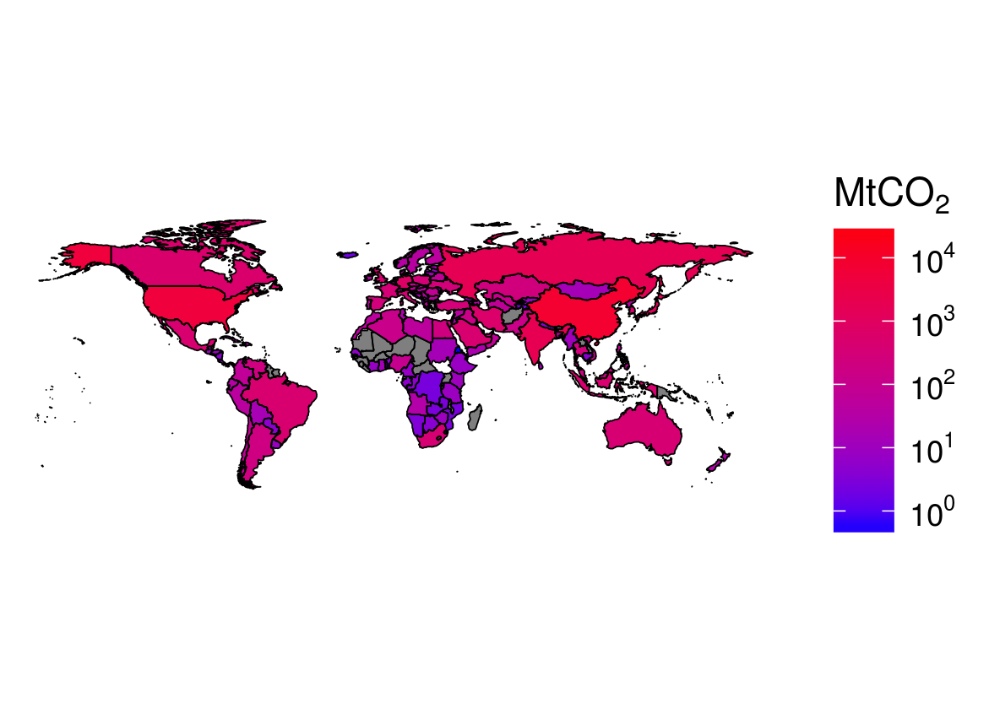

<!-- To do: -->
<!-- Talk about merge vs *_join -->
  
# Efficient data carpentry

There are many words for data processing. You can **clean**, **hack**, **manipulate**, **munge**, **refine** and **tidy** your dataset, ready for the next stage, typically modelling and visualisation. Each word says something about perceptions towards the process: data processing is often seen as *dirty work*, an unpleasant necessity that must be endured before the *real*, *fun* and *important* work begins. This perception is wrong. Getting your data 'ship shape' is a respectable and in some cases vital skill. For this reason we use the more admirable term *data carpentry*.

The metaphor is not accidental. Carpentry is the process of taking rough pieces of wood and working with care, diligence and precision to create a finished product. A carpenter does not hack at the wood at random. He or she will inspect the raw material and select the right tool for the job. In the same way *data carpentry* is the process of taking rough, raw and to some extent randomly arranged input data and creating neatly organised and *tidy* data. Learning the skill of data carpentry early will yield benefits for years to come. "Give me six hours to chop down a tree and I will spend the first four sharpening the axe" as Abraham Lincoln put it, continuing the metaphor.

Data processing is a critical stage in any project involving any datasets from external sources, i.e. most real world applications. In the same way that *technical debt*, discussed in the previous Chapter, can cripple your workflow, working with messy data can lead to project management hell.

Fortunately, done efficiently, at the outset of your project (rather than half way through, when it may be too late) and using appropriate tools this data processing stage can be highly rewarding. More importantly from an efficiency perspective, working with clean data will be beneficial for every subsequent stage of your R project. So, for data intensive applications, this could be the most important chapter of book. In it we cover the following topics:

- Tidying data with **tidyr**
- Processing data with **dplyr**
- Working with databases
- Data processing with **data.table**

## Top 5 tips for efficient data carpentry

- Give data processing the proper time and attention it needs as it could save hours of frustration in the long run.

- Tidy your data carefully at the earliest stage of the analysis process, perhaps using functions provided by **tidyr**.

- Use efficient functions for reading and writing plain text files, such as `read_csv` and `fread`, from the **readr** and **data.table** packages respectively.

- Don't rely on base R for data processing. We recommend **dplyr** for most applications, although **data.table** may be optimal in contexts where speed is critical.

- Using the ` %>%` 'pipe' operator in combination with **dplyr**'s verbs can help clarify complex data processing workflows, easing the writing of analysis code and communication with others.

## Tidying data with tidyr

A key skill in data analysis is understanding the structure of datasets and being able to 'reshape' them. This is important from a workflow efficiency perspective: more than half of a data analyst's time can be spent re-formatting datasets [@Wickham_2014], so getting it into a suitable form early could save hours in the future. Converting data into a 'tidy' form is also advantageous from a computational efficiency perspective: it is usually faster to run analysis and plotting commands on tidy data.

Data tidying includes data cleaning and data reshaping. Data cleaning is the process of re-formatting and labelling messy data. Packages including **stringi** and **stringr** can help update messy character strings using regular expressions; **assertive** and **assertr** packages can perform diagnostic checks for data integrity at the outset of a data analysis project. A common data cleaning task is the conversion of non-standard text strings into date formats as described in the **lubridate** vignette (see `vignette("lubridate")`). Tidying is a broader concept, however, and also includes re-shaping data so that it is in a form more conducive to data analysis and modelling.
The process of reshaping is illustrated by Tables \@ref(tab:tpew) and \@ref(tab:tpewt), provided by @Wickham_2014.

```{r, echo=FALSE, eval=FALSE}
# Download data from its original source - an academic paper
downloader::download("http://www.jstatsoft.org/v59/i10/supp/4", destfile = "v59i10-data.zip")
# The source code associated with the paper
downloader::download("http://www.jstatsoft.org/v59/i10/supp/3", destfile = "data/reshape/v59i10.R")
# After running the R script...
dir.create("data/reshape")
unzip("v59i10-data.zip", exdir = "data/reshape/")
# write.csv(raw, "data/reshape-pew.csv")
```

These tables may look different, but they contain precisely the same information.
Column names in the 'wide' form in Table \@ref(tab:tpew) became a new variable in the 'long' form in Table \@ref(tab:tpewt).
According to the concept of 'tidy data', the long form is correct.
Note that 'correct' here is used in the context of data analysis and graphical visualisation.
For tabular presentation the wide form may be better. Wide data can also be less memory consuming because it requires fewer cells.

Tidy data has the following characteristics [@Wickham_2014]:

1. Each variable forms a column.
2. Each observation forms a row.
3. Each type of observational unit forms a table.

Because there is only one observational unit in the example (religions), it can be described in a single table.
Large and complex datasets are usually represented by multiple tables, with unique identifiers or 'keys' to join them together [@Codd1979]. 

Two common operations facilitated by **tidyr** are *gathering* and *splitting* columns.

- Gathering: this means making 'wide' tables 'long' by converting column names to a new variable. This is done is done with the function
`gather` (the inverse of which is `spread`) , as illustrated in Table \@ref(tab:tpew) and Table \@ref(tab:tpewt) and in the code block below:


```{r}
library("tidyr")
raw = read_csv("data/pew.csv") # read in the 'wide' dataset
dim(raw)
rawt = gather(raw, Income, Count, -religion)
dim(rawt)
rawt[1:3,]
```

```{block, gather-note, type='rmdtip'}
Note
that the dimensions of the data change from having 10 observations across 18 columns to 162 rows in only 3 columns.
Note that when we print the object `rawt[1:3,]`, the class of each variable is given
(`chr`, `fctr`, `int` refer to character, factor and integer classes, respectively).
This is because **tidyr** uses the `tbl` class from the **tibble** package (described below).
```

```{r tpew, echo=FALSE}
# generate pew dataset
raw = read_csv("data/reshape-pew.csv")
raw = raw[-c(1,ncol(raw))] # remove excess cols
names(raw) = c("religion", "<$10k", "$10--20k", "$20--30k", "$30--40k",
               "$40--50k", "$50--75k", "$75--100k", "$100--150k", ">150k")
# write_csv(raw, "data/pew.csv")
knitr::kable(raw[1:3,1:4], caption = "First 6 rows of the aggregated 'pew' dataset from Wickham (2014a) in an 'untidy' form.")
```

```{r tpewt, echo=FALSE}
library("tidyr")
rawt = gather(raw, Income, Count, -religion)
rawt_mini = gather(raw[1:3,1:4], Income, Count, -religion)
knitr::kable(rawt_mini, caption = "Long form of the Pew dataset represented above.")
```

- Splitting: this means taking a variable that is really two variables combined and creating two separate columns from it. A classic example is age-sex variables (e.g. `m0-10` and `f0-15` to represent males and females in the 0 to 10 age band). Splitting such variables can be done with `separate`, as illustrated in Table \@ref(tab:to-separate) and \@ref(tab:separated).

```{r}
agesex = c("m0-10", "f0-10") # create compound variable
n = c(3, 5) # create a value for each observation
agesex_df = data.frame(agesex, n) # create a data frame
separate(agesex_df, agesex, c("sex", "age"), 1)
```

```{r to-separate, echo=FALSE,}
knitr::kable(agesex_df, caption = "Joined age and sex variables in one column")
```

```{r separated, echo=FALSE}
knitr::kable(separate(agesex_df, agesex, c("sex", "age"), 1),
             caption = "Age and sex variables separated by the funtion `separate`.")
```

There are other tidying operations that **tidyr** can perform, as described in the package's vignette (`vignette("tidy-data")`).
The wider issue of manipulation is a large topic with major potential implications for efficiency [@Spector_2008] and this section only covers some of the key operations. More important is understanding the principles behind converting messy data into standard output forms. These same principles can also be applied to the representation of model results: the **broom** package provides a standard output format for model results, easing interpretation (see [the broom vignette](https://cran.r-project.org/web/packages/broom/vignettes/broom.html)).

```{block, non-standard evaluation, type='rmdnote'}
Note that in the above code chunks we used non standard evaluation, which means not surrounding variable names in quote marks for ease of typing and autocompletion. This is fine when using R interactively. But when you'd like to use R non-interactively, code is generally more robust using standard evaluation. The affix `_` can be added to functions in **dplyr** and **tidyr** to allow the use of standard evaluation. Thus the standard evaluation version of `separate(agesex_df, agesex, c("sex", "age"), 1)` is `separate_(agesex_df, "agesex", c("sex", "age"), 1)`.
```

## Efficient data frames with tibble

**tibble** is a package that defines a new data frame class for R, the `tbl_df`. These 'tibble diffs' (as their inventor [suggests](https://github.com/hadley/tibble) they should be pronounced) are like the base class `data.frame`, but with more user friendly printing, subsetting, and factor handling.

'Tibbles' can provide a small efficiency boost when creating data frames. Instead of writing a test data frame row-by-row, `frame_data()` enables the data to be written as it will be seen, as illustrated below in comparison with `data.frame()`.

```{r}
# Using base data.frame
(df_base_R = data.frame(
  name = c("Robin", "Colin"),
  height = c(1.8, 1.9)
  ))

# Using tibble
library(tibble)
(df_tibble = frame_data(
  ~name, ~height,
  "Robin", 1.8,
  "Colin", 1.9
))
```

The example above illustrates the main differences between the **tibble** and base R approach to data frames:

- The `tbl_df` example was more consise, using 72 characters instead of 78, due to the use of `frame_data`. (Note: `data_frame` can be used in place of `data.frame`.)

- When printed, `tbl_df` objects report the class of each variable. `data.frame` objects do not. 

- Character vectors are not coerced into factors when they are incorporated into a `tbl_df`, as can be seen by the `<chr>` heading between the variable name and the first value, `Robin`. `data.frame()`, by contrast, coerces characters into factors which can cause problems further down the line:

```{r}
# Class conversion from character
class(df_base_R$name)
# Potentially unexpected conversion to numeric
as.numeric(df_base_R$name)
# Less surprising conversion to numeric
as.numeric(df_tibble$name)
```

Additional differences include the fact that tibbles only print the first 10 rows of data to screen, avoiding information overload, only print columns that will fit on the screen, and always return another data frame when subsetted using a single `[` (use `[[` or `$` to return a vector).

## Efficient data processing with dplyr {#dplyr}

After tidying your data, the next stage is generally data processing. This includes the creation of new data, for example a new column that is some function of existing columns, or data analysis, the process of asking directed questions of the data and exporting the results in a user-readable form.

Following the advice in Section \@ref(package-selection), we have carefully selected an appropriate package for these tasks: **dplyr**, which roughly means 'data pliers'. **dplyr** has a number of advantages over base R and **data.table** approaches to data processing:

- **dplyr** is fast to run (due to its C++ backend) and intuitive to type
- **dplyr** works well with tidy data, as described above
- **dplyr** works well with databases, providing efficiency gains on large datasets

Furthermore, **dplyr** is efficient to *learn* (see Chapter \@ref(efficient-learning). It has small number of intuitively named functions, or 'verbs'. These can be used in combination with each other, and the grouping function `group_by()`, to solve a wide range of data processing challenges (see Table \@ref(tab:verbs)).

```{r verbs, echo=FALSE}
verbs = read_csv("data/verbs.csv")
knitr::kable(verbs, caption = "dplyr 'verb' functions.")
```

Unlike the base R analogues, **dplyr**'s data processing functions work in a consistent way. Each function takes a data frame object as its first argument and results in another data frame. Variables can be called directly without using the `$` operator. **dplyr** was designed to be used with the 'pipe' operator `%>%` provided by the **magittr** package, allowing each data processing stage to be represented as a new line. This is illustrated below, to provide a taster of **dplyr**'s unique syntax. By the end of this section you should be able to know exactly what is going on in each line of this code, the results of which are illustrated in table \@ref(tab:speed).

<!-- __XXX__ Colin write stuff on lazy evaluation, the collect or explain functions. -->

```{r}
library("dplyr")
data("ghg_ems", package = "efficient")
top_table =
  ghg_ems %>%
  filter(!grepl("World|Europe", Country)) %>% 
  group_by(Country) %>% 
  summarise(Mean = mean(Transportation),
            Growth = diff(range(Transportation))) %>% 
  top_n(3, Mean)
```

```{r speed, echo=FALSE}
knitr::kable(top_table, digits = 0, caption = "The top 3 countries in terms of average CO2 emissions from transport since 1971, and growth in transport emissions over that period (MTCO2e/yr).")
```

Building on the 'learning by doing' ethic, the remainder of this section works through these functions to process and begin to analyse a dataset on economic equality provided by the World Bank. The input dataset can be loaded as follows:

```{r, message=FALSE}
library("readr")
fname = system.file("extdata/world-bank-ineq.csv", package = "efficient")
idata = read_csv(fname)
idata # print the dataset 
```

You should not be expecting to master **dplyr**'s functionality in one sitting:
the package is large and can be seen as
a language in its own right. Following the 'walk before you run' principle,
we'll start simple, by filtering and aggregating rows.

### Renaming columns

Renaming data columns is a common task that can make writing code faster by using short, intuitive names. The **dplyr** function `rename()` makes this easy.

```{block, varname-block, style='rmdtip'}
Note
in this code block the variable name is surrounded by back-quotes (`).
This allows R to refer to column names that are non-standard.
Note also the syntax:
`rename` takes the `data.frame` as the first object and then creates new variables by specifying `new_variable_name = original_name`.
```

```{r, message=FALSE}
library("dplyr")
idata = rename(idata, Country = `Country Name`)
```

To rename multiple columns the variable names are simply separated by commas. The base R and **dplyr** way of doing this is illustrated for clarity.

```{r}
# The dplyr way (rename two variables)
idata = rename(idata,
 top10 = `Income share held by highest 10% [SI.DST.10TH.10]`,
 bot10 = `Income share held by lowest 10% [SI.DST.FRST.10]`)
# The base R way (rename five variables)
names(idata)[5:9] = c("top10", "bot10", "gini", "b40_cons", "gdp_percap")
```

Now we have usefully renamed the object we save the result for future reference:

```{r, eval=FALSE}
saveRDS(idata, "data/idata-renamed.Rds")
```

### Changing column classes

The *class* of R objects is critical to performance.
If a class is incorrectly specified (e.g. if numbers are treated as factors or characters) this will lead to incorrect results. The class of all columns in a `data.frame` can be queried using the function `str()` (short for display the **str**ucture of an object), as illustrated below, with the inequality data loaded previously.^[`vapply(idata, class, character(1))` is an alternative way to query the class of columns in a dataset.]

```{r}
idata = readRDS("data/idata-renamed.Rds")
str(idata)
```

This shows that although we loaded the data correctly all columns are seen by R as characters. This means we cannot perform numerical calculations on the dataset: `mean(idata$gini)` fails.

Visual inspection of the data (e.g. via `View(idata)`) clearly shows that all columns except for 1 to 4 ("Country", "Country Code", "Year" and "Year Code") should be numeric. We can re-assign the classes of the numeric variables one-by one:

```{r}
idata$gini = as.numeric(idata$gini)
mean(idata$gini, na.rm = TRUE) # now the mean is calculated
```

However, the purpose of programming languages is to *automate* tasks and reduce typing.
The following code chunk re-classifies all of the numeric variables using `data.matrix()`, which converts a `data.frame` to a numeric `matrix`:

```{r, warning=FALSE}
id = 5:9 # column ids to change
idata[id] = data.matrix(idata[id])
vapply(idata, class, character(1))
```

As is so often the case with R, there are many ways to solve the problem. Below is a one-liner using `unlist()` which converts list objects into vectors:

```{r, warning=FALSE}
idata[id] = as.numeric(unlist(idata[id]))
```

*Another* one-liner to achieve the same result uses **dplyr**'s `mutate_each` function: 

```{r, warning=FALSE}
idata_mutate = mutate_each(idata, funs(as.numeric), id)
```


As with other operations there are other ways of achieving the same result in R, including the use of loops via `apply()` and `for()`. These are shown in the chapter's [source code](https://github.com/csgillespie/efficientR).

```{r, echo=FALSE, warning=FALSE}
# Idea: these 4 methods could be benchmarked
# An alternative method for changing the column class
idata[id] = apply(idata[id], 2, as.numeric)

# Another alternative method using a for loop
idata_df = as.data.frame(idata)
for(i in id){
  idata_df[,i] = as.numeric(idata_df[,i])
}
```

### Filtering rows

**dplyr** offers an alternative and more flexible way of filtering data, using `filter()`.

```{r}
## Base R: idata[idata$Country == "Australia",]
aus2 = filter(idata, Country == "Australia")
```

In addition to being more flexible (see `?filter`), `filter` is slightly faster than base R's notation.^[Note that `filter` is also the name of a function used in the base **stats** library. Usually packages avoid using names already taken in base R but this is an exception.]
Note that **dplyr** does not use the `$` symbol: it knows that that `Country` is a variable of `idata`:
the first argument of **dplyr** functions usually a `data.frame`, and
subsequent in this context variable names can be treated as vector objects.^[Note that this syntax is a defining feature of **dplyr**
and many of its functions work in the same way.
Later we'll learn how this syntax can be used alongside the `%>%` 'pipe' command to write clear data manipulation commands.
] 

There are **dplyr** equivalents of many base R functions but these usually work slightly differently. The **dplyr** equivalent of `aggregate`, for example is to use the grouping function `group_by` in combination with the general purpose function `summarise` (not to be confused with `summary` in base R), as we shall see in Section \@ref(data-aggregation). For consistency, however, we next look at filtering columns.

### Filtering columns

Large datasets often contain much worthless or blank information. This consumes RAM and reduces computational efficiency. Being able to focus quickly only on the variables of interest becomes especially important when handling large datasets.

Imagine that we have a text file called `miniaa` which is large enough to consume most of your computer's RAM. We can load it with the following command:

```{r}
fname = system.file("extdata/miniaa", package = "efficient")
miniaa = read_csv(fname) # load imaginary large data
dim(miniaa)
```

Note that the data frame has 329 columns, and imagine it has millions of rows, instead of 9. That's a lot of variables. Do we need them all? It's worth taking a glimpse at this dataset to find out:

```{r, eval=FALSE}
glimpse(miniaa)
#> $ NPI                   (int) 1679576722, ...
#> $ Entity Type Code      (int) 1, 1, 2,    ...
#> $ Replacement NPI       (lgl) NA, NA, NA, ...
#> ...
```

Looking at the output, it becomes clear that the majority of the variables only contain `NA`. To clean the giant dataset, removing the empty columns, we need to identify which variables these are.

```{r, echo=FALSE}
# TODO: demonstrate dplyr::select
```

```{r}
# Identify the variable which are all NA
all_na = vapply(miniaa, function(x) all(is.na(x)),
                logical(1))
summary(all_na) # summary of the results
miniaa1 = miniaa[!all_na] # subset the dataframe
```

The new `miniaa` object has fewer than a third of the original columns. Another way to save storage space, beyond removing the superfluous columns, is to save the dataset in R's binary data format:

```{r, eval=FALSE}
saveRDS(miniaa1, "data/miniaa.Rds")
```

#### Exercises

1. How much space does the data take in wide form vs. long form? (Hint: use `object.size()`.)

2. How many times smaller is the .Rds file saved above compared with the .csv file? (Hint: use `file.size()`.)

```{r, include=FALSE}
object.size(miniaa1) / object.size(miniaa)
file.size(fname) / file.size("data/miniaa.Rds")
```

### Data aggregation

Data aggregation is the process of creating summaries of data based on a grouping variable. The end result usually has the same number of rows as there are groups. Because aggregation is a way of condensing datasets it can be a very useful technique for making sense of large datasets. The following code finds the number of unique countries (country being the grouping variable) from the `ghg_ems` dataset stored in the **efficient** package.

```{r, warning=FALSE}
# data available online, from github.com/csgillespie/efficient_pkg
data(ghg_ems, package = "efficient")
names(ghg_ems)
nrow(ghg_ems)
length(unique(ghg_ems$Country))
```

Note that while there are almost 8000 rows, there are less than 200 countries.

```{block, gsub, type='rmdnote'}
Note that the `ghg_ems` column names were cleaned using the command `word(names(ghg_ems), sep = " |/")` from the **stringr** package before it was saved as a dataset within the **efficient** package. `" |/"` in this context means "any space or forward slash is a word break". See the Pattern matching section in `vignette("stringr")` for more on this. For details about the `ghg_ems` dataset, see the documentation in `?efficient::ghg_ems`.
```

<!-- Note the first argument in the function is the vector we're aiming to aggregate and the second is the grouping variable (in this case Countries). -->
<!-- Another way to specify the `by` argument is with the tilde (`~`). -->
<!-- Thus `ghg_ems$Electricity, list(ghg_ems$Country)` can usefully be replaced by `Electricity ~ Country`, which is more concise. Note that the `data` argument must be specified for this to work, however. -->

<!-- The resulting data frame now has the same number of rows as there are countries: -->
<!-- the aggregation has successfully reduced the number of rows we need to deal with. -->
<!-- Now it is easier to find out per-country statistics, such as the three lowest emitters from electricity production: -->

<!-- ```{r} -->
<!-- head(e_ems[order(e_ems$x),], 3) -->
<!-- ``` -->

To aggregate the dataset using **dplyr** package, you divide the task in two: to *group* the dataset first and then to summarise, as illustrated below.^[The equivalent code in base R is: `e_ems = aggregate(ghg_ems$Electricity, list(ghg_ems$Country),
                  mean, na.rm  = TRUE, data = ghg_ems)
nrow(e_ems)`.]

```{r, message=FALSE}
library("dplyr")
group_by(ghg_ems, Country) %>%
  summarise(mean_eco2 = mean(Electricity, na.rm  = TRUE))
```

```{block, unix-philosophy, type='rmdnote'}
The example above relates to a philosophical question in programming: how much work should one function do?  The [Unix philosophy](http://www.catb.org/esr/writings/taoup/html/ch01s06.html) states that programs should "do one thing well".  And shorter functions are easier to understand and debug.  But having too many functions can also make your call stack confusing, and the code hard to maintain. In general, being modular and specific is advantageous for clarity, and this modular approach is illustrated in the above example with the dual `group_by` and `summarise` stages.
```

To reinforce the point, this operation is also performed below on the `idata` dataset:

```{r}
countries = group_by(idata, Country)
summarise(countries, gini = mean(gini, na.rm  = TRUE))
```

Note that `summarise` is highly versatile, and can be used to return a customised range of summary statistics:

```{r tidy=FALSE}
summarise(countries,
  # number of rows per country
  obs = n(), 
  med_t10 = median(top10, na.rm  = TRUE),
  # standard deviation
  sdev = sd(gini, na.rm  = TRUE), 
  # number with gini > 30
  n30 = sum(gini > 30, na.rm  = TRUE), 
  sdn30 = sd(gini[ gini > 30 ], na.rm  = TRUE),
  # range
  dif = max(gini, na.rm  = TRUE) - min(gini, na.rm  = TRUE)
  )
```

To showcase the power of `summarise` used on
a `grouped_df`, the
above code reports a wide range of customised
summary statistics
*per country*: 

- the number of rows in each country group
- standard deviation of gini indices
- median proportion of income earned by the top 10%
- the number of years in which the gini index was greater than 30
- the standard deviation of gini index values over 30
- the range of gini index values reported for each country.

#### Exercises

1. Referring back to Section \@ref(renaming-columns), rename the variables 4 to 8 using the **dplyr** function `rename`. Follow the pattern `ECO2`, `MCO2` etc.

```{r, echo=FALSE, eval=FALSE}
# Using dplyr::rename
ghg_ems = rename(ghg_ems,
             ECO2 = Electricity.Heat..CO2...MtCO2.,
             MCO2 = Manufacturing.Construction..CO2...MtCO2.,
             TCO2 = Transportation..CO2...MtCO2.,
             FCO2 = Fugitive.Emissions..CO2...MtCO2.)
```

2. Explore **dplyr**'s documentation, starting with the introductory vignette, accessed by entering [`vignette("introduction")`](https://cran.rstudio.com/web/packages/dplyr/vignettes/introduction.html).

3. Test additional **dplyr** 'verbs' on the `idata` dataset. (More vignette names can be discovered by typing `vignette(package = "dplyr")`.)

### Chaining operations

Another interesting feature of **dplyr** is its ability
to chain operations together. This overcomes one of the
aesthetic issues with R code: you can end end-up with
very long commands with many functions nested inside each
other to answer relatively simple questions.

> What were, on average, the 5 most unequal
years for countries containing the letter g?

Here's how chains work to organise the analysis in a
logical step-by-step manner:

```{r tidy=FALSE}
idata %>% 
  filter(grepl("g", Country)) %>%
  group_by(Year) %>%
  summarise(gini = mean(gini, na.rm  = TRUE)) %>%
  arrange(desc(gini)) %>%
  top_n(n = 5)
```

The above function consists of 6 stages, each of which
corresponds to a new line and **dplyr** function:

1. Filter-out the countries we're interested in (any selection criteria could be used in place of `grepl("g", Country)`).
2. Group the output by year.
3. Summarise, for each year, the mean gini index.
4. Arrange the results by average gini index
5. Select only the top 5 most unequal years.

To see why this method is preferable to the nested
function approach, take a look at the latter.
Even after indenting properly it looks terrible
and is almost impossible to understand!

```{r, eval=FALSE, tidy=FALSE}
top_n(
  arrange(
    summarise(
      group_by(
        filter(idata, grepl("g", Country)),
        Year),
      gini = mean(gini, na.rm  = TRUE)),
    desc(gini)),
  n = 5)
```

```{r, echo=FALSE}
# # Removed - should illustrate how to do it in base R if mentioned:
# Of course, you *could* write code in base R to
# undertake the above analysis but for many
# people the **dplyr** approach is the most agreeable to write.
```

This section has provided only a taster of what is possible **dplyr** and why it makes sense from code writing and computational efficiency perspectives. For a more detailed account of data processing with R using this approach we recommend *R for Data Science* [@grolemund_r_2016].

## Combining datasets

The usefulness of a dataset can sometimes be greatly enhanced by combining it with other data. If we could merge the global `ghg_ems` dataset with geographic data, for example, we could visualise the spatial distribution of climate pollution. For the purposes of this section we join `ghg_ems` to the `world` data provided by **ggmap** to illustrate the concepts and methods of data *joining* (also referred to as merging).

```{r}
library(ggmap)
world = map_data("world")
names(world)
```

Visually compare this new dataset of the `world` with `ghg_ems` (e.g. via `View(world); View(ghg_ems)`). It is clear that the column `region` in the former contains the same information as `Country` in the latter. This will be the *joining variable*; renaming it in `world` will make the join more efficient. 

```{r}
world = rename(world, Country = region)
ghg_ems$All = rowSums(ghg_ems[3:7])
```

```{block same-class, type = "rmdtip"}
Ensure that both joining variables have the same class (combining `character` and `factor` columns can cause havoc).
```

How large is the overlap between `ghg_ems$Country` and `world$Country`? We can find out using the `%in%` operator, which finds out how many elements in one vector match those in another vector. Specifically, we will find out how many *unique* country names from `ghg_ems` are present in the `world` dataset:

```{r}
# save the result as 'm', for match
c_u = unique(ghg_ems$Country)
w_u = unique(world$Country)
summary({m = c_u %in% w_u})
```

This comparison exercise has been fruitful: most of the countries in the `co2` dataset exist in the `world` dataset. But what about the 20 country names that do not match? We can identify these as follows:

```{r}
(n = c_u[!m]) # non-matching country names in world data
```

It is clear from the output that some of the non-matches (e.g. the European Union) are not countries at all. However, others, such as 'Gambia, The' and the United States clearly should have matches. *Fuzzy matching* can help to rectify this, as illustrated the first non-matching country below:

```{r}
grep(n[1], w_u) # no match
(fm = agrep(n[1], w_u, max.distance = 10))
(w_u1 = w_u[fm])
```

What just happened? We verified that first unmatching country in the `ghg_ems` dataset was not in the `world` country names with a `grep`. So we used the more powerful `agrep` to search for fuzzy matches (with the `max.distance` argument set to `10` after trial and error). The results show that the country `Antigua & Barbuda` from the `ghg_ems` data is matched *two* countries in the `world` dataset. We can update the names in the dataset we are joining to accordingly:

```{r}
world$Country[world$Country %in% w_u1] = n[1]
```

Fuzzy matching is still a laborious process that must be complemented by human judgement. It takes a human to know for sure that `United States` is represented as `USA` in the `world` dataset, without risking false matches via `agrep`. This can be fixed manually:

```{r}
world$Country[world$Country == "USA"] = "United States"
```

To fix the remaining issues, we simply continued with the same method, using a `for` loop and verifying the results instead of doing all by hand. The code used to match the remaining unmatched countries can be seen on the book's [GitHub page](https://github.com/csgillespie/efficientR/blob/master/05-data-carpentry.Rmd).

```{r co2-clean, echo=FALSE, eval=FALSE}
i = n[1]
match_df = data_frame(co2_name = n, w_name = NA)
for(i in n){
  (fm = agrep(i, w_u, max.distance = 10))
  (w_um = w_u[fm])
  match_df$w_name[match_df$co2_name == i] = paste(w_um, collapse = "|")
  # world$Country[world$Country %in% w_u1] = i
}

# View(match_df) # check the results: 1, 3 , 14, 16, 17 are right
i = 3
for(i in c(1, 3 , 14, 16, 17)){
  world$Country[grep(match_df$w_name[i], world$Country) ] =
    match_df$co2_name[i]
}
match_df = match_df[-c(1, 3 , 14, 16, 17),]

# manually fix countries with multiple matches
world$Country[grep("Baham", world$Country)] =
  c_u[grep("Baham", c_u)]
world$Country[grep("Democratic Republic of the Congo", world$Country)] =
  c_u[grep("Congo, Dem. Rep.", c_u)]
world$Country[grep("Republic of C", world$Country)] =
  c_u[grep("Congo, R", c_u)]
world$Country[grep("Ivo", world$Country)] =
  c_u[grep("Ivo", c_u)]
world$Country[grep("Gambia", world$Country)] =
  c_u[grep("Gambia", c_u)]
world$Country[grep("Macedonia", world$Country)] =
  c_u[grep("Macedonia", c_u)]
world$Country[grep("USA", world$Country)] =
  c_u[grep("United States", c_u)]
world$Country[grep("UK", world$Country)] =
  c_u[grep("United Kingdom", c_u)]
world$Country[grep("North Korea", world$Country)] =
  c_u[grep("Korea, Dem. Rep. \\(N", c_u)]
world$Country[grep("South Korea", world$Country)] =
  c_u[grep("Korea, Rep", c_u)]
world$Country[grep("Russia", world$Country)] =
  c_u[grep("Russia", c_u)]
world$Country[grep("Vincent", world$Country)] =
  c_u[grep("Vincent", c_u)]

# ghg_ems = ghg_ems[!ghg_ems$Country == "World",]

# save the result as 'm', for match
c_u = unique(ghg_ems$Country)
w_u = unique(world$Country)
m = c_u %in% w_u
# summary(m)
n = c_u[!m]
```


There is one more stage that is needed before global CO^2^ emissions can be mapped for any year: the data must be *joined*. The base function `merge` can do this but we strongly recommend using one of the `join` functions from **dplyr**, such as `left_join` (which keeps all rows in the original dataset) and `inner_join` (which keeps only rows with matches in both datasets), as illustrated below:

```{r}
nrow({world_co2 = left_join(world, ghg_ems)})
nrow(inner_join(world, ghg_ems))
```

Note that `inner_join` removes rows from the `world` dataset which have no match in `ghg_ems`: if we were to plot the resulting dataset, the continent of Antarctica and a number of countries not represented in the `ghg_ems` dataset would be absent. Figure \@ref(fig:wco2) shows the results of this data carpentry, produced using a modified version of the **ggplot2** code below, were worth the effort.

```{r, eval=FALSE}
world_co2_2012 = filter(world_co2, Year == 2012 | is.na(Year))
ggplot(world_co2_2012, aes(long, lat)) +
  geom_polygon(aes(fill = All, group = group))
```

```{r wco2, echo=FALSE, fig.cap="The geographical distribution of carbon dioxide emissions in 2012."}

```

```{r, eval=FALSE, echo=FALSE}
library(scales)
world_co2_2012 = filter(world_co2, Year == 2012 | is.na(Year))
ggplot(world_co2_2012, aes(long, lat, group = group)) +
  geom_polygon(aes(fill = All)) +
  geom_path(size = 0.2) +
  scale_fill_gradient(
    low = "blue", high = "red", trans = "log",
    breaks = trans_breaks("log10", function(x) 10^x),
    labels = trans_format("log10", math_format(10^.x)),
    name = expression(MtCO[2])) +
  coord_equal() +
  theme_nothing(legend = TRUE)
# ggsave("figures/world_co2.png")
```

## Working with databases

Instead of loading all the data into RAM, as R does, databases query data from the hard-disk. This can allow a subset of a very large dataset to be defined and read into R quickly, without having to load it first.
R can connect to databases in a number of ways, which are briefly touched on below. Databases is a large subject area undergoing rapid evolution. Rather than aiming at comprehensive coverage, we will provide pointers to developments that enable efficient access to a wide range of database types. An up-to-date history of R's interfaces to databases can be found in README of the [**DBI** package](https://cran.r-project.org/web/packages/DBI/README.html), which provides a common interface and set of classes for driver packages (such as **RSQLite**).

**RODBC** is a veteran package for querying external databases from within R, using the Open Database Connectivity (ODBC) API. The functionality of **RODBC** is described in the package's vignette (see `vignette("RODBC")`).
**RODBC** connects to 'traditional' databases such as MySQL, PostgreSQL, Oracle and SQLite. Since then, the **DBI** package has created a unified structure for accessing databases allowing for other drivers to be added as modular packages. Thus new packages that build on **DBI** can be seen as a replacement of **RODBC** (**RMySQL**, **RPostgreSQL**, and **RSQLite**) (see `vignette("backend")` for more on how **DBI** drivers work). Because the **DBI** syntax applies to a wide range of database types we use it here with a worked example.

Imagine you have access to a database on donations for a community café.

```{r, eval=FALSE}
# Connect to a database driver
library("RMySQL") # also loads DBI package
con = dbConnect(MySQL(), username = "me", password = pwd, dbname = "cafes")

# List available tables
dbListTables(con)
rs = dbSendQuery(con, "SELECT * FROM tblDonnations")
df_head = dbFetch(rs, n = 6) # extract first 6 rows
```

The above code chunk shows how the function `dbConnect` connects to an external database, in this case a MySQL database. The `username` and `password` arguments are used to establish the connection. Next we query which tables are available with `dbListTables`, query the database (without yet extracting the results to R) with `dbSendQuery` and, finally, load the results into R with `dbFetch`.

```{block, password-tip, type='rmdtip'}
Be sure never to release your password by entering it directly into the command. Instead, we recommend saving sensitive information such as database passwords and API keys in `.Renviron`, described in Chapter 2. Assuming you had saved your password as the environment variable `PSWRD`, you could enter `pwd = Sys.getenv("PSWRD")` to minimise the risk of exposing your password through accidentally releasing the code or your session history.
```

Recently there has been a shift to the 'noSQL' approach for storing large datasets.
This is illustrated by the emergence and uptake of software such as MongoDB and Apache Cassandra, which have R interfaces via packages [mongolite](https://cran.r-project.org/web/packages/mongolite/index.html) and [RJDBC](https://cran.r-project.org/web/packages/RJDBC/index.html), which can connect to Apache Cassandra data stores and any source compliant with the Java Database Connectivity (JDBC) API.

MonetDB is a recent alternative to traditional and noSQL approaches which offers substantial efficiency advantages for handling large datasets [@kersten2011researcher].
A tutorial on the [MonetDB website](https://www.monetdb.org/Documentation/UserGuide/MonetDB-R) provides an excellent introduction to handling databases from within R. A new development showcased in this tutorial is the ability to interact with databases using exactly the same syntax used to interact with R objects stored in RAM. This innovation was made possible by **dplyr**, an R library for data processing that aims to provide a unified 'front end' to perform a wide range of analysis task on datasets using a variety of 'back ends' which do the number crunching. This is one of the main advantages of **dplyr**
(see Section \@ref(dplyr)).

To access a database in R via **dplyr**, one must use one of the `src_` functions to create a source. Continuing with the MySQL example above, one would create a `tbl` object, that can be queried by **dplyr** as follows:

```{r, eval=FALSE}
library("dplyr")
cafes_db = src_mysql(user = "me", password = pwd, dbname = "cafes")
cafes_tbl = tbl(cafes_db, sql("SELECT * FROM tblDonnations"))
```

```{r, echo=FALSE, message=FALSE}
library("dplyr")
```

Of course, the above example will not work because there is no pre-existing SQL database on your computer. To see the method work on your computer we will create an SQLite database from within R, building on the **dplyr** databases vignette (see `vignette('databases')`).

There are many wider considerations in relation to databases that we will not cover here: who will manage and maintain the database? How will it be backed up locally (local copies should be stored to reduce reliance on the network)? What is the appropriate database for your project. These issues can have major efficiency, especially on large, data intensive projects. However, we will not cover them here because it strays too far out of the R ecosystem and into the universe of databases for the purposes of this book. Instead, we direct the interested reader towards further resources on the subject, including:

- [db-engines.com/en/](http://db-engines.com/en/): a website comparing the relative merits of different databases.
- The `databases` vignette from the **dplyr** package.
- [Getting started with MongoDB in R](https://cran.r-project.org/web/packages/mongolite/vignettes/intro.html), an introductory vignette on non-relational databases and map reduce from the **mongolite** package.

#### Exercises {-}

Follow the worked example below to create and query a database on land prices in the UK using **dplyr** as a front end to an SQLite database.

The first stage is to download and read-in the data:

```{r, eval=FALSE}
url = paste0("http://prod.publicdata.landregistry.gov.uk",
  ".s3-website-eu-west-1.amazonaws.com/pp-monthly-update.txt")
download.file(url = url, destfile = "pp-monthly-update.txt")
land_df = readr::read_csv("pp-monthly-update.txt")
```

To avoid downloading the file from the internet, you can subset of this data that is provided by the **efficient** package that accompanies this book:

```{r}
library("efficient")
data("land_df")
```

The next stage is to create an SQLite database to hold the data:

```{r}
# install.packages("RSQLite") # Requires RSQLite package
my_db = src_sqlite("land.sqlite3", create = TRUE)
land_sqlite = copy_to(my_db, land_df, indexes = list("trnsctnuni", "dtoftrnsfr"))
class(land_sqlite)
```

From the above code we can see that we have created a `tbl`. This can be accessed using **dplyr** in the same way as any data frame can. Now we can query the data. You can use SQL code to query the database directly or use standard **dplyr** verbs on the table.

```{r}
# Method 1: using sql
tbl(my_db, sql('SELECT "price", "dtoftrnsfr", "postcode"  FROM land_df'))

# Method 2: using dplyr
select(land_sqlite, price, dtoftrnsfr, postcode, proprtytyp)
```


## Data processing with data.table

**data.table** is a mature package for fast data processing that presents an alternative to **dplyr**. There is some controversy about which is more appropriate for different
tasks^[One
[question](http://stackoverflow.com/questions/21435339) on the stackoverflow website titled 'data.table vs dplyr' illustrates this controversy and delves into the philosophy underlying each approach.
]
so it should be stated at the outset that which to use can be a matter of personal preference. Both are powerful and efficient packages that take time to learn, so it is best to learn one and stick with it, rather than have the duality of using two for similar purposes. There are situations in which one works better than another: **dply** provides a more consistent and flexible interface (e.g. with its interface to databases) so for most purposes we recommend **dplyr**. However, **data.table** has a few features that make it very fast for some operations that it is worth at least being aware of from an efficiency perspective.

This section provides a few examples to illustrate how **data.table** differs and (at the risk of inflaming the debate further) some benchmarks to explore which is more efficient. As emphasised throughout the book, efficient code writing is often more important than efficient execution on many everyday tasks so to some extent it's a matter of preference.

The foundational object class of **data.table** is the `data.table`. Like **dplyr**'s `tbl_df`, **data.table**'s `data.table` objects behave in the same was as the base `data.frame` class. However the **data.table** paradigm has some unique features that make it highly computationally efficient for many common tasks in data analysis. Building on subsetting methods using `[` and `filter()` presented in Section \@ref(filtering-columns), we'll see **data.tables**'s unique approach to subsetting. Like base R **data.table** uses square brackets but you do not need to refer to the object name inside the brackets:

```{r}
library("data.table")
idata = readRDS("data/idata-renamed.Rds")
idata_dt = data.table(idata) # convert to data.table class
aus3a = idata_dt[Country == "Australia"]
```

To boost performance, one can set 'keys'. These are
'[supercharged rownames](https://cran.r-project.org/web/packages/data.table/vignettes/datatable-keys-fast-subset.html)'
which order the table based on one or more variables. This allows a *binary search* algorithm to subset the rows of interest, which is much, much faster than the *vector scan* approach used in base R (see [`vignette("datatable-keys-fast-subset")`](https://cran.r-project.org/web/packages/data.table/vignettes/datatable-keys-fast-subset.html)). **data.table** uses the key values for subsetting by default so the variable does not need to be mentioned again. Instead, using keys, the search criteria is provided as a list (invoked below with the concise `.()` syntax below).

```{r}
setkey(idata_dt, Country)
aus3b = idata_dt[.("Australia")]
```

The result is the same, so why add the extra stage of setting the key? The reason is that this one-off sorting operation can lead to substantial performance gains in situations where repeatedly subsetting rows on large datasets consumes a large proportion of computational time in your workflow. This is illustrated in Figure \@ref(fig:dtplot), which compares 4 methods of subsetting incrementally larger versions of the `idata` dataset. 

```{r, eval=FALSE, echo=FALSE}
res = NULL
for(i in seq(10, 1000, length.out = 10)){
  idata_big = do.call("rbind", replicate(i, idata, simplify = FALSE))
  idata_dt = as.data.table(idata_big)
  idata_key = copy(idata_dt) # copy the object
  setkey(idata_key, "Country")
  mb = microbenchmark(
    times = 1,
    base_sqrbrkt = idata_big[idata_big$Country == "Australia", ],
    dplyr_filter = filter(idata_big, Country == "Australia"),
    dt_standard = idata_dt[Country == "Australia"],
    dt_key = idata_key[list("Australia"), ]
  )
  tab = tapply(mb$time / 1000, mb$expr, mean)
  res_tmp = data.frame(
    exp = names(tab),
    time = as.vector(tab),
    rows = nrow(idata_big),
    MB = as.numeric(object.size(idata_big) / 1000000)
  )
  res_tmp$Time = res_tmp$time / min(res_tmp$time)
  res = rbind(res, res_tmp)
}
saveRDS(res, "data/res-datatable.Rds")
```

```{r dtplot, fig.cap="Benchmark illustrating the performance gains to be expected for different dataset sizes.", echo=FALSE, fig.width=6, fig.height=4}
local(source("code/04-project-planning_f4.R", local=TRUE))
```

Figure \@ref(fig:dtplot) demonstrates that **data.table** is *much faster* than base R and **dplyr** at subsetting. As with using external packages to read in data (see Section \@ref(fread)), the relative benefits of **data.table** improve with dataset size, approaching a ~70 fold improvement on base R and a ~50 fold improvement on **dplyr** as the dataset size reaches half a Gigabyte. Interestingly, even the 'non key' implementation of **data.table** subset method is faster than the alternatives: this is because **data.table** creates a key internally by default before subsetting. The process of creating the key accounts for the ~10 fold speed-up in cases where the key has been pre-generated.

In summary, this section has introduced **data.table** as a complimentary approach to base and **dplyr** methods for data processing. It offers performance gains due to its implementation in C and use of *keys* for subsetting tables. **data.table** offers much more, however, including: highly efficient data reshaping; dataset merging (also known as joining, as with `left_join` in **dplyr**); and grouping. For further information on **data.table**, we recommend reading the package's [`datatable-intro`](https://cran.r-project.org/web/packages/data.table/vignettes/datatable-intro.pdf), [`datatable-reshape`](https://cran.r-project.org/web/packages/data.table/vignettes/datatable-reshape.html) and [`datatable-reference-semantics`](https://cran.r-project.org/web/packages/data.table/vignettes/datatable-reference-semantics.html) vignettes.
