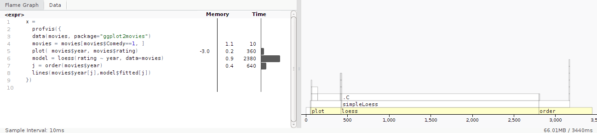
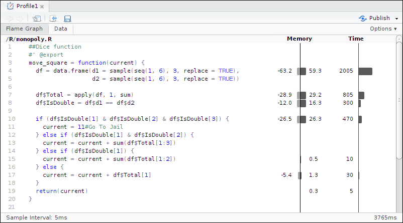
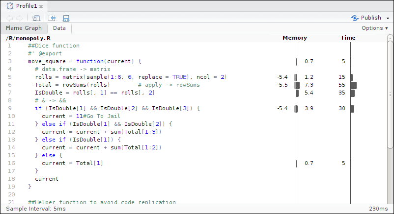

```{r, echo=FALSE}
rm(list=ls())
```

# Efficient optimization {#performance}

[Donald Knuth](https://en.wikiquote.org/wiki/Donald_Knuth) is a legendary American
computer scientist who developed a number of the key algorithms that we use today (see for 
example `?Random`).
On the subject of optimization he give this advice.

> The real problem is that programmers have spent far too much time worrying about
efficiency in the wrong places and at the wrong times; premature optimization is the
root of all evil (or at least most of it) in programming.

Knuth's point is that it is easy to undertake code optimisation inefficiently.
When developing code, the causes of inefficiencies may shift so that what originally caused slowness at the beginning of your work may not be relevant at a later stage. This means that
time spent optimizing code early in the developmental stage could be wasted. Even worse,
there is a trade-off between code speed and code readability; we've already made this trade-off
once by using readable, (but slow) R compared with verbose C code! 

For this reason this chapter is covered towards the latter half of the book. The
previous chapters deliberately focussed on concepts, packages and functions to
increase efficiency. These are (relatively) easy ways of saving time that, once
implemented, will work for future projects. Code optimisation, by contrast, is an
advanced topic that should only be tackled once 'low hanging fruit' for efficiency
gains have been taken.

In this chapter we assume that you already have well-developed code that is mature
conceptually and has been tried and tested. Now you want to optimize this code, but
not prematurely. The chapter is organised as follows. First we begin with general
hints and tips about optimising base R code. Code profiling can identify key
bottlenecks in the code in need of optimization, and this is covered in the next
section. Section \@ref(performance-parallel) discusses how parallel code can overcome
efficiency bottlenecks for some problems. The final section explains how `Rcpp` can be
used to efficiently incorporating C++ code into an R analysis.

### Prerequistes {-}

In this chapter, some of the examples require a working C++ compiler. The installation
method depends on your operating system:
 
 * Linux: A compiler should already be installed. Otherwise, install `r-base` and a compiler will be installed as a dependency.
 * Macs: Install `Xcode`.
 * Windows: Install [Rtools](http://cran.r-project.org/bin/windows/). Make sure you select the version that corresponds to your version of R.

The packages used in this chapter are
```{r}
library("microbenchmark")
library("ggplot2movies")
library("profvis")
library("Rcpp")
```

## Top 5 tips for efficient performance

  1. Before you start to optimise you code, ensure you know where the bottleneck lies; use
  a code profiler.
  1. If the data in your data frame is all of the same type, consider converting it
  to a matrix for a speed boost.
  1. Use specialised row and column functions whenever possible.
  1. The __parallel__ package is ideal for Monte-Carlo simulations.
  1. For optimal performance, consider re-writing key parts of your code in C++.

## Code profiling {#performance-profvis}

Often you will have working code, but simply want it to run faster. In some cases it's
obvious where the bottle neck lies. Sometimes you will guess, relying on intuition. A
drawback of this is that you could be wrong, and waste time optimising the wrong piece
of code. To make slow code run faster, it is first important to determine where the
slow code lives. This is the purpose of code profiling.

The `Rprof()` function is a built-in tool for profiling the execution of R expressions. At
regular time intervals, the profiler stops the R interpreter, records the current
function call stack, and saves the information to a file. The results from `Rprof()` are
stochastic. Each time we run a function R, the conditions have changed. Hence, each
time you profile your code, the result will be slightly different.

Unfortunately `Rprof()` is not user friendly. For this reason we recommend using the **profvis** package for profiling your R code.
**profvis** provides an interactive graphical interface for visualising code profiling data data from `Rprof()`.

### Getting started with **profvis**

After installing **profvis**, e.g. with `install.packages("profvis")`, it can be used
to profile R code. As a simple example, we will use the `movies` data set, which
contains information on around 60,000 movies. First, we'll select movies that are
classed as comedies, then plot year the movies was made verus the movie rating, and
draw a local polynomial regression line to pick out the trend. The main function from
the **profvis** package is `profvis()`, which profiles the code and creates an
interactive HTML page of the results. The first argument of `profvis()` is the R
expression of interest. This can be many lines long:

```{r, eval=FALSE}
library("profvis")
profvis({
  data(movies, package = "ggplot2movies") # Load data
  movies = movies[movies$Comedy == 1,]
  plot(movies$year, movies$rating)
  model = loess(rating ~ year, data = movies) # loess regression line
  j = order(movies$year)
  lines(movies$year[j], model$fitted[j]) # Add line to the plot
})
```

The above code provides an interactive HTML page (figure \@ref(fig:7-1)). On the
left side is the code and on the right is a flame graph (horizontal direction is time
in milliseconds and the vertical direction is the call stack).

```{r 7-1, echo=FALSE, fig.cap="Output from profvis", out.width="100%"}

```

The left hand panel gives the amount of time spent on each line of code. It shows that
majority of time is spent calculating the `loess()` smoothing line. The bottom line of
the right panel also highlights that most of the execution time is spent on the
`loess()` function. Travelling up the function, we see that `loess()` calls `simpleLoess()`
which in turn calls `.C()` function.

The conclusion from this graph is that if optimisation were required, it would make
sense to focus on the `loess()` and possibly the `order()` function calls.
 
```{r, eval=FALSE, echo=FALSE}
# Code for screen shot
library("profvis")
x = 
  profvis({
    data(movies, package="ggplot2movies")
    movies = movies[movies$Comedy==1, ]
    plot(movies$year, movies$rating)
    model = loess(rating ~ year, data=movies)
    j = order(movies$year)
    lines(movies$year[j], model$fitted[j])
})
print(x, viewer=TRUE, width="1300px", height="300px")
```

### Example: Monopoly Simulation {#monopoloy}

Monopoly is a board game that originated in the United States over $100$ years ago. The
objective of the game is to go round the board and purchase squares (properties). If
other players land on your properties they have to pay a tax. The player with the most
money at the end of the game, wins. To make things more interesting, there are Chance
and Community Chest squares. If you land on one of these squares, you draw card, which
may send to you to other parts of the board. The other special square, is Jail. One
way of entering Jail is to roll three successive doubles.

The **efficient** package contains a Monte-Carlo function for simulating a simplified
game of monopoly. By keeping track of where a person lands when going round the board,
we obtain an estimate of the probability of landing on a certain square. The entire
code is around 100 lines long. In order for **profvis** to fully profile the code, the
**efficient** package needs to be installed from source

```{r eval=FALSE}
devtools::install_github("csgillespie/efficient", args="--with-keep.source")
```

The function can then be profiled via the following code, which results in figure \@ref(fig:7-2). 

```{r eval=FALSE}
library("efficient")
profvis(simulate_monopoly(10000))
```

```{r 7-2, echo=FALSE, out.width="100%", fig.cap="Code profiling for simulating the game of Monopoly."}

```

The output from **profvis** shows that the vast majority of time (around 65%) is spent in the
`move_square()` function.

In Monopoly moving around the board is complicated by the fact that rolling a double
(a pair of 1's, 2's, ..., 6's) is special:

 * Roll two dice (`total1`): `total_score = total1`;
 * If you get a double, roll again (`total2`) and `total_score = total1 + total2`;
 * If you get a double, roll again (`total3`) and `total_score = total1 + total2 + total3`;
 * If roll three is a double, Go To Jail, otherwise move `total_score`.

The function `move_square()` captures this logic. Now we know where the code is slow, 
how can we speed up the computation? In the next section, we will discuss standard
techniques that can be used. We will then revisit this example.

## Efficient base R 

In R there is often more than one way to solve a problem. In this section we
highlight standard tricks or alternative methods that may improve performance. 

### The `if()` vs `ifelse()` functions {-}

`ifelse()` is a vectorised version of the standard control-flow function `if(test) if_yes else if_no` 
that works as follows:
```{r eval=FALSE}
ifelse(test, if_yes, if_no)
```
In the above imaginary example, the return value
is filled with elements from the `if_yes` and `if_no` arguments that are
determined by whether the element of `test` is `TRUE` or `FALSE`. For example, 
suppose we have a vector of exam marks. `ifelse()` could be used to classify
them as pass or fail:
```{r}
marks = c(25, 55, 75)
ifelse(marks >= 40, "pass", "fail")
```

If the length of `test` condition is equal to $1$, i.e. `length(test) == 1`, 
then the standard conditional statement

```{r, results="hide"}
mark = 25
if(mark >= 40) {
  "pass" 
} else {
  "fail"
}
```
is around five to ten times faster than `ifelse(mark >= 40, "pass", "fail")`.

An additional quirk of `ifelse()` is that although it is more *programmer efficient*, as it is more concise and understandable, than multi-line alternatives, it is often **less** *computationally efficient* than a more verbose alternative. This is illustrated with the following benchmark, in which the second option runs around 20 times faster, despite the results being identical:

```{r}
marks = runif(n = 10e6, min = 30, max = 99)
system.time({
  result1 = ifelse(marks >= 40, "pass", "fail")
})
system.time({
  result2 = rep("fail", length(marks)) 
  result2[marks >= 40] = "pass"
})
identical(result1, result2)
```

There is talk on the [R-devel email](http://r.789695.n4.nabble.com/ifelse-woes-can-we-agree-on-a-ifelse2-td4723584.html) list of speeding up `ifelse()` in base R. A simple solution is to use the `if_else()` function from **dplyr**, although, as discussed in the [same thread](http://r.789695.n4.nabble.com/ifelse-woes-can-we-agree-on-a-ifelse2-td4723584.html), it cannot replace `ifelse()` in all situations. For our exam result test example, `if_else()` works fine and is much faster than base R's implantation (although is still around 3 times slower than the hard-coded solution):

```{r}
system.time({
  result3 = dplyr::if_else(marks >= 40, "pass", "fail")
})
identical(result1, result3)
```

### Sorting and ordering {-}

Sorting a vector is relatively quick; sorting a vector of length
$10^7$ takes around $0.01$ seconds. If you only sort a vector once at the top of a
script, then don't worry too much about this. However if you are sorting inside a loop, or
in a shiny application, then it can be worthwhile thinking about how to optimise this
operation.

There are currently three sorting algorithms, `c("shell", "quick", "radix")` that can
be specified in the `sort()` function; with `radix` being a new addition to R 3.3.
Typically the `radix` (the non-default option) is the most computationally efficient option
for most situations (it is around 
20% faster when sorting a large vector of doubles).

Another useful trick is to partially order the results. For example, if you only want
to display the top ten results, then use the `partial` argument, i.e. `sort(x, partial = 1:10)`.
For very large vectors, this can give a three fold speed increase.


```{r, eval=FALSE, echo=FALSE}
x = matrix(rnorm(1e7), ncol=100)
system.time({
  for(i in 1:100)
    sort(x[,i], method="radix")
})

system.time({
  for(i in 1:100)
    sort(x[,i], method="shell")
})
system.time({
  for(i in 1:100)
    sort(x[,i], method="quick")
})
system.time({
  for(i in 1:100)
    sort(x[,i], partial=1:2)
})
```

### Reversing elements {-}

The `rev()` function provides a reversed version of its argument. If you wish to sort in
increasing order, `sort(x, decreasing = TRUE)` is marginally (around 10%) faster than `rev(sort(x))`.

### Which indices are `TRUE` \ {-}

To determine which index of a vector or array are `TRUE`, we would typically use the
`which()` function. If we want to find the index of just the minimum or maximum value,
i.e. `which(x == min(x))` then using the efficient `which.min()`/`which.max()`
variants can be orders of magnitude faster (see figure \@ref(fig:7-3))

```{r 7-3, fig.cap="Comparison of `which.min()` with `which()`.", echo=FALSE, warning=FALSE, message=FALSE, out.width="90%", fig.align="center"}
local(source("code/07-performance_f3.R", local=TRUE))
```

###  Converting factors to numerics {-}

A factor is just a vector of integers with associated levels. Occasionally we want to
convert a factor into its numerical equivalent. The most efficient way of doing this (especially for long factors) is

```{r, echo=2, results="hide"}
f = factor(10:100)
as.numeric(levels(f))[f]
```

### Logical AND and OR {-}

The logical AND (`&`) and OR (`|`) operators are vectorised functions and are
typically used during multi-criteria subsetting operations. The code below, for example, 
returns `TRUE` for all elements of `x` greater than $0.4$ or less than $0.6$:

```{r, echo=-1}
x = c(0.2, 0.5, 0.7)
x < 0.4 | x > 0.6
```

When R executes the above comparison, it will **always** calculate `x > 0.6`
regardless of the value of `x < 0.4`. In contrast, the non-vectorised version, `&&`,
only executes the second component if needed. This is efficient and leads to neater
code, e.g.

```{r, results="hide"}
# We only calculate the mean if data doesn't contain NAs
if(all(!is.na(x)) && mean(x) > 0) {
  # Do something
}
```

compared to 

```{r, results="hide"}
if(all(!is.na(x))) {
  if(mean(x) > 0) {
    # do somthing
  }
}
```

However care must be taken not to use `&&` or `||` on vectors since it only evaluates the first element of the vector, giving the
incorrect answer. This is illustrated below:

```{r}
x < 0.4 || x > 0.6
```

### Row and column operations {-}

In data analysis we often want to apply a function to each column or row of a data
set. For example, we might want to calculation the column or row sums. The `apply()`
function makes this type of operation straightforward.
```{r eval=FALSE}
# Second argument: 1 -> rows. 2 -> columns
apply(data_set, 1, function_name)
```
There are optimised functions for calculating row and columns sums/means, `rowSums()`,
`colSums()`, `rowMeans()` and `colMeans()` that should be used whenever possible.  The package
**matrixStats** contains many optimised row/col functions.

### `is.na()` and `anyNA()` \ {-}

To test whether a vector (or other object) contains missing
values we use the `is.na()` function. Often we are interested in whether a vector
contains _any_ missing values. In this case, `anyNA(x)` is more efficient than
`any(is.na(x))`.

### Matrices {-}

A matrix is similar to a data frame: it is a two dimensional object and sub-setting
and other functions work in the same way. However all matrix elements must have
the same type. Matrices tend to be used during statistical calculations.
The `lm()` function, for example, internally converts the data to a
matrix before calculating the results; any characters are thus recoded as numeric
dummy variables.

Matrices are generally faster than data frames. For example, the datasets `ex_mat` and `ex_df` from
the **efficient** package each have $1000$ rows and $100$ columns and contain the
same random numbers. However selecting rows from the data frame is around $150$ times
slower than a matrix, as illustrated below:

```{r mat_vs_df, cache=TRUE}
data(ex_mat, ex_df, package="efficient")
microbenchmark(times=100, unit="ms", ex_mat[1,], ex_df[1,])
```

```{block, type="rmdtip"}
Use the `data.matrix()` function to efficiently convert a data frame into a matrix.
```

### The integer data type {-}

Numbers in R are usually stored in [double-precision floating-point
format](https://goo.gl/ZA5R8a), which is described in detail in @Braun2007 and @Goldberg1991. The term 'double'
refers to the fact that on $32$ bit systems (for which the format was developed) two
memory locations are used to store a single number. Each double-precision number is
accurate to around $17$ decimal places.

```{block type="rmdnote"}
When comparing floating point numbers we should be particularly careful, since `y = sqrt(2) * sqrt(2)` 
is not exactly $2$, instead it's __almost__ $2$. Using `sprintf("%.17f", y)` will
give you the true value of `y` (to 17 decimal places).
```

Integers are another numeric data type. Integers primarily exist to be passed to C or
Fortran code. You do will not need to create integers for most applications. However,
they are occasionally used to optimise sub-setting operations. When we subset a data
frame or matrix, we are interacting with C code we might be tempted to use integers
with the purpose of speeding up our code. For example, if we look at the arguments for
the `head` function

```{r}
args(head.matrix)
```

```{block, type="rmdtip"}
Using the `:` operator automatically creates a vector of integers.
```

we see that the default argument for `n` is `6L` rather than simply `6` (the `L` is short for Literal and is used to create an
integer). This gives a tiny speed boost (around 0.1 microseconds!)

```{r, matrix_timing, eval=FALSE}
x = runif(10)
microbenchmark(head(x, 6.0), head(x, 6L), times=1000000)
# Unit: microseconds
#        expr   min    lq  mean median    uq    max neval cld
#  head(x, 6) 7.067 8.309 9.058  8.686 9.098 105266 1e+06   a
# head(x, 6L) 6.947 8.219 8.933  8.594 9.007 106307 1e+06   a
```

Since this function is ubiquitous, this low level optimisation is useful. 
In general, if you are worried about shaving microseconds off your R code run time, you should
probably consider switching to another language.

Integers are more space efficient. 
The code below compares size of a integer vector to a standard numeric vector:

```{r}
pryr::object_size(1:10000)
pryr::object_size(y = seq(1, 10000, by=1.0))
```

The results show that the integer version is roughly half the size. However, most mathematical operations will convert
the integer vector into a standard numerical vector, as illustrated below: 

```{r}
is.integer(1L + 1)
```

Further storage savings can be obtained using the **bit** package.

### Sparse matrices {-}

Another data structure that can be stored efficiently is a sparse matrix. This is simply a matrix where most of the elements are
zero. Conversely, if most elements are non-zero, the matrix is considered dense. The proportion of non-zero elements
is called the sparsity. Large sparse matrices often crop up when performing numerical calculations. Typically, our
data isn't sparse but the resulting data structures we create may be sparse. There are a number of
techniques/methods used to store sparse matrices. Methods for creating sparse matrices
can be found in the **Matrix** package^[Technically this isn't in base R, it's a recommended
package.]. 

As an example, suppose we have a large matrix where the diagonal elements are non-zero:

```{r, message=FALSE}
library("Matrix")
N = 10000
sp = sparseMatrix(1:N, 1:N, x = 1)
m = diag(1, N, N)
```

Both objects contain the same information, but the data is stored differently; since 
we have the same value multiple times in the matrix, we only need to store the value once and 
link it to multiple matrix locations. The matrix object
stores each individual element, while the sparse matrix object only stores the location of the non-zero
elements. This is much more memory efficient, as illustrated below:

```{r}
pryr::object_size(sp)
pryr::object_size(m)
```

#### Exercises {-}

  1. Create a vector `x`. Benchmark `any(is.na(x))` against `anyNA()`. Do the results vary with the size of the vector.

  1. Examine the following function definitions to give you an idea of how integers are used.
    * `tail.matrix()`
    * `lm()`. 

  1. Construct a matrix of integers and a matrix of numerics. Using `pryr::object_size()`, compare the 
  objects.
  
  1. How does the function `seq.int()`, which was used in the `tail.matrix()` function, 
  differ to the standard `seq()` function?

```{block, type="rmdnote"}
A related memory saving idea is to replace `logical` vectors
with vectors from the **bit** package which take up just over 16th of the space
(but you can't use `NA`s).
```

## Example: Optimising  the `movie_square()` function

Figure \@ref(fig:7-2) shows that in our main bottle neck in simulating the game of
Monopoly is the `movie_square()` function. Within this function, we spend around 50%
of the time creating a data frame, 20% time calculating row sums, and the remainder on
a comparison operations. This piece of code can be optimised fairly easily (will still
retaining the same overall structure) by incorporating the following
improvements^[Solutions are available in the **efficient** package vignette.]:

  * Instead of using `seq(1, 6)` to generate the 6 possible values of rolling a dice, 
  use `1:6`. Also, instead of a data frame, use a matrix and perform a single call to 
  the `sample()` function
  
    ```{r, results="hide"}
    matrix(sample(1:6, 6, replace = TRUE), ncol = 2)
    ```
  
    Overall, this revised line is around 25 times faster; most of the speed boost came from
    switching to a matrix.
  * Using `rowSums()` instead of `apply()`. The `apply()` function call is already faster since we've switched 
  from a data frame to a matrix (around 3 times). Using `rowSums()` with a matrix, gives a 10 fold speed boost.
  * Use `&&` in the `if` condition; this is around twice as fast compared to `&`.
  
Impressively the refactored code runs 20 times faster than the original code, compare
figures \@ref(fig:7-2) and \@ref(fig:7-4), with the main speed boost coming from using
a matrix instead of a data frame.

```{r 7-4, echo=FALSE, out.width="100%", fig.cap="Code profiling of the optimised code."}

```


```{r eval=FALSE, echo=FALSE}
library(microbenchmark)
microbenchmark(seq(1, 6), 1:6)

microbenchmark(data.frame(d1 = sample(seq(1, 6), 3, replace = TRUE),
                  d2 = sample(seq(1, 6), 3, replace = TRUE)), 
               matrix(sample(1:6, 6, replace = TRUE), ncol = 2))

df = data.frame(d1 = sample(seq(1, 6), 3, replace = TRUE),
                  d2 = sample(seq(1, 6), 3, replace = TRUE))
dm = matrix(sample(1:6, 6, replace = TRUE), ncol = 2)
microbenchmark(apply(df, 1, sum), rowSums(df), apply(dm, 1, sum), rowSums(dm)) 
```


#### Exercise {-}

The `move_square()` function above uses a vectorised solution. Whenever we move, we
always roll six dice, then examine the outcome and determine the number of doubles.
However, this is potentially wasteful, since the probability of getting one double is
$1/6$ and two doubles is $1/36$. Another method is too only roll additional dice if
and when they are needed. Implement and time this solution.

## Parallel computing {#performance-parallel}

This section provides a brief foray into the word of parallel computing. It only looks
at methods for parallel computing on 'shared memory systems'. This simply means
computers in which multiple central processor unit (CPU) cores can access the same
block, i.e. most laptops and desktops sold worldwide. This section provides flavour of
what is possible; for a fuller account of parallel processing in R, see @mccallum2011.

The foundational package for parallel computing in R is **parallel**. In recent R versions (since R 2.14.0) this comes pre-installed
with base R. The **parallel** package must still be loaded before use, however, and
you must determine the number of available cores manually, as illustrated below:

```{r echo=1:2}
library("parallel")
no_of_cores = detectCores()
```

```{block, type="rmdnote"}
The value returned by `detectCores()` turns out to be operating system and chip maker
dependent - see `help("detectCores")` for full details. For most standard machines,
`detectCores()` returns the number of simultaneous threads.
```


### Parallel versions of apply functions

The most commonly used parallel applications are parallelised replacements of
`lapply()`, `sapply()` and `apply()`. The parallel implementations and their arguments are
shown below.

```{r eval=FALSE, tidy=FALSE}
parLapply(cl, x, FUN, ...)
parApply(cl = NULL, X, MARGIN, FUN, ...)
parSapply(cl = NULL, X, FUN, ..., simplify = TRUE, USE.NAMES = TRUE) 
```

The key point is that there is very little difference in arguments between `parLapply()`
and `apply()`, so the barrier to using (this form) of parallel computing is low,
assuming you are proficient with the apply family of functions. Each function above
has an argument `cl`, which is created by a `makeCluster()` call. This function, amongst
other things, specifies the number of processors to use.

### Example: Snakes and Ladders

Parallel computing is ideal for Monte-Carlo simulations. Each core independently
simulates a realisation from model. At the end, we gather up the results. In the
**efficient** package, there is a function that simulates a single game of Snakes and
Ladders - `snakes_ladders()`^[The idea for this example came to one of the authors
after a particularly long and dull game of Snakes and Ladders with his son.]

The following code illustrates how to simulate `N` games using `sapply()`:

```{r eval=FALSE, echo=c(1, 3)}
N = 10^4
N = 2
sapply(1:N, snakes_ladders)
```

Rewriting this code to make use of the **parallel** package is straightforward. 
Begin by making a cluster object:

```{r, eval=FALSE, echo=2:3}
library("efficient")
library("parallel")
cl = makeCluster(4)
```

Then simply swap `sapply()` for `parSapply()`:

```{r eval=FALSE}
parSapply(cl, 1:N, snakes_ladders)
```

It is important to stop the created clusters, as this can lead to memory leaks,^[See [github.com/npct/pct-shiny/issues/292](https://github.com/npct/pct-shiny/issues/292) for a real world example of the dangers of not stopping created cores.] as illustrated below:

```{r eval=FALSE}
stopCluster(cl)
```

If we achieved perfect parallelisation and used a four (or more) core, then we would
obtain a four-fold speed up (we set `makeCluster(4)`). However, we rarely get this 

On a multi-processor computer, this can lead to a four-fold speed-up. However, it is
rare that we would achieve this optimal speed-up since there always communication
between threads.

### Exit functions with care

Always call `stopCluster()` to free resources when you finish with the
cluster object. However if the parallel code is within function, it's possible that
function ends as the results of an error and so `stopCluster()` is omitted.

The `on.exit()` function handles this problem with the minimum of fuss; regardless of
how the function ends, `on.exit()` is always called. In the context of parallel
programming we will have something similar to
```{r}
simulate = function(cores) {
  cl = makeCluster(cores)
  on.exit(stopCluster(cl))
  # Do something  
}
```

```{block, type="rmdtip"}
Another common use of `on.exit()` is with the `par()` function. If you use
`par()` to change graphical parameters within a function, `on.exit()` ensures these
parameters are reset to their previous value when the function ends.
```

### Parallel code under Linux & OS X

```{r echo=FALSE}
library("efficient")
library("parallel")
```

If you are using Linux or OS, then another way of running code in parallel is to use 
the `mclapply()` and `mcmapply()` functions
```{r results="hide"}
# This will run on Windows, but will only use 1 core
mclapply(1:N, snakes_ladders)
```
These functions use forking, that is creating a new copy of a process running on the
CPU. However Windows does not support this low-level functionality in the way that
Linux does. The main advantage of `mclapply()` is that you don't have to start and stop cluster 
objects. The big disadvantage is that on Windows machines, you are limited to a single core.

## Rcpp

Sometimes R is just slow. You've tried every trick you know, and your code is still
crawling along. At this point you could consider rewriting key parts of your code in
another, faster language. R has interfaces to other languages via packages, such as
**Rcpp**, **rJava**, **rPython** and recently **V8**. These provide R interfaces to
C++, Java, Python and JavaScript respectively. **Rcpp** is the most popular of these
(figure \@ref(fig:7-5)).

```{r 7-5, echo=FALSE, fig.cap="Downloads per day from the RStudio CRAN mirror of packages that provide R interfaces to other languages.", warning=FALSE, fig.width=6, fig.height=4, out.width="70%", fig.align="center"}
local(source("code/07-performance_f5.R", local=TRUE))
```

C++ is a modern, fast and very well-supported language with libraries for performing
many kinds of computational task. **Rcpp** makes incorporating C++ code into your R
workflow easy.

Although C/Fortran routines can be used using the `.Call()` function this is not
recommended: using `.Call()` can be a painful experience. **Rcpp** provides a friendly
API (Application Program Interface) that lets you write high-performance code,
bypassing R's tricky C API. Typical bottlenecks that C++ addresses are loops and
recursive functions.

C++ is a powerful programming language about which entire books have been written.
This section therefore is focussed on getting started and provide a flavour of what is
possible. It is structured as follows. After ensuring that your computer is set-up for
**Rcpp**, we proceed by creating a simple C++ function, to show how C++ compares with
R (Section \@ref(simple-c)). This is converted into an R function using
`cppFunction()` in Section \@ref(cppfunction). The remainder of the chapter explains
C++ data types (Section \@ref(c-types)), illustrates how to source C++ code directly
(Section \@ref(sourcecpp)) and explains vectors (Section \@ref(vectors-and-loops))
**Rcpp** sugar (Section \@ref(sugar)) and finally provides guidance on further
resources on the subject (Section \@ref(rcpp-resources)).


### A simple C++ function {#simple-c}

To write and compile C++ functions, you need a working C++ compiler (see the
Prerequiste section at the beginning of this chapter). The code in this chapter was
generated using version `r packageDescription("Rcpp")$Version` of **Rcpp**. 

**Rcpp** is well documented, as illustrated by the number of vignettes on the package's
[CRAN](https://cran.r-project.org/web/packages/Rcpp/) page. In addition to its
popularity, many other packages depend on **Rcpp**, which can be seen by looking at
the `Reverse Imports` section.

To check that you have everything needed for this chapter, run the following piece of
code from the course R package:

```{r test_cpp, eval=FALSE, results="hide"}
efficient::test_rcpp()
```

A C++ function is similar to an R function: you pass a set of inputs to function, some
code is run, a single object is returned. However there are some key differences.

1. In the C++ function each line must be terminated with `;` In R, we use `;` only when we have multiple statements on the same line.
2. We must declare object types in the C++ version. In particular we need to declare the types of the function arguments, return value and any intermediate objects we create. 
3. The function must have an explicit `return` statement. Similar to R, there can be multiple returns, but the function will terminate when it hits it's first `return` statement.
4. You do not use assignment when creating a function.
5. Object assignment must use `=` sign. The `<-` operator isn't valid.
6. One line comments can be created using `//`. Multi-line comments are created using `/*...*/`

Suppose we want to create a function that adds two numbers together. In R this would
be a simple one line affair:
  
```{r} 
add_r = function(x, y) x + y
```

In C++ it is a bit more long winded

```{Rcpp eval=FALSE, tidy=FALSE}
/* Return type double
 * Two arguments, also doubles
 */
double add_cpp(double x, double y) { 
  double value = x + y;
  return value;
}
```

If we were writing a C++ program we would also need another function called `main()`.
We would then compile the code to obtain an executable. The executable is platform
dependent. The beauty of using **Rcpp** is that it makes it very easy to call C++
functions from R and the user doesn't have to worry about the platform, or compilers
or the R/C++ interface.

### The `cppFunction()` command {#cppfunction}

If we pass the C++ function created in the previous section as a text string argument to
`cppFunction()`:

```{r tidy=FALSE}
library("Rcpp")
cppFunction('
  double add_cpp(double x, double y) {
    double value = x + y;
    return value;
  }
')
```

**Rcpp** will magically compile the C++ code and construct a function that bridges the
gap between R and C++. After running the above code, we now have access to the `add_cpp()`
function

```{r}
add_cpp
```
and can call the `add_cpp()` function in the usual way

```{r}
add_cpp(1, 2)
```

We don't have to worry about compilers. Also, if you include this function in a
package, users don't have to worry about any of the **Rcpp** magic. It just works.

### C++ data types {#c-types}

The most basic type of variable is an integer, `int`. An `int` variable can store a
value in the range $-32768$ to $+32767$. To store floating point numbers, there are
single precision numbers, `float` and double precision numbers, `double`. A `double`
takes twice as much memory as a `float` (in general, we should always work with double
precision numbers unless we have a compiling reason to switch to floats). For
__single__ characters, we use the `char` data type.

```{block, type="rmdnote"}
There is also something called an unsigned
int, which goes from $0$ to $65,535$ and a `long int` that ranges  from $0$ to $2^{31}-1$.
```

```{r cpptypes, echo=FALSE}
tmp = data.frame(Type = c("char", "int", "float", "double", "void"), 
                 Description = c("A single character.", "An integer.", 
                                 "A single precision floating point number.",
                                 "A double-precision floating point number.",
                                 "A valueless quantity."))
knitr::kable(tmp, caption="Overview of key C++ object types.")
```

A pointer object is a variable that points to an area of memory that has been given a
name. Pointers are a very powerful, but primitive facility contained in the C++
language. They are very useful since rather than passing large objects around, we pass
a pointer to the memory location; rather than pass the house, we just give the
address. We won't use pointers in this chapter, but mention them for completeness.
Table \@ref(tab:cpptypes) gives an overview.

### The `sourceCpp()` function {#sourcecpp}

The `cppFunction()` is great for getting small examples up and running. But it is better
practice to put your C++ code in a separate file (with file extension `cpp`) and use
the function call `sourceCpp("path/to/file.cpp")` to compile them. However we need to
include a few headers at the top of the file. The first line we add gives us access to
the **Rcpp** functions. The file `Rcpp.h` contains a list of function and class
definitions supplied by **Rcpp**. This file will be located where **Rcpp** is
installed. The `include` line

```{Rcpp eval=FALSE}
#include <Rcpp.h>
```

causes the compiler to replace that lines with the contents of the named source file.
This means that we can access the functions defined by **Rcpp**. To access the
**Rcpp** functions we would have to type `Rcpp::function_1`. To avoid typing `Rcpp::`,
we use the namespace facility

```{Rcpp eval=FALSE}
using namespace Rcpp;
```

Now we can just type `function_1()`; this is the same concept that R uses for managing
function name collisions when loading packages. Above each function we want to
export/use in R, we add the tag

```{Rcpp eval=FALSE}
// [[Rcpp::export]]
```

```{block, type="rmdnote"}
Similar to packages and the `library()` function in R, we access additional functions
via `#include`. A standard header to include is `#include <math.h>` which contains
standard mathematics functions.
```

This would give the complete file

```{Rcpp}
#include <Rcpp.h>
using namespace Rcpp;

// [[Rcpp::export]]
double add_cpp(double x, double y) {
  double value = x + y;
  return value;
}
```

There are two main benefits with putting your C++ functions in separate files. First,
we have the benefit of syntax highlighting (RStudio has great support for C++
editing). Second, it's easier to make syntax errors when the switching between R and
C++ in the same file. To save space we we'll omit the headers for the remainder of
the chapter.

### Vectors and loops

Let's now consider a slightly more complicated example. Here we want to write our own
function that calculates the mean. This is just an illustrative example: R's version
is much better and more robust to scale differences in our data. For comparison, let's
create a corresponding R function - this is the same function we used in chapter
\@ref(programming). The function takes a single vector `x` as input, and returns the
mean value, `m`:

```{r}
mean_r = function(x) {
  m = 0
  n = length(x)
  for(i in 1:n)
    m = m + x[i] / n
  m
}
```

This is a very bad R function; we should just use the base function `mean()` for real
world applications. However the purpose of `mean_r()` is to provide a comparison for the
C++ version, which we will write in a similar way.

In this example, we will let **Rcpp** smooth the interface between C++ and R by using
the `NumericVector` data type. This **Rcpp** data type mirrors the R vector object
type. Other common classes are: `IntegerVector`, `CharacterVector`, and
`LogicalVector`.

In the C++ version of the mean function, we specify the arguments types: `x`
(`NumericVector`) and the return value (`double`). The C++ version of the `mean()`
function is a few lines longer. Almost always, the corresponding C++ version will be,
possibly much, longer. In general R optimises for reduced development time; C++
optimises for fast execution time. The corresponding C++ function for calculating the
mean is

```{Rcpp eval=FALSE}
double mean_cpp(NumericVector x) {
  int i;
  int n = x.size();
  double mean = 0;

  for(i=0; i<n; i++) {
    mean = mean + x[i] / n;
  }
  return mean;
}
``` 

To use the C++ function we need to source the file (remember to put the necessary headers in).

```{r}
sourceCpp("src/mean_cpp.cpp")
```

Although the C++ version is similar, there are a few crucial differences.

1. We use the `.size()` method to find the length of `x`.
1. The `for` loop has a more complicated syntax.
    ```{Rcpp eval=FALSE}
    for (variable initialisation; condition; variable update ) {
      // Code to execute
    }
    ```
    In this example, the loop initialises `i = 0` and will continue running until `i < n` is false. 
    The statement `i++` increases the value of `i` by `1`; essentially it's just shortcut for `i = i + 1`.
1. Similar to `i++`, C++ provides other operators to modify variables in place. For example we could rewrite part of the loop as
    ```{Rcpp eval=FALSE}
    mean += x[i] / n;
    ```
The above code adds `x[i] / n` to the value of `mean`. Other similar operators are `-=`, `*=`, `/=` and `i--`.
1. A C++ vector starts at `0` **not** `1`

To compare the C++ and R functions, we'll generate some normal random numbers for the
comparison

```{r}
x = rnorm(1e4)
```

Then call the `microbenchmark()` function (results plotted in figure
\@ref(fig:7-6)).

```{r cache=TRUE, echo=-1, eval=FALSE}
com_mean_r = compiler::cmpfun(mean_r)
# com_mean_r is the compiled version of mean_r
z = microbenchmark(
  mean(x), mean_r(x), com_mean_r(x), mean_cpp(x),
  times = 1000
)
```

In this simple example, the Rcpp variant is around $100$ times faster than the
corresponding pure R version. This sort of speed-up is not uncommon when switching to
an Rcpp solution. Notice that the Rcpp version and standard base function `mean()` run
at roughly the same speed; after all, the base R function is written in C. However,
`mean()` uses a more sophisticated algorithm when calculating the mean to ensure
accuracy.

```{r 7-6, fig.width=6, fig.height=4, echo=2, fig.cap="Comparison of mean functions.", echo=2, cache=TRUE, fig.pos='t', out.width="70%"}
local(source("code/07-performance_f6.R", local=TRUE))
```

#### Exercises {-}

Consider the following piece of code

```{Rcpp eval=FALSE, tidy=FALSE}
double test1() {
  double a = 1.0 / 81;
  double b = 0;
  for (int i = 0; i < 729; ++ i)
    b = b + a;
  return b;
}
```

1. Save the function `test1()` in a separate file. Make sure it works.
2. Write a similar function in R and compare the speed of the C++ and R versions.
3. Create a function called `test2()` where the `double` variables have been replaced by `float`. Do you still get the correct answer?
4. Change `b = b + a` to `b += a` to make your code more C++ like. 
5. (Hard) What's the difference between `i++` and `++i`?

#### Matrices {-}

Each vector type has a corresponding matrix equivalent: `NumericMatrix`,
`IntegerMatrix`, `CharacterMatrix` and `LogicalMatrix`. We use these types in a
similar way to how we used `NumericVector`'s. The main differences are:

 * When we initialise, we need specify the number of rows and columns
    ```{Rcpp, eval=FALSE}
    // 10 rows, 5 columns
    NumericMatrix mat(10, 5);
    // Length 10
    NumericVector v(10);
    ```

 * We subset using `()`, i.e. `mat(5, 4)`.
 * The first element in a matrix is `mat(0, 0)` - remember indexes start with `0` not `1`.
 * To determine the number of rows and columns, we use the `.nrow()` and `.ncol()` methods.

### C++ with sugar on top {#sugar}

**Rcpp** sugar brings a higher-level of abstraction to C++ code written using the
**Rcpp** API. What this means in practice is that we can write C++ code in the style
of R. For example, suppose we wanted to find the squared difference of two vectors; a
squared residual in regression. In R we would use
```{r}
sq_diff_r = function(x, y) (x - y)^2
```
Rewriting the function in standard C++ would give

```{Rcpp eval=FALSE}
NumericVector res_c(NumericVector x, NumericVector y) {
  int i;
  int n = x.size();
  NumericVector residuals(n);
  for(i=0; i < n; i++) {
    residuals[i] = pow(x[i] - y[i], 2);
  }
  return residuals;
}
```

With **Rcpp** sugar we can rewrite this code to be more succinct and have more of an R
feel:

```{Rcpp eval=FALSE}
NumericVector res_sugar(NumericVector x, NumericVector y) {
  return pow(x-y, 2);
}
```

In the above C++ code, the `pow()` function and `x-y` are valid due to **Rcpp** sugar.
Other functions that are available include the d/q/p/r statistical functions, such as
`rnorm()` and `pnorm()`. The sweetened versions aren't usually faster than the C++
version, but typically there's very little difference between the two. However with
the sugared variety, the code is shorter and is constantly being improved.

#### Exercises {-}

1. Construct an R version (using a `for` loop rather than the vectorised solution),
`res_r()` and compare the three function variants. 
1. In the above example, `res_sugar()` is faster than `res_c()`. Do you know why?

### Rcpp resources

The aim of this section was to provide an introduction to **Rcpp**. One of the selling 
features of **Rcpp** is that there is a great deal of documentation available.

 * The **Rcpp** [website](http://www.rcpp.org/);
 * The original Journal of Statistical Software paper describing **Rcpp**
 and the follow-up book [@Eddelbuettel2011; @Eddelbuettel2013];
 * @Wickham2014 provides a very readable chapter on **Rcpp** that goes into a bit more detail than this section;
 * The **Rcpp** section on the [stackoverflow](https://stackoverflow.com/questions/tagged/rcpp) website.
 Questions are often answered by the **Rcpp** authors.
 

