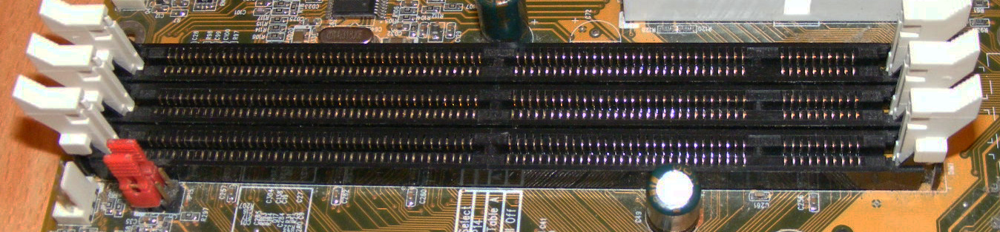
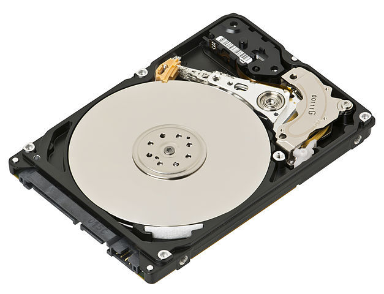

```{r, echo=FALSE}
rm(list=ls())
```

# Efficient hardware {#hardware}

This chapter is odd for a book on R programming. It contains very little code, 
and yet the chapter has the potential to speed up your algorithms by orders of
magnitude. This chapter considers the impact that your computer has on your time.

Your hardware is crucial. It will not only determine how _fast_ you can solve your
problem, but also whether you can even tackle the problem of interest. 
This is because everything is loaded in RAM. Of course, having a more powerful
computer costs money. The goal is to help you decide whether the benefits of
upgrading your hardware are worth that extra cost.

We'll begin this chapter with an background section on computer storage and 
memory and how it is measured. Then we consider individual computer components, 
before concluding with renting machines in the cloud.

### Prerequisites {-}

This chapter will focus on assessing your hardware and the benefit of upgrading. We 
will use the **benchmarkme** package to quantify the effect of changing your CPU.
```{r}
library("benchmarkme")
```

## Top 5 tips for efficient hardware

1. Use the package **benchmarkme** to assess your CPUs number crunching ability; 
  is it worth upgrading your hardware?
1. If possible, add more RAM.
1. Double check that you have installed a $64$-bit version of R.
1. Cloud computing is a cost effective way of obtaining more compute power.
1. A solid state drives typically won't have much impact on the speed of your R code, 
  but will increase your overall productivity since I/0 is much faster.

## Background: what is a byte?

A computer cannot store "numbers" or "letters". The only thing a computer can store and work with is bits. A bit is binary, it is either a $0$ or a $1$. In fact from a physics perspective, a bit is just a blip of electricity that either is or isn't there.

In the past the ASCII character set dominated computing. This set defines $128$ characters including $0$ to $9$, upper and lower case alpha-numeric and a few control characters such as a new line. To store these characters required $7$ bits
since $2^7 = 128$, but $8$ bits were typically used for performance [reasons](http://stackoverflow.com/q/14690159/203420). Table \@ref(tab:ascii) gives the binary representation of the first few characters.

```{r ascii, echo=FALSE}
dd = tibble::frame_data(
  ~"Bit representation", ~"Character",
  "$01000001$",  "A",
  "$01000010$" , "B",
  "$01000011$" , "C",
  "$01000100$" , "D",
  "$01000101$" , "E",
  "$01010010$" , "R"
)
knitr::kable(dd, caption="The bit representation of a few ASCII characters.")
```

The limitation of only having $256$ characters led to the development of Unicode, a standard framework aimed at creating a single character set for every reasonable writing system. Typically, Unicode characters require sixteen bits of storage. 

Eight bits is one byte, or ASCII character. So two ASCII characters would use two bytes or $16$ bits. A pure text document containing $100$ characters would use $100$ bytes ($800$ bits). Note that mark-up, such as font information or meta-data, can impose a substantial memory overhead: an empty `.docx` file requires about $3,700$ bytes of storage.

When computer scientists first started to think about computer memory, they noticed that $2^{10} = 1024 \simeq 10^3$ and $2^{20} =1,048,576\simeq 10^6$, so they adopted the short hand of kilo- and mega-bytes. Of course, _everyone_ knew that it was just a short hand, and it was really a binary power. When computers became more wide spread, foolish people like you and me just assumed that kilo actually meant $10^3$ bytes.

Fortunately the IEEE Standards Board intervened and created conventional, internationally adopted definitions of the International System of Units (SI) prefixes. So a kilobyte (kB) is $10^3 = 1000$ bytes and a megabyte (MB) is $10^6$ bytes or $10^3$ kilobytes (see table 8.2). A petabyte is approximately $100$ million drawers filled with text. Astonishingly Google processes around $20$ petabytes of data every day. 

Factor | 	Name |	Symbol |	Origin| Derivation 
-------|-------|---------|--------|-----------
$2^{10}$ |  kibi  | 	Ki | 	Kilobinary:  | $(2^{10})^1$  |  Kilo: $(10^3)^1$ 
$2^{20}$ | 	mebi  | 	Mi | 	Megabinary:  | $(2^{10})^2$  |  Mega: $(10^3)^2$ 
$2^{30}$ | 	gibi  | 	Gi | 	Gigabinary:  | $(2^{10})^3$	 |  Giga: $(10^3)^3$ 
$2^{40}$ | 	tebi  | 	Ti | 	Terabinary:  | $(2^{10})^4$	 |  Tera: $(10^3)^4$ 
$2^{50}$ | 	pebi  | 	Pi | 	Petabinary:  | $(2^{10})^5$	 |  Peta: $(10^3)^5$ 

Table 8.2: Data conversion table. Credit: [http://physics.nist.gov/cuu/Units/binary.html](http://physics.nist.gov/cuu/Units/binary.html)

Even though there is now an agreed standard for discussing memory, that doesn't mean that everyone follows it.
Microsoft Windows, for example, uses 1MB to mean $2^{20}$B. Even more confusing the capacity of a $1.44$MB floppy disk is a mixture, $1\text{MB} = 10^3 \times 2^{10}$B. Typically RAM is specified in kibibytes, but hard drive manufactors follow the SI standard!

## Random access memory: RAM {#ram}

Random access memory (RAM) is a type of computer memory that can be accessed randomly: any byte of memory can be accessed without touching the preceding bytes. RAM is found in computers, phones, tablets and even printers. The amount of RAM R has access to is incredibly important. Since R loads objects into RAM, the amount of RAM you have available can limit the size of data set you can analysis.

Even if the original data set is relatively small, your analysis can generate large objects. For example, suppose we want to perform standard cluster analysis. The built-in data set `USAarrests`, is a data frame with $50$ rows and $4$ columns. Each row corresponds to a state in the USA

```{r echo=2}
data("USArrests", package = "datasets")
head(USArrests, 3)
```

If we want to group states that have similar crime statistics, a standard first step is to calculate the distance or similarity matrix

```{r}
d = dist(USArrests)
```

When we inspect the object size of the original data set and the distance object using the **pryr** package

```{r}
pryr::object_size(USArrests)
pryr::object_size(d)
```

```{block, type="rmdnote"}
The distance object `d` is actually a vector that contains the distances in the upper triangular region. 
```

we have managed to create an object that is three times larger than the original data set. In fact the object `d` is a symmetric $n \times n$ matrix, where $n$ is the number of rows in `USAarrests`. Clearly, as `n` increases the size of `d` increases at rate $O(n^2)$. So if our original data set contained $10,000$ records, the associated distance matrix would contain almost $10^8$ values. Of course since the matrix is symmetric, this corresponds to around $50$ million unique values. 

```{block, type="rmdtip"}
A rough rule of thumb is that your RAM should be three times the size of your data set.
```

Another benefit of having increasing the amount of onboard RAM is that the 'garbage collector', a process that runs periodically to free-up system memory occupied by R, is called less often. It is straightforward to determine how much RAM you have using the **benchmarkme** package

```{r, results="hide"}
benchmarkme::get_ram()
#> 16.3 GB
```

<!-- https://en.wikipedia.org/wiki/DIMM -->
```{r 8-1, fig.cap="Three DIMM slots on a computer motherboard used for increasing the amount of available RAM. Credit: Wikimedia.org", echo=FALSE, out.width="100%"}

```

It is sometimes possible to increase your computer's RAM. On a computer motherboard there are typically $2$ to $4$ RAM or memory slots. If you have free slots, then you can add more memory. RAM comes in the form of dual in-line memory modules (DIMMs) that can be slotted into the mother board spaces (see figure \@ref(fig:8-1) for example).
However it is common that all slots are already taken. This means that to upgrade your computer's memory, some or all of the DIMMs will have to be removed. To go from $8$GB to $16$GB, for example, you may have to discard the two $4$GB RAM cards and replace them with two $8$GB cards. Increasing your laptop/desktop from $4$GB to $16$GB or $32$GB is cheap and should definitely be considered. As R Core member Uwe Ligges states,

```{r}
fortunes::fortune(192)
```

It is a testament to the design of R that it is still relevant and its popularity is growing. Ross Ihaka, one of the originators of the R programming language, made a throw-away comment in 2003:

```{r}
fortunes::fortune(21)
```

Considering that a standard smart phone now contains $1$GB of RAM, the fact that R was designed for "basic" computers, but can scale across clusters is impressive.
R's origins on computers with limited resources helps explain its efficiency at dealing with large datasets.

#### Exercises {-}

The following two exercises aim to help you determine if it is worthwhile upgrading your RAM.

1. R loads everything into memory, i.e. your computers RAM. How much RAM does your computer you have?
2. Using your preferred search engine, how much does it cost to double the amount of available RAM on your system? 

## Hard drives: HDD vs SSD

You are using R because you want to analyse data. 
The data is typically stored on your hard drive; but not all hard drives are equal.
Unless you have a fairly expensive laptop your computer probably has a standard hard disk drive (HDD). 
HDDs were first introduced by IBM in 1956. Data is stored using magnetism on a rotating platter, as shown in Figure \@ref(fig:8-2). The faster the platter spins, the faster the HDD can perform. Many laptop drives spin at either $5400$RPM (Revolutions per Minute) or $7200$RPM. The major advantage of HDDs is that they are cheap, making a $1$TB laptop standard.

```{block type="rmdnote"}
In the authors' experience, having an SSD drive doesn't make **much** difference to
R. However, the reduction in boot time and general tasks makes an SSD drive 
a wonderful purchase.
```

```{r 8-2, fig.cap='A standard 2.5" hard drive, found in most laptops. Credit: https://en.wikipedia.org/wiki/Hard\\_disk\\_drive', echo=FALSE}

```

Solid state drives (SSDs) can be thought of as large, but more sophisticated versions of USB sticks. They have no moving parts and information is stored in microchips. Since there are no moving parts, reading/writing is much quicker. SSDs have other benefits: they are quieter, allow faster boot time (no 'spin up' time) and require less power (more battery life).

The read/write speed for a standard HDD is usually in the region of $50-120$MB/s (usually closer to $50$MB). For SSDs, speeds are typically over $200$MB/s. For top-of-the-range models this can approach $500$MB/s. If you're wondering, read/write speeds for RAM is around $2-20$GB/s. So at best SSDs are at least one order of magnitude slower than RAM, but still faster than standard HDDs.

```{block type="rmdtip"}
If you are unsure what type of hard drive you have, then time how long your computer takes to reach the
log-in screen. If it is less then five seconds, you probably have a SSD. 
There are links on the book's website detailing more precise methods for each OS.
```

## Operating systems: 32-bit or 64-bit

R comes in two versions: $32$-bit and $64$-bit. 
Your operating system also comes in two versions, $32$-bit and $64$-bit. 
Ideally you want $64$-bit versions of both R and the operating system.
Using a $32$-bit version of either has severe limitations on the amount of RAM R can access.
So when we suggest that you should just buy more RAM, this assumes that you are using a $64$-bit operating system, with
a $64$-bit version of R.

```{block type="rmdnote"}
If you are using an OS version from the last five years, it is unlikely to be $32$-bit OS.
```

A $32$-bit machine can access at most only $4$GB of RAM. Although some CPUs offer solutions to this limitation, if you are running a $32$-bit operating system, then R is limited to around $3$GB RAM. If you are running a $64$-bit operating system, but only a $32$-bit version of R, then you have access to slightly more memory (but not much).
Modern systems should run a $64$-bit operating system, with a $64$-bit version of R.
Your memory limit is now measured as $8$ terabytes for Windows machines and $128$TB for Unix-based OSs. 
An easy method for determining if you are running a $64$-bit version of R is to run
```{r results="hide"}
.Machine$sizeof.pointer
```
which will return $8$ if you a running a $64$-bit version of R.

To find precise details consult the R help pages `help("Memory-limits")` and `help("Memory")`.

#### Exercises {-}

These exercises aim to condense the previous section into the key points.

1. Are you using $32$-bit or $64$-bit version of R?
2. If you are using Windows, what are the results of running the command `memory.limit()`?

## Central processing unit (CPU)

The central processing unit (CPU), or the processor, is the brains of a computer. The
CPU is responsible for performing numerical calculations. The faster the processor,
the faster R will run. The clock speed (or clock rate, measured in hertz) is frequency
with which the CPU executes instructions. The faster the clock speed, the more
instructions a CPU can execute in a section. CPU clock speed for a single CPU has been
fairly static in the last couple of years, hovering around 3.4GHz (see figure
\@ref(fig:8-3)).

```{r 8-3, echo=FALSE, fig.width=6, fig.height=4, fig.cap="CPU clock speed. The data for this figure was collected from web-forum and wikipedia. It is intended to indicate general trends in CPU speed.", out.width="70%"} 
local(source("code/08-hardware_cpu_speed.R", local = TRUE))
```

Unfortunately we can't simply use clock speeds to compare CPUs, since the internal
architecture of a CPU plays a crucial role in determining the CPU performance. The R
package **benchmarkme** provides functions for benchmarking your system and contains
data from previous benchmarks. Figure \@ref(fig:8-4) shows the relative performance
for over $150$ CPUs.

```{r 8-4, echo=FALSE, fig.width=6, fig.height=4,  fig.cap="CPU benchmarks from the R package, **benchmarkme**. Each point represents an individual CPU result.", fig.keep="last", out.width="70%"}
local(source("code/08-hardware_benchmarks.R", local = TRUE))
```

Running the benchmarks and comparing your CPU to others is straightforward using the **benchmarkme** package.
After loading the package, we can benchmark your CPU
```{r eval=FALSE}
res = benchmark_std() 
```
and compare the results to other users
```{r eval=FALSE}
plot(res)
# Upload your benchmarks for future users
upload_results(res) 
```
You get the model specifications of the top CPUs using `get_datatable(res)`. 

## Cloud computing

Cloud computing uses networks of remote servers, instead of a local computer, to store and analyse data. It is now becoming increasingly popular to rent cloud computing resources.

### Amazon EC2

Amazon Elastic Compute Cloud (EC2) is one of a number of providers of this service. EC2 makes it (relatively) easy to run R instances in the cloud. Users can configure the operating system, CPU, hard drive type, the amount of RAM and where your project is physically located.

If you want to run a server in the Amazon EC2 cloud, you have to select the system you are going to boot up. There are a vast array of pre-packaged system images. Some of these images are just basic operating systems, such as Debian or Ubuntu, which require further configuration. There is also an [Amazon machine image](http://www.louisaslett.com/RStudio_AMI/) that specifically targets R and RStudio.

#### Exercise {-}

To assess whether you should consider cloud computing, how much does it cost to rent a machine comparable to your laptop in the cloud?
