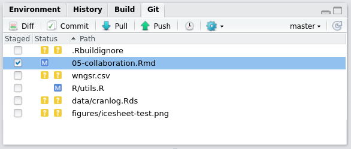
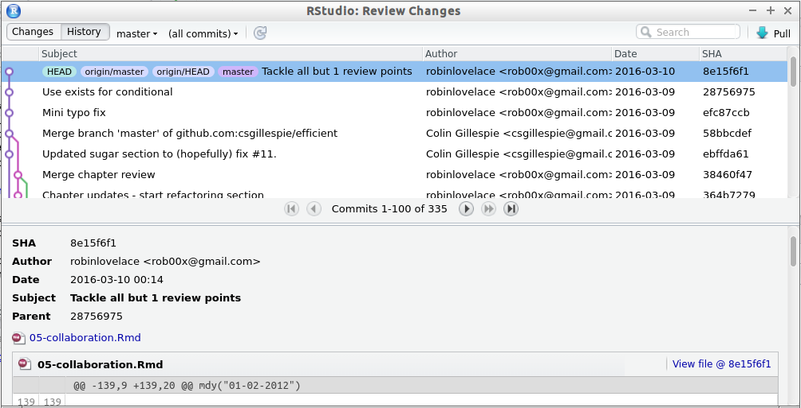

```{r echo=FALSE, message=FALSE}
library(dplyr)
```

# Efficient collaboration {#collaboration}

Large projects inevitably involve many people. This poses risks but also opportunities for improving computational efficiency and productivity, especially if project collaborators are reading and committing code. This chapter provides guidance on how to minimise the risks and maximise the benefits of collaborative R programming. 

Collaborative working has a number of benefits. A team with a diverse skill set is usually stronger than a team with a very narrow focus. It makes sense to specialize: clearly defining roles such as statistician, front-end developer, system administrator and project manager will make your team stronger. Even if you are working alone, dividing the work into discrete branches in this way can be useful, as discussed in Chapter \@ref(workflow).

Collaborative programming provides an opportunity for people to review each other's code. This can be encouraged by using a uniform style with many comments, as described in Section \@ref(coding-style). Like using a clear style in human language, following a style guide has the additional advantage of making your code more understandable to others.

When working on complex programming projects with multiple inter-dependencies version control is essential. Even on small projects tracking the progress of your project's code-base has many advantages and makes collaboration much easier. Fortunately it is now easier than ever before to integrate version control into your project, using RStudio's interface to the version control software `git` and online code sharing websites such as GitHub. This is the subject of Section \@ref(version-control).

The final section, \@ref(refactoring), addresses the question of how to respond when you find inefficient code. Refactoring is the process of re-writing poorly written or scripts so they are faster, more comprehensible, more portable and easier to maintain.

### Prerequisites {-}

This chapter deals with coding standards and techniques. The only packages required for this 
chapter are **lubridate** and **dplyr**. These packages are used to illustrate good practice.

## Top 5 tips for efficient collaboration

1. Have a consistent coding style. 
1. Think carefully about your comments and keep them up to date.
1. Use version control whenever possible.
1. Use informative commit messages.
1. Don't be afraid to update (refactor) code when needed.

## Coding style

To be a successful programmer you need to use a consistent programming style.
There is no single 'correct' style, but using multiple styles in the same project is wrong [@ba_aa_ath_state_2012]. To some extent good style is subjective and down to personal taste. There are, however, general principles that
most programmers agree on, such as:

- Use modular code;
- Comment your code;
- Don't Repeat Yourself (DRY);
- Be concise, clear and consistent.

Good coding style will make you more efficient even if you are the only person who reads it.
When your code is read by multiple readers or you are developing code with
co-workers, having a consistent style is even more important. There are a number of R style guides online that are broadly similar, including one by
[Google](https://google-styleguide.googlecode.com/svn/trunk/Rguide.xml), [Hadley Whickham](http://adv-r.had.co.nz/Style.html) and
[Richie Cotton](https://4dpiecharts.com/r-code-style-guide/).
The style followed in this book is based on a combination of Hadley Wickham's guide and our own preferences (we follow Yihui Xie in preferring `=` to `<-` for assignment, for example).

In-line with the principle of automation (automate any task that can save time by automating), the easiest way to improve your code is to ask your computer to do it, using RStudio.

### Reformatting code with RStudio

RStudio can automatically clean up poorly indented and formatted code. To do this, select the lines that need to be formatted (e.g. via `Ctrl+A` to select the entire script) then automatically indent it with `Ctrl+I`. The shortcut `Ctrl+Shift+A` will reformat the code, adding spaces for maximum readability. An example is provided below.

```{r, eval=FALSE}
# Poorly indented/formatted code
if(!exists("x")){
x=c(3,5)
y=x[2]}
```

This code chunk works but is not pleasant to read. RStudio automatically indents the code after the `if` statement as follows.

```{r}
# Automatically indented code (Ctrl+I in RStudio)
if(!exists("x")){
  x=c(3,5)
  y=x[2]}
```

<!-- XXX: Robin: Rstudio don't format code as below. -->
This is a start, but it's still not easy to read. This can be fixed in RStudio as illustrated below (these options can be seen in the Code menu, accessed with `Alt+C` on Windows/Linux computers).

```{r}
# Automatically reformat the code (Ctrl+Shift+A in RStudio)
if(!exists("x")) {
  x = c(3, 5)
  y = x[2]
}
```

Note that some aspects of style are subjective: we would not leave a space after the `if` and `)`. 

### File names

File names should use the `.R` extension and should be lower case (e.g. `load.R`). Avoid spaces. Use a dash or underscore to separate words.

```{r, engine='bash', eval=FALSE}
# Good names
normalise.R
load.R
# Bad names
Normalise.r
load data.R
```

Section 1.1 of [Writing R Extensions](https://cran.r-project.org/doc/manuals/r-release/R-exts.html#Package-structure) provides
more detailed guidence on file names, such as avoiding non-English alphabetic characters since they cannot be guaranteed 
to work across locales. While the guidelines are strict, the guidence aids in making your scripts more portable.

### Loading packages

Library function calls should be at the top of your script. When loading an essential package, 
use `library` instead of `require` since a missing package will then raise an error. If a package isn't essential, 
use `require` and appropriately capture the warning raised. 
Package names should be surrounded with speech marks. 

```{r messages=FALSE}
# Good
library("dplyr")
# Non-standard evaluation
library(dplyr)
```

Avoid listing every package you may need, instead just include the packages you actually use. If you find
that you are loading many packages, consider putting all packages in a file called `packages.R` and using
`source` appropriately. 

### Commenting

Comments can greatly improve the efficiency of collaborative projects by helping everyone to understand what each line of code is doing. However comments should be used carefully: plastering your script with comments does not necessarily make it more efficient, and too many comments can be inefficient. Updating heavily commented code can be a pain, for example: not only will you have to change all the R code, you'll also have to rewrite or delete all the comments!

Ensure that your comments are meaningful. Avoid using verbose English to explain standard R code. The comment below, for example, adds no useful information because it is obvious by reading the code that `i` is being set to 1:

```{r}
# Setting x equal to 1
x = 1
```

Instead, comments should provide context. Imagine `x` was being used as a counter (in which case it should probably have a more meaningful name, like `counter`, but we'll continue to use `x` for illustrative purposes). In that case the comment could explain your intention for its future use:

```{r}
# Initialize counter
x = 1
```

The example above illustrates that comments are more useful if they provide context and explain the programmer's intention [@Mcconnell2004]. Each comment line should begin with a single hash (`#`), followed by a space. Comments can be toggled (turned on and off) in this way with `Ctl+Shift+C` in RStudio. The double hash (`##`) can be reserved for R output. If you follow your comment with four dashes (`# ----`) RStudio will enable code folding until the next instance of this.

### Object names

> "When I use a word," Humpty Dumpty said, in a rather scornful tone, 
> "it means just what I choose it to mean - neither more nor less."
>
> * Lewis Carroll - Through the Looking Glass, Chapter 6.

It is important for objects and functions to be named consistently and sensibly. To take a silly example, imagine if all objects in your projects were called `x`, `xx`, `xxx` etc. The code would run fine. However, it would be hard for other people, and a future you, to figure our what was going on, especially when you got to the object `xxxxxxxxxx`!

For this reason, giving a clear and consistent name to your objects, especially if they are going to be used many times in your script, can boost project efficiency (if an object is only used once, its name is less important, a case where `x` could be acceptable). Following discussion in [@ba_aa_ath_state_2012] and elsewhere, suggest an `underscore_separated` style for function and object names^[One notable exception are packages in Bioconductor, where variable names are `camelCase`. In this case, you should match the existing style.]. Unless you are creating an S3 object, avoid using a `.` in the name, (this will help avoid confusing Python programmers!). Names should be concise yet meaningful. 

In functions the required arguments should always be first, followed by optional arguments. The special `...` argument should last. If your argument has a boolean value, use `TRUE`/`FALSE` instead of `T`/`F` for clarity. 

```{block type="rmdwarning"}
It's tempting to use `T`/`F` as shortcuts. But it is easy to accidentally redefine these variables, e.g. `F = 10`.
R raises an error if you try to redefine `TRUE`/`FALSE`
```

While it's possible to write arguments that depend on other arguments, try to avoid using this idiom
as it makes understanding the default behaviour harder to understand. Typically it's easier to set an argument to have a default value of `NULL` and check its value using `is.null` than by using `missing`. 
Where possible, avoid using names of existing functions. 

### Example package

The `lubridate` package is a good example of a package that has a consistent naming system, 
to make it easy for users to guess its features and behaviour. Dates are encoded in a variety of ways, but the `lubridate` package has a neat set of functions consisting of the three letters, **y**ear, **m**onth and **d**ay. For example,

```{r results="hide", message=FALSE}
library("lubridate")
ymd("2012-01-02")
dmy("02-01-2012")
mdy("01-02-2012")
```

### Assignment

The two most common ways of assigning objects to values in R is with `<-` and `=`. 
In most (but not all) contexts, they can be used interchangeably. Regardless of which operator
you prefer, consistency is key, particularly when working in a 
group. In this book we use the `=` operator for assignment, as it's faster to type and more consistent with other languages.

The one place where a difference occurs is during function calls. Consider the following 
piece of code used for timing random number generation

```{r eval=FALSE, results="hide"}
system.time(expr1 <- rnorm(10e5))
system.time(expr2 = rnorm(10e5)) # error
```

The first lines will run correctly __and__ create a variable called `expr1`.
The second line will raise an error. When we use `=` in a function call, it changes from an 
_assignment_ operator to an _argument passing_ operator. For further information about
assignment, see `?assignOps`.

### Spacing

Consistent spacing is an easy way of making your code more readable. Even a simple command such as `x = x + 1` takes a bit more time to understand when the spacing is removed, i.e. `x=x+1`. You should add a space around the operators `+`, `-`, `\` and `*`. Include a space around the assignment operators, `<-` and `=`. Additionally, add a space around any comparison operators such as `==` and `<`. The latter rule helps avoid bugs 

```{r echo=2:5, results="hide"}
x = 10
# Bug. x now equals 1
x[x<-1]
# Correct. Selecting values less than -1
x[x < -1]
```

The exceptions to the space rule are `:`, `::` and `:::`, as well as `$` and `@` symbols for selecting sub-parts of objects. As with English, add a space after a comma, e.g.

```{r eval=FALSE}
z[z$colA > 1990, ]
```

### Indentation

Use two spaces to indent code. Never mix tabs and spaces. RStudio can automatically convert the tab character to spaces (see `Tools -> Global options -> Code`).

### Curly braces

Consider the following code:

```{r eval=FALSE}
# Bad style, fails
if(x < 5)
{ 
y} 
else {
  x}
```

Typing this straight into R will result in an error. 
An opening curly brace, `{` should not go on its own line and 
should always be followed by a line break. A closing curly brace should always go on its own line (unless it’s followed by an `else`, in which case the `else` should go on its own line). The code inside a curly braces should be indented (and RStudio will enforce this rule), as shown below.

```{r, results="hide"}
# Good style
if(x < 5){
  x
} else {
  y
}
```

#### Exercises {-}

Look at the difference between your style and RStudio's based on a representative R script that you have written (see Section \@ref(coding-style)). What are the similarities? What are the differences? Are you consistent? Write these down and think about how you can use the results to improve your coding style.

## Version control

When a project gets large, complicated or mission-critical it is important to keep track of how it evolves. In the same way that Dropbox saves a 'backup' of your files, version control systems keep a backup of your code. The only difference is that version control systems back-up your code *forever*. 

The version control system we recommend is Git, a command-line application created by Linus Torvalds, who also invented Linux.^[We recommend '10 Years of Git: An Interview with Git Creator Linus Torvalds' from
[Linux.com](http://www.linux.com/news/featured-blogs/185-jennifer-cloer/821541-10-years-of-git-an-interview-with-git-creator-linus-torvalds) for more information on this topic.
] The easiest way to integrate your R projects with Git, if you're not accustomed to using a shell (e.g. the Unix command line), is with RStudio's Git tab, in the top right-hand window (see figure \@ref(fig:9-1)). This shows a number of files have been modified (as illustrated with the blue M symbol) and that some are new (as illustrated with the yellow ? symbol). Checking the tick-box will enable these files to be *committed*.

### Commits

Commits are the basic units of version control. Keep your commits 'atomic': each one should only do one thing. Document your work with clear and concise commit messages, use the present tense, e.g.: 'Add analysis functions'.

Committing code only updates the files on your 'local' branch. To update the files stored on a remote server (e.g. on GitHub), you mush 'push' the commit. This can be done using `git push` from a shell or using the green up arrow in RStudio, illustrated in figure \@ref(fig:9-1). The blue down arrow will 'pull' the latest version of the repository from the remote.^[For a more detailed account of this process, see
[GitHub's help pages](https://help.github.com/).]

```{r 9-1, fig.cap="The Git tab in RStudio", echo=FALSE, out.width="70%"}

```

### Git integration in RStudio

How to enable this functionality on your installation of RStudio? RStudio can be a GUI Git only if Git has been installed *and* RStudio can find it. You need a working installation of Git (e.g. installed through `apt-get install git` Ubuntu/Debian or via [GitHub Desktop](https://help.github.com/desktop/guides/getting-started/installing-github-desktop/) for Mac and Windows). RStudio can be linked to your Git installation via Tools > Global Options, in the Git/SVN tab. This tab also provides a [link](https://support.rstudio.com/hc/en-us/articles/200532077) to a help page on RStudio/Git.

Once Git has been linked to your RStudio installation, it can be used to track changes in a new project by selecting `Create a git repository` when creating a new project. The tab illustrated in figure \@ref(fig:9-1) will appear, allowing functionality for interacting with Git via RStudio.

RStudio provides a useful GUI for navigating past commits. This allows you to see the entire history of your project. To navigate and view the details of past commits click on the Diff button in the Git pane, as illustrated in figure \@ref(fig:9-2).

```{r 9-2, fig.cap="The Git history navigation interface", echo=FALSE, out.width="100%"}

```

### GitHub

GitHub is an online platform that makes sharing your work and collaborative code easy. There are alternatives such as [GitLab](https://about.gitlab.com/). The focus here is on GitHub as it's by far the most popular among R developers. Also, through the command `devtools::install_github()`, preview versions of a package can be installed and updated in an instant. This makes 'GitHub packages' a great way to access the latest functionality. And GitHub makes it easy to get your work 'out there' to the world for efficiently collaborating with others, without the restraints placed on CRAN packages.

To install the GitHub version of the **benchmarkme** package, for example one would enter

```{r, eval=FALSE}
devtools::install_github("csgillespie/benchmarkme")
```

Note that `csgillespie` is the GitHub user and `benchmarkme` is the package name. Replacing `csgillespie` with `robinlovelace` in the above code would install Robin's version of the package. This is useful for fast collaboration with many people, but you must remember that GitHub packages will not update automatically with the command `update.packages` (see \@ref(updating-r-packages)).

```{block, note-text, type='rmdwarning'}
Warning: although GitHub is fantastic for collaboration, it can end up creating more problems than it solves if your collaborators are not git-literate. In one project, Robin eventually abandoned using GitHub to collaborate after his collaborator found it impossible to work with. More time was being spent debugging git/GitHub than actually working. Our advice therefore is to **never impose git** and always ensure that other lines of communication (e.g. phone calls, emails) are open as different people prefer different ways of communicating.
```

### Branches, forks, pulls and clones

Git is a large program which takes a long time to learn in depth. However, getting to grips with the basics of some of its more advanced functions can make you a more efficient collaborator. Using and merging branches, for example, can make you work more scalable but testing new features in a self-contained environment before it is used in production (e.g. when shifting to an updated version of a package which is not backwards compatible). Instead of bogging you down with a comprehensive discussion of what is possible, this section cuts to the most important features for collaboration: branches, forks, fetches and clones. For a more detailed description of Git's powerful functionality, we recommend the Jenny Byran's [book](http://happygitwithr.com/), "Happy Git and Github for the useR".

Branches are distinct versions of your repository. Git allows you jump seamlessly between different versions of your entire project. To create a new branch called test, you need to enter the shell and use the Git command line:

```{r, engine='bash', eval=FALSE}
git checkout -b test
```

This is equivalent of entering two commands: `git branch test` to create the branch and then `git checkout test` to *checkout* that branch. Checkout means switch into that branch. Any changes will not affect your previous branch. In RStudio you can jump quickly between branches using the drop down menu in the top right of the Git pane. This is illustrated in figure \@ref(fig:9-1): see the `master` text followed by a down arrow. Clicking on this will allow you to select other branches.

Forks are like branches but they exist on other people's computers. You can fork a repository on GitHub easily, as described on the site's [help pages](https://help.github.com/articles/fork-a-repo/). If you want an exact copy of this repository (including the commit history) you can *clone* this fork to your computer using the command `git clone` or by using a Git GUI such as GitHub Desktop. This is preferable from a collaboration perspective than cloning the repository directly, because any changes can be pushed back online easily if you are working from your own fork. You cannot push to forks that you have not created. If you want your work to be incorporated into the original fork you can use a *pull request*. Note: if you don't need the project's entire commit history, you can simply download a zip file containing the latest version of the repository from GitHub (see at the top right of any GitHub repository).

A pull request (PR) is a mechanism on GitHub by which your code can be added to an existing project. One of the most useful features of a PR from a collaboration perspective is that it provides an opportunity for others to comment on your code, line by line, before it gets merged. This is all done online on GitHub, as discussed in [GitHub's online help](https://help.github.com/articles/merging-a-pull-request/). Following feedback, you may want to refactor code, written by you or others.


```{r, echo=FALSE}
# Content to add
# For this reason GitHub is the subject of the next section.
### Using GitHub
```

## Refactoring code {#refactoring}

It is likely that your skills as an R programmer will improve over time (e.g. after reading books such as this!). Furthermore, as R packages evolve, the best way to accomplish a task 6 months ago may not be the best way to accomplish it now. Thus it is likely that you will want to rewrite your code at some point. From a collaboration perspective, you may also need to adapt someone else's code to be more efficient. This is *refactoring*.

An example would be messy code that creates many objects and uses overlapping packages. The refactored code would be much clearer, efficient and more concise. There is no 'magic bullet' formula to refactor code, but a [series of techniques](https://en.wikipedia.org/wiki/Code_refactoring) can be used, including improving variable names, breaking the code into smaller, more modular chunks and making the code more abstract and generalisable. Refactoring it is a skill that you will learn over time. Good practice involves frequently updating your code - that will get you into the habit of reading code at a 'high level' so you identify quickly its key components and hopefully write it in a better form.

Let's use some code introduced in Chapter 5 as an example of something that could be written more efficiently:

```{r, eval=FALSE}
# old code
fname = system.file("extdata/ghg-ems.csv", package = "efficient")
co2_ems = read.csv(fname)
names(co2_ems) = gsub("\\..*", "", names(co2_ems)) 
e_ems = aggregate(co2_ems$Electricity, list(co2_ems$Country),
                  mean, data = co2_ems)
```

```{r, eval=FALSE}
# new code
library("dplyr")
fname = system.file("extdata/ghg-ems.csv", package = "efficient")
co2_ems = readr::read_csv(fname)
co2_elec_agg = group_by(co2_ems, Country) %>% 
  summarise(Elec = mean(`Electricity/Heat (CO2) (MtCO2)`, na.rm = TRUE))
```

Although both approaches generate the same output data using the same number of lines of code (5), the new, refactored code is better in a number of ways. It is more efficient to type (containing 10 fewer characters) and more efficient to run (it is around 20% faster). More importantly, the refactored code is more readable and easily extended, which is a vital consideration from the perspective of efficient collaboration. Adding the following line after the penultimate bracket in the second code chunk would create a new aggregate variable, for example:

```{r, eval=FALSE}
, Trans = mean(`Transportation (CO2) (MtCO2)`, na.rm= TRUE)
```

Furthermore, by using the origin column names, the refactored code remains more faithful to the source data. The benefits of being explicit and verbose (i.e. including the units in the variable names) will likely outweigh the costs of additional characters in the analysis process when it comes to publishing the results.

```{block, nlines, type='rmdnote'}
Note that the number of lines of code is not a good measure of code efficiency. Clear and easily readable that is many lines of code is better than code that is compressed into a few lines that is tricky to read. Do not be afraid to make functions with multiple arguments more than one line. The ` %>%` pipe operator encourages multi-line code that is easy to read. The number of *characters* in code is a better measure, but is still an imperfect measure of efficiency, let alone readability.
```

```{r, echo=FALSE, eval=FALSE}
# benchmarking code
system.time({
  fname = system.file("extdata/ghg-ems.csv", package = "efficient")
  co2_ems = read.csv(fname)
  names(co2_ems) = gsub("\\..*", "", names(co2_ems)) # clean column names
  e_ems = aggregate(co2_ems$Electricity, list(co2_ems$Country),
                  mean, data = co2_ems)
})


system.time({
  fname = system.file("extdata/ghg-ems.csv", package = "efficient")
  co2_ems = readr::read_csv(fname)
  co2_elec_agg = group_by(co2_ems, Country) %>% 
    summarise(Elec = mean(`Electricity/Heat (CO2) (MtCO2)`, na.rm = TRUE))
})
```

#### Exercise {-}

1. Refactor the following code chunk to make it run faster:

```{r}
df = data.frame(
  letters = c("a", "a", "b", "b", "c", "c"),
  numbers = c(1, 2, 3, 4, 5, 6)
)
aggregate(df$numbers, list(df$letters), sum)
```

```{r, echo=FALSE, results='hide'}
# option 1
df = data.frame(
  letters = rep(letters[1:3], each = 2),
  numbers = 1:6
)
aggregate(numbers ~ letters, df, sum)
```

```{r, echo=FALSE, results='hide'}
# option 2
df = data.frame(
  letters = rep(letters[1:3], each = 2),
  numbers = 1:6
)
group_by(df, letters) %>%
  summarise(sum = sum(numbers))
```

2. Refector the code in the move function below, to make it faster, more stylish, and more concise.
This is from [monopoly.R](https://github.com/csgillespie/efficient/blob/master/R/monopoly.R) file in the efficient package (see section \@ref(monopoloy) in the previous chapter for guidance).

```{r}
move = function(current) {
  
  df = data.frame(d1 = sample(1:6, 3, replace=TRUE), 
                  d2 = sample(1:6, 3, replace=TRUE))
  
  df$Total = apply(df, 1, sum)
  df$IsDouble = df$d1 == df$d2
  
  if(df$IsDouble[1] & df$IsDouble[2] & df$IsDouble[3]) {
    current = 11#Go To Jail
  } else if(df$IsDouble[1] & df$IsDouble[2]) {
    current = current + sum(df$Total[1:3])
  } else if(df$IsDouble[1]) {
    current = current + sum(df$Total[1:2])
  } else {
    current = current + df$Total[1]
  }
  return(current)
}
```

```{r, eval=FALSE, echo=FALSE}
# The refactored code, after implementing these optimisations, is shown below
# It is around 25 times faster!
move = function(current) {
  # data.frame -> matrix
  rolls = matrix(sample(1:6, 6, replace=TRUE), ncol=2)
  Total = rowSums(rolls)	# apply -> rowSums	
  IsDouble = rolls[,1] == rolls[,2]
  # & -> &&
  if(IsDouble[1] && IsDouble[2] && IsDouble[3]) {
    current = 11#Go To Jail
  } else if(IsDouble[1] && IsDouble[2]) {
    current = current + sum(Total[1:3])
  } else if(IsDouble[1]) {
    current = current + Total[1:2]
  } else {
    current = Total[1]
  }
  current
}
```
