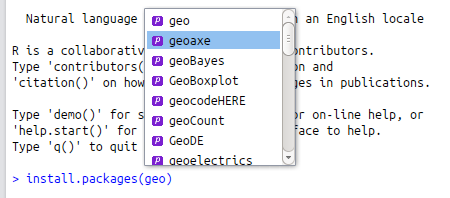

```{r, echo=FALSE}
rm(list=ls())
```

# Efficient learning {#learning}

As with any vibrant open source software community, R is fast moving. This can be
disorientating because it means that you can never 'finish' learning R. On the other
hand, it makes R a fascinating subject: there is always more to learn. Even
experienced R users keep finding new functionality that helps solve problems quicker
and more elegantly. Therefore *learning how to learn* is one of the most important
skills to have if you want to learn R *in depth*. We emphasise *depth* of
learning because it is more efficient to learn something properly than to Google it
repeatedly every time you forget how it works.

This chapter aims to equip you with concepts, guidance and tips that will accelerate your transition
from an R *hacker* to an R *programmer*. This inevitably involves effective use of R's
help, reading R source code, and use of online material.

### Prerequisties {-}

The only package used in this section is **swirl**

```{r}
library("swirl")
```

## Top 5 tips for efficient learning

1. Use R's internal help, e.g. with `?`, `??`, `vignette()` and `apropos()`. Try **swirl**.
1. Read about the latest developments in established outlets such as the *Journal for Statistical Software*, the *R Journal*, R lists and the 'blogosphere'.
1. If stuck, ask for help! A clear question posted in an appropriate place, using reproducible code, should get a quick and enlightening answer.
1. For more in-depth learning, nothing can beat immersive R books and tutorials. Do some research and decide which resources you should complete.
1. One of the best ways to consolidate learning is to write-it-up and pass on the knowledge: telling the story of what you've learned with also help others.

## Using R's internal help

Sometimes the best place to look for help is within R itself. Using R's help has 3 main advantages from an efficiency perspective: 1) it's faster to query R from inside your IDE than to switch context and search for help on a different platform (e.g. the internet which has countless distractions); 2) it works offline; 3) learning to read R's documentation (and source code) is a powerful skill in itself that will improve your R programming.

The main disadvantage of R's internal help is that it is terse and in some cases sparse. Do not expect to *always* be able to find the answer in R so be prepared to look elsewhere for more detailed help and context. From a learning perspective becoming acquainted with R's documentation is often better than finding out the solution from a different source: it was written by developers, largely for developers. Therefore with R documentation you learn about function *from the horses mouth*. R help also sometimes sheds light on a function's history, e.g. through references to academic papers.

As you look to learn about a topic or function in R, it is likely that you will have a search strategy of your own, ranging from broad to narrow:

1. Searching R and installed packages for help on a specific *topic*.
1. Reading-up on *packages* vignettes.
1. Getting help on a specific *function*.
1. Looking into the *source code*.

In many cases you may already have researched stages 1 and 2. Often you can stop and 3 and simply use the function without worrying exactly how it works. In every case, it is useful to be aware of this hierarchical approach to learning from R's internal help, so you can start with the 'Big Picture' (and avoid going down a misguided route early on) and then quickly focus in on the functions that are most related to your task. To illustrate this approach in action, imagine that you are interested in a specific topic: optimisation. The remainder of this section will work through the stages 1 to 4 outlined above as if we wanted to find out more about this topic, with occasional diversions from this topic to see how specific help functions work in more detail. The final method of learning from R's internal resources covered in this section is **swirl**, a package for interactive learning that we cover last.

### Searching R for topics

A 'wide boundary' search for a topic in R will often begin with a search for instances of a keyword in the documentation and function names. Using the example of optimisation, one could start with a search for a text string related to the topic of interest:

```{r, eval=FALSE}
# help.search("optim") # or, more concisely
??optim
```

Note that the `??` symbol is simply a useful shorthand version of the function `help.search()`.
It is sometimes useful to use the full function rather than the shorthand version, because that way you can specify a number of options.
To search for all help pages that mention the more specific terms "optimisation" or "optimization" (the US spelling), in the title or alias of the help pages, for example, the following command would be used:

```{r, eval=FALSE}
help.search(pattern = "optimisation|optimization", fields = c("title", "concept"))
```

This will return a short (and potentially more efficiently focussed) list of help pages than the wide-ranging `??optim` call.
To make the search even more specific, we can use the `package` argument to constrain the search to a single package.
This can be very useful when you know that a function exists in a specific package, but you cannot remember what it is called:

```{r, eval=FALSE}
help.search(pattern = "optimisation|optimization", fields = c("title", "concept"), package = "stats")
```

Another function for searching R is `apropos()`. It prints to the console any R objects (including 'hidden' functions, those beginning with `.` and datasets) whose name matches a give text string. Because it does not search R's documentation, it tends to return fewer results than `help.search()`. Its use and typical outputs can be seen from a couple of examples below:

```{r}
apropos("optim")
apropos("lm")[1:6] # show only first six results
```

To search *all R packages*, including those you have not installed locally, for a specific topic there are a number of options. For obvious reasons, this depends on having internet access. The most rudimentary way to see what packages are available from CRAN, if you are using RStudio, is to use its autocompletion functionality for package names. To take an example, if you are looking for a package for geospatial data analysis, you could do worse than enter the text string `geo` as an argument into package installation function (for example `install.packages(geo)`) and hitting `Tab` when the cursor is between the `o` and the `)` in the example. The resulting options are are shown in the figure below: selecting one from the dropdown menu will result in it being completed with surrounding quote marks, as necessary.

```{r, echo=FALSE, fig.cap="Package name autocompletion in action in RStudio for packages beginning with 'geo'.", out.width="100%"}

```

### Finding and using vignettes

Some packages contain vignettes. These are pieces of ['long-form' documentation](http://r-pkgs.had.co.nz/vignettes.html) that allow package authors to go into detail explaining how the package works [@Wickham_2015]. In general they are high quality. Because they can be used to illustrate real world use cases, vignettes can be the best way to understand functions in the context of broader explanations and longer examples than are provided in function help pages. Although many packages lack vignettes, they deserve a sub-section of their own because they can boost the efficiency with which package functions are used, in an integrated workflow.

```{block, type="rmdnote"}
If you are frustrated because a certain package lacks a vignette, you can create one. This can be a great way of learning about and consolidating your knowledge of a package. To create a vignette, first download the source code of a package and then use `devtools::use_vignette()`. To add a vignette to the **efficient** package used in this book, for example, you could clone the repo, e.g. using the command `git clone git@github.com:csgillespie/efficient`. Once you have opened the repo as a project, e.g. in RStudio, you could create a vignette called "efficient-learning" with the following command: `use_vignette("efficient-learning")`.
```

To browse any vignettes associated with a particular package, we can use the handy function `browseVignettes()`:

```{r eval=FALSE}
browseVignettes(package = "benchmarkme")
```

This is roughly equivalent to `vignette(package = "benchmarkme")` but opens a new page in a browser and lets you navigate all the vignettes in that particular package. For an overview of all vignettes available from R packages installed on your computer, try browsing all available vignettes with `browseVignettes()`. You may be surprised at how many hidden gems there are in there!

How best to *use* vignettes depends on the vignette in question and your aims. In general you should expect to spend longer reading vignette's than other types of R documentation. The *Introduction to dplyr* vignette (opened with `vignette("introduction", package = "dplyr")`), for example, contains almost 4,000 words of prose and example code and outputs, illustrating how its functions work. We recommend working through the examples and typing the example code to 'learn by doing'.

Another way to learn from package vignettes is to view their source code. You can find where vignette source code lives by looking in the `vignette/` folder of the package's source code: **dplyr**'s vignettes, for example, can be viewed (and edited) online at [github.com/hadley/dplyr/tree/master/vignettes](https://github.com/hadley/dplyr/tree/master/vignettes). A quick way to view a vignette's R code is with the `edit()` function:

```{r, eval=FALSE}
v = vignette("introduction", package = "dplyr")
edit(v)
```


### Getting help on functions

All functions have help pages. These contain, at a minimum, a list of the input arguments and the nature of the output that can be expected. Once a function has been identified, e.g. using one of the methods outlined in Section \@ref(searching-r-for-topics), its *help page* can be displayed by prefixing the function name with `?`. Continuing with the previous example, the help page associated with the command `optim()` (for general purpose optimisation) can be invoked as follows:

```{r eval=FALSE}
# help("optim") # or, more concisely:
?optim
```

In general, help pages describe *what* functions do, not *how* they work. This is one of the reasons
that function help pages are thought (by some) to be difficult to understand. In practice, 
this means that the help page does not describe the underlying mathematics or algorithm in 
detail, it's aim is to describe the interface.

A help page is divided into a number of sections. 
The help for `optim()` is typical, in that it has a title (General-purpose Optimization) followed by short Description, Usage and Arguments sections.
The Description is usually just a sentence or two for explaining what it does. Usage shows the arguments that the function needs to work. And Arguments describes what kind of objects the function expects. Longer sections typically include Details and Examples, which provide some context and provide (usually reproducible) examples of how the function can be used, respectively. The typically short Value, References and See Also sections facilitate efficient learning by explaining what the output means, where you can find academic literature on the subject, and which functions are related.

`optim()` is a mature and heavily used function so it has a long help page: you'll probably be thankful to learn that not all help pages are this long!
With so much potentially overwhelming information in a single help page, the placement of the short, dense sections at the beginning is efficient because it means can understand the fundamentals of a function in few words.
Learning how to read and quickly interpret such help pages will greatly help your ability to learn R. Take some time to study the help for `optim()` in detail.

It is worth discussing the contents of the Usage section in particular, because this contains information that may not be immediately obvious:

```
optim(par, fn, gr = NULL, ...,
      method = c("Nelder-Mead", "BFGS", "CG", "L-BFGS-B", "SANN", "Brent"),
      lower = -Inf, upper = Inf, control = list(), hessian = FALSE)
```

This contains two pieces of critical information: 1) the *essential* arguments which must be provided for the function to work (`par` and `fn` in this case, as `gr` has a default value) before the `...` symbol; and 2) *optional* arguments that control how the function works (`method`, `lower`, and `hessian` in this case). `...` are optional arguments whose values depend on the other arguments (which will be passed to the function represented by `fn` in this case). Let's see how this works in practice by trying to run `optim()` to find the minimum value of the function $y = x^4 - x^2$:

```{r}
fn = function(x) {
  x^4 - x^2
}
optim(par = 0, fn = fn)
```

The results show that the minimum value of `fn(x)` is found when `x = 0.707..` ($\frac{1}{\sqrt{2}}$), with a minimum value of $-0.25$. It took $58$ iterations of the function call for `optim()` to converge on this value. Each of these output values is described in the Values section of the help pages.
From the help pages, we could guess that providing the function call without specifying `par` (i.e. `optim(fn = fn)`) would fail, which indeed it does. 

The most _helpful_
section is often is the Examples. These lie at the bottom the help page and show precisely
how the function works. You can either copy and paste the code, or actually run the
example code using the `example` command (it is well worth running these examples due to the graphics produced):

```{r eval=FALSE}
example(optim)
```

```{block, type="rmdnote"}
When a package is added to CRAN, the example part of the documentation is run on all major
platforms. This helps ensure that a package works on multiple systems.
```

Another useful section in the help file is `See Also:`. In the `optim()` help page, it links to `optimize()` which may be more appropriate for this use case.

### Reading R source code

R is open source. This means that we view the underlying source code and examine any
function. Of course the code is complex, and diving straight into the source code
won't help that much. However, watching to the github R source code
[mirror](https://github.com/wch/r-source/) will allow you to monitor small changes
that occur. This gives a nice entry point into a complex code base. Likewise, examining
the source of small functions, such as `NCOL` is informative, e.g.
`getFunction("NCOL")`

```{block, type="rmdtip"}
Subscribing to the R NEWS [blog](https://developer.r-project.org/blosxom.cgi/R-devel/NEWS/)
is an easy way of keeping track of future changes.
```

Many R packages are developed in the open on github or r-forge. Select a few well
known packages and examine their source. A good package to start with is
**[drat](https://github.com/eddelbuettel/drat)**. This is a relatively simple package
developed by Dirk Eddelbuettel (author of Rcpp) that only contains a few functions. It
gives you an excellent pointer into software development by one of the key R package
writers.

A shortcut for browsing R's source code is provided by the RStudio IDE: clicking on a function and then hit `F2` will open its source code in the file editor. This works for both functions that exist in R and its packages and functions that you created yourself in another R script (so long as it is within your project directory).
Although reading source code can be interesting in itself, it is probably best done in the context of a specific question, e.g. "how can I use a function name as an argument in my own function?" (looking at the source code of `apply()` may help here).

### Swirl

**swirl** is an interactive teaching platform for R. It offers a number of extensions and, for the pioneering, the ability for others to create custom extensions. The learning curve and method will not work for everyone, but this package is worth flagging as a potent self teaching resource. In some ways **swirl** can be seen as the ultimate internal R help as it allows dedicated learning sessions, based on multiple choice questions, all within a usual R session. To enter the **swirl** world, just enter the following. The resultant instructions will explain the rest:

```{r, eval=FALSE}
library("swirl")
swirl()
```

## Online resources

The R community has a strong online presence, providing many resources for learning. Over time, there has fortunately been a tendency for R resources to become more user friendly and up-to-date. Many resources that have been on CRAN for many years are dated by now so it's more efficient to navigate directly to the most up-to-date and efficient-to-use resources.

'Cheat sheets' are short documents summarising how to do certain things. [RStudio](http://www.rstudio.com/resources/cheatsheets/), for example, provides excellent cheat sheets on [**dplyr**](https://www.rstudio.com/wp-content/uploads/2015/02/data-wrangling-cheatsheet.pdf), [**rmarkdown**](https://www.rstudio.com/wp-content/uploads/2016/03/rmarkdown-cheatsheet-2.0.pdf) and the [RStudio IDE](https://www.rstudio.com/wp-content/uploads/2016/01/rstudio-IDE-cheatsheet.pdf) itself.

The R-project website contains six detailed [official manuals](https://cran.r-project.org/manuals.html), plus a giant pdf file containing documentation for all recommended packages. These include [An Introduction to R](https://cran.r-project.org/doc/manuals/r-release/R-intro.html), [The R language definition](https://cran.r-project.org/doc/manuals/r-release/R-lang.html) and [R Installation and Administration](https://cran.r-project.org/doc/manuals/r-release/R-admin.html), all of which are recommended for people wanting to learn their general R skills. If you are developing a package and want to submit it to CRAN, the [Writing R Extensions](https://cran.r-project.org/doc/manuals/r-release/R-exts.html) manual is recommended reading, although it has to some extent been superseded by @Wickham_2015, the source code of which is [available online](https://github.com/hadley/r-pkgs). While these manuals are long, they contain important information written by experienced R programmers.

For more domain-specific and up-to-date information on developments in R, we recommend checking out academic journals.
The [R-journal](https://journal.r-project.org/) regularly publishes articles
describing new R packages, as well as general programming hints. Similarly, the
articles in the [Journal of Statistical Software](https://www.jstatsoft.org/) have a
strong R bias. Publications in these journals are generally of very high quality and have been rigorously peer reviewed. However, they may be rather technical for R novices.

The wider community provides a much larger body of information, of more variable quality, than the official R resources. The [Contributed Documentation](https://cran.r-project.org/other-docs.html) page on R's home page contains a dozens of tutorials and other resources on a wide range of topics. Some of these are excellent, although many are not kept up-to-date. An excellent resource for browsing R help pages online is provided by [rdocumentation.org](http://www.rdocumentation.org).

Lower grade but more frequently released information can be found on the 'blogosphere'. Central to this is  [R-bloggers](http://www.r-bloggers.com/),
a blog aggregator of content contributed by bloggers who write about R (in English).
It is a great way to get exposed to new and different packages. Similarly monitoring
the _[#rstats](https://twitter.com/search?q=%23rstats)_ twitter tag keeps you up-to-date
with the latest news.

There are also mailing lists, Google groups and the Stack Exchange Q & A sites. Before
requesting help, read a few other questions to learn the format of the site. Make sure
you search previous questions so you are not duplicating work. Perhaps the most
important point is that people aren't under __any__ obligation to answer your
question. One of the fantastic things about the open-source community is that you can
ask questions and one of core developers may answer your question free; but remember,
everyone is busy!

### Stackoverflow

The number one place on the internet for getting help on programming is
[Stackoverflow](http://www.stackoverflow.com). This website provides a platform for
asking and answering questions. Through site membership, questions and answers are
voted up or down. Users of Stackoverflow earn reputation points when their question or
answer is up-voted. Anyone (with enough reputation) can edit a question or answer.
This helps the content remain relevant.

Questions are tagged. The R questions can be found under the [R tag](http://stackoverflow.com/questions/tagged/r). The [R page](https://stackoverflow.com/tags/r/info) contains links to Official documentation, free resources, and various other links. Members of the Stackoverflow R community have tagged, using `r-faq`, a few question that often crop up. 

### Mailing lists and groups.

There are many mailing lists and Google groups focused on R and particular packages. The main list for getting help is
`R-help`. This is a high volume mailing list, with around a dozen messages per day. A more technical mailing list
is `R-devel`. This list is intended for questions and discussion about code development in R. The discussion on this list is very technical. However,
it's a good place to be introduced to new ideas - but it's not the place to ask about these ideas! There are 
many other special interest mailing [lists](https://www.r-project.org/mail.html) covering topics such as high performance computing to ecology.
Many popular packages also have their own mailing list or Google group, e.g. **ggplot2** and **shiny**. The key piece of advice is before mailing a
list, read the relevant mailing archive and check that your message is appropriate.

## Asking a question

A great way to get specific help on a difficult topic is to ask for help.
However, asking a good question is not easy. Three common mistakes, and ways to avoid them, outlined below:

1. Asking a question that has already been asked: ensure you've properly searched for the answer before posting.
2. The answer to the question can be found in R's help: make sure you've properly read the relevant help pages before asking.
3. The question does not contain a reproducible example: create a simple version of your data, show the code you've tried, and display the result you are hoping for.

Your question should contain
just enough information that you problem is clear and can be reproducible, while
at the same time avoid unnecessary details. Fortunately there is a StackOverflow question - [How to make a great R reproducible example?](http://stackoverflow.com/q/5963269/203420) that provides excellent guidance.
Additional guides that explain how to create good programming questions are provided by
[StackOverflow](https://stackoverflow.com/help/how-to-ask) and and the [R mailing list posting guide](https://www.r-project.org/posting-guide.html). 

### Minimal data set {-}

What is the smallest data set you can construct that will reproduce your issue? Your
actual data set may contain $10^5$ rows and $10^4$ columns, but to get your idea across
you might only need $4$ rows and $3$ columns. Making small example data sets is easy. 
For example, to create a data frame with two numeric columns and a column of characters
just use

```{r echo=-3}
set.seed(1)
example_df = data.frame(x = rnorm(4), y = rnorm(4), z = sample(LETTERS, 4))
```

Note the call to `set.seed` ensures anyone who runs the code will get the same
random number stream. Alternatively, you use one of the many data sets that come with R - `library(help = "datasets")`. 

If creating an example data set isn't possible, then use `dput` on your actual data set. This
will create an ASCII text representation of the object that will enable anyone to recreate
the object

```{r results="hide"}
dput(example_df)
#> structure(list(
#>  x = c(-0.626453810742332, 0.183643324222082, -0.835628612410047, 1.59528080213779), 
#>  y = c(0.329507771815361, -0.820468384118015, 0.487429052428485, 0.738324705129217), 
#>  z = structure(c(3L, 4L, 1L, 2L), .Label = c("J", "R", "S", "Y"), class = "factor")), 
#>  .Names = c("x", "y", "z"), row.names = c(NA, -4L), class = "data.frame")
```

### Minimal example {-}

What you should not do, is simply copy and paste your entire function into your question.
It's unlikely that your entire function doesn't work, so just simplify it the bare minimum. 
The aim is to target your actual issue. 
Avoid copying and pasting large blocks of code; remove superfluous lines that are not part of the problem.
Before asking your question, can you run you code in a clean R environment and reproduce your error?

## Learning in depth

In the age of the internet and social media, many people feel lucky if they have time out to go for a walk, let alone sit down to read a book. However it is undeniable that leaning R *in depth* is a time consuming activity. Reading a book or a large tutorial (and completing the practical examples contained within) may not be the most efficient way to solve a particular problem in the short term, but it can be one of the best ways to learn R programming properly, especially in the long-run.

In depth learning differs from shallow, incremental learning because rather than discovering how a specific function works, you find out how systems of functions work together. To take a metaphor from civil engineering, in depth learning is about building strong foundations, on which a wide range of buildings can be constructed. In depth learning can be highly efficient in the long run because it will pay back over many years, regardless of the domain-specific problem you want to use R to tackle. Shallow learning, to continue the metaphor, is more like erecting many temporary structures: they can solve a specific problem in the short term but they will not be durable. Flimsy dwellings can be swept away. Shallow memories can be forgotten.

Having established that time spent 'deep learning' can, counter-intuitively, be efficient, it is worth thinking about how to deep learn. This varies from person to person. It does not involve passively absorbing sacred information transmitted year after year by the 'R gods'. It is an active, participatory process. To ensure that memories are rapidly actionable you must 'learn by doing'. Learning from a cohesive, systematic and relatively comprehensive resource will help you to see the many interconnections between the different elements of R programming and how they can be combined efficient work.

There are a number of such resources, including this book. Although the understandable tendency will be to use it incrementally, dipping in and out of different sections when different problems arise, we also recommend reading it systematically to see how the different elements of efficiency fit together. It is likely that as you work progressively through this book, in parallel with solving real world problems, you will realise that the solution is not to have the 'right' resource at hand but to be able to use the tools provided by R efficiently. Once you hit this level of proficiency, you should have the confidence to address most problems encountered from first principles. Over time, your 'first port of call' should move away from Google and even R's internal help to simply giving it a try: informed trial and error, intelligent experimentation, can be the best approach to both learning and solving problems quickly, once you are equipped with the tools to do so. That's why this is the last section in the book.

If you have already worked through all the examples in this book, or if you want to learn areas not covered in it, there are many excellent resources for extending and deepening your knowledge of R programming for fast and effective work, and to do new things with it. Because R is a large and ever-evolving language, there is no definitive list of resources for taking your R skills to new heights. However, the list below, in rough ascending order of difficulty and depth, should provide plenty of material and motivation for in depth learning of R.

1. Free webinars and online courses provided by [RStudio](http://www.rstudio.com/resources/webinars/) and [DataCamp](https://www.datacamp.com/community/open-courses). Both organisations are well regarded and keep their content up-to-date, but there are likely other sources of other online courses. We recommend testing pushing your abilities, rather than going over the same material covered in this book. 
1. *R for Data Science* [@grolemund_r_2016], a free book introducing many concepts and 'tidy' packages for working with data (a free online version is available from [r4ds.had.co.nz/](http://r4ds.had.co.nz/)).
1. *R programming for Data Science* [@peng_r_2014], which provides in depth coverage of analysis and visualisation of datasets.  
1. *Advanced R Programming* [@Wickham2014], an advanced book which looks at the internals of how R works (free from [adv-r.had.co.nz](http://adv-r.had.co.nz/)).

## Spread the knowledge

The final thing to say on the topic of efficient learning relates to the [old](https://en.wikipedia.org/wiki/Docendo_discimus) (~2000 years old!) saying *docendo discimus*:

> **by teaching we learn**.

This means that passing on information is one of the best ways to consolidate your learning It was largely by helping others to learn R that we became proficient R users.

Demand for R skills is growing, so there are many opportunities to teach R. Whether it's helping your colleague to use `apply()`, or writing a blog post on solving certain problems in R, teaching others R is can be a rewarding experience. Furthermore, spreading the knowledge can be efficient: it will improving your own understanding of the language and benefit the entire community, providing a positive feedback to the movement towards open source software in data-driven computing.

Assuming you have completed reading the book, the only remaining thing to say is well done: you are now an efficient R programmer. We hope you direct your new found skills towards the greater good and pass on the wisdom to others along the way.
