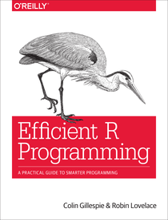

## Efficient R programming by Colin Gillespie and Robin Lovelace
[](https://travis-ci.org/csgillespie/efficientR) 



The text and code for the forthcoming O'Reilly book: [Efficient R programming](https://csgillespie.github.io/efficientR/). Pull requests and general comments are welcome.


### Building this book

To build this book on your own system, use 

```r
devtools::install_github("csgillespie/efficientR")
```

to install the necessary packages.

To build the book, run

```r
bookdown::render_book("index.Rmd",  bookdown::html_chapters())
```
