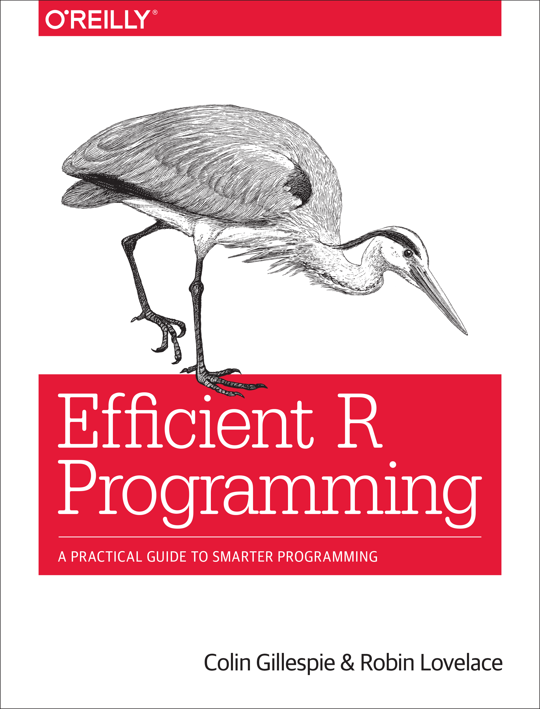

--- 
title: "Efficient R programming"
author: ["Colin Gillespie", "Robin Lovelace"]
date: "`r Sys.Date()`"
knit: "bookdown::render_book"
site: bookdown::bookdown_site
documentclass: book
bibliography: [refs.bib, packages.bib]
biblio-style: apalike
link-citations: yes
twitter-handle: csgillespie
cover-image: figures/f0_web.png
description: "Efficient R Programming is about increasing the amount of work you 
can do with R in a given amount of time. It's about both computational and programmer efficiency."
github-repo: csgillespie/efficientR
url: 'https\://csgillespie.github.io/efficientR/'
---

# Welcome to Efficient R Programming {-}

```{r echo=FALSE, out.width="33%"}

```

This is the [online version](https://csgillespie.github.io/efficientR/) of the O'Reilly book: [Efficient R programming](http://shop.oreilly.com/product/0636920047995.do). Pull requests and general comments are welcome.

## Authors {-}

[Colin Gillespie](http://www.mas.ncl.ac.uk/~ncsg3/) is Senior lecturer (Associate
professor) at Newcastle University, UK. His research interests are high performance
statistical computing and Bayesian statistics. He is regularly employed as a
consultant by [Jumping Rivers](http://www.jumpingrivers.com/) and has been teaching R
since 2005 at a variety of levels, ranging from beginners to advanced programming.

[Robin Lovelace](http://robinlovelace.net/) is a Research Fellow in the Leeds Institute for Data Analytics, which
specialises in the handling of large datasets. Robin has 5 years using R for academic
research and 3 years teaching R at all levels. Robin developed the popular tutorial
[Introduction to Visualising Spatial Data in R](https://github.com/Robinlovelace/Creating-maps-in-R)
and authored Spatial
Microsimulation with R [@lovelace_spatial_2016]. Robin has used R to solve many real world problems, including the creation of the Propensity to Cycle Tool, a nationally scalable interactive online mapping
tool to prioritise new cycle infrastructure, for the UK’s Department for Transport (DfT)
(see [www.pct.bike](http://www.pct.bike/)).

# Preface {-}

*Efficient R Programming* is about increasing the amount of work you can do with R in a given amount of time. It's about both *computational* and *programmer* efficiency. There are many excellent R resources about topic areas such as visualisation [e.g. @chang2012r], data science [e.g. @grolemund_r_2016] and package development [e.g. @Wickham_2015]. There are even more resources on how to use R in particular domains, including Bayesian Statistics, Machine Learning and Geographic Information Systems. However, there are very few unified resources on how to simply make R work effectively. Hints, tips and decades of community knowledge on the subject are scattered across hundreds of internet pages, email threads and discussion forums, making it challenging for R users to understand how to write efficient code.

In our teaching we have found that this issue applies to beginners and experienced users alike. Whether it's a question of understanding how to use R's vector objects to avoid for loops, knowing how to set-up your `.Rprofile` and `.Renviron` files or the ability to harness R's excellent C++ interface to do the 'heavy lifting', the concept of efficiency is key. The book aims to distill tips, warnings and 'tricks of the trade' down into a single, cohesive whole that will provide a useful resource to R programmers of all stripes for years to come.

The content of the book reflects the questions that our students, from a range of disciplines, skill levels and industries, have asked over the years to make their R work faster. How to set-up my system optimally for R programming work? How can one apply general principles from Computer Science (such as do not repeat yourself, DRY) to the specifics of an R script? How can R code be incorporated into an efficient workflow, including project inception, collaboration and write-up? And how can one learn quickly how to use new packages and functions?

The book answers each of these questions, and more, in 10 self-contained chapters. Each chapter starts simple and gets progressively more advanced, so there is something for everyone in each. While the more advanced topics such as parallel programming and C++ may not be immediately relevant to R beginners, the book helps to navigate R's famously steep learning curve with a commitment to starting slow and building on strong foundations. Thus even experienced R users are likely to find previously hidden gems of advice in the early parts of the chapters. "Why did no one tell me that before?" is a common exclamation we have heard while teaching this material.

Efficient programming should not be seen as an optional extra and the importance of efficiency grows with the size of projects and datasets. In fact, this book was devised while we were teaching a course on 'R for Big Data': it quickly became apparent that if you want to work with large datasets, your code must work efficiently. Even if you work with small datasets, efficient code, that is both fast to write *and* run is a vital component of successful R projects. We found that the concept of efficient programming is important to all branches of the R community. Whether you are a sporadic user of R (e.g. for its unbeatable range of statistical packages), looking to develop a package, or working on a large collaborative project in which efficiency is mission-critical, code efficiency will have a major impact on your productivity.

Ultimately efficiency is about getting more output for less work input. To take the analogy of a car, would you rather drive 1000 km on a single tank (or a single charge of your batteries) or refuel a heavy, clunky and ugly car every 50 km? In the same way, efficient R code is better than inefficient R code in almost every way: it is easier to read, write, run, share and maintain. This book cannot provide all the answers about how to produce such code but it certainly can provide ideas, example code and tips to make a start in the right direction of travel.

